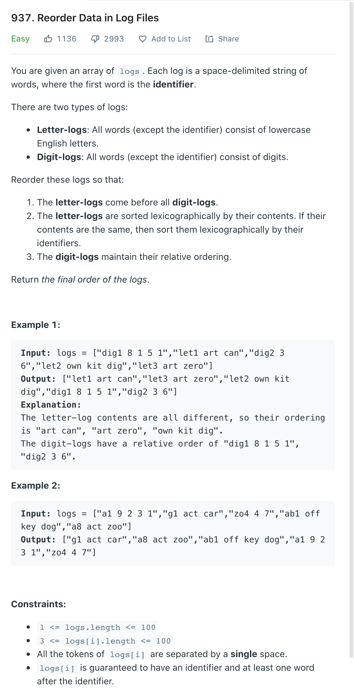
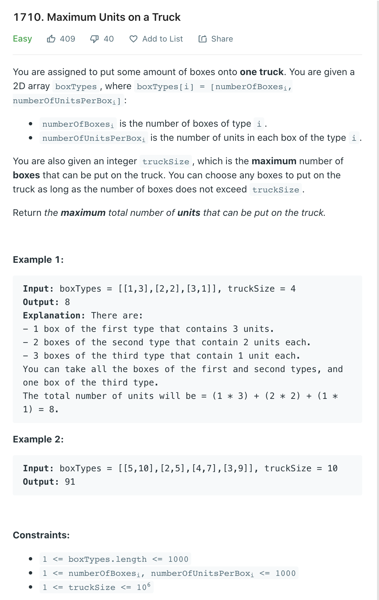
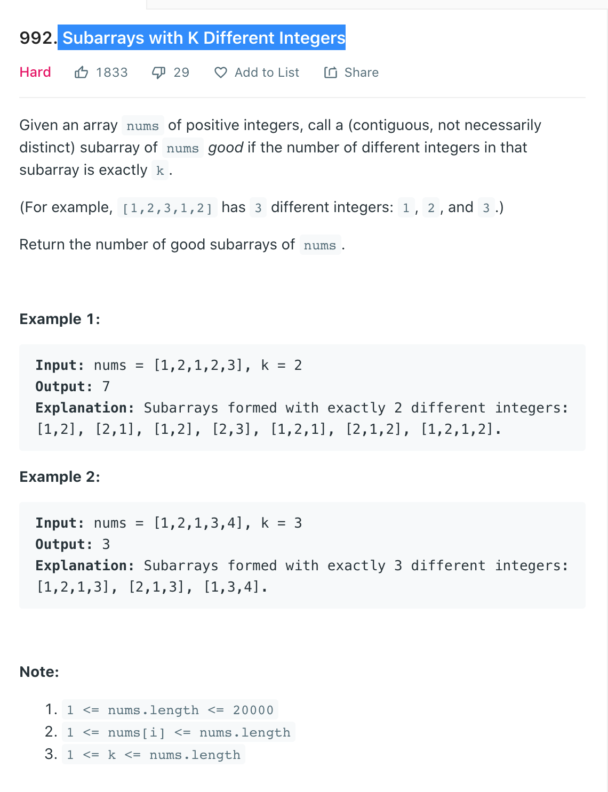
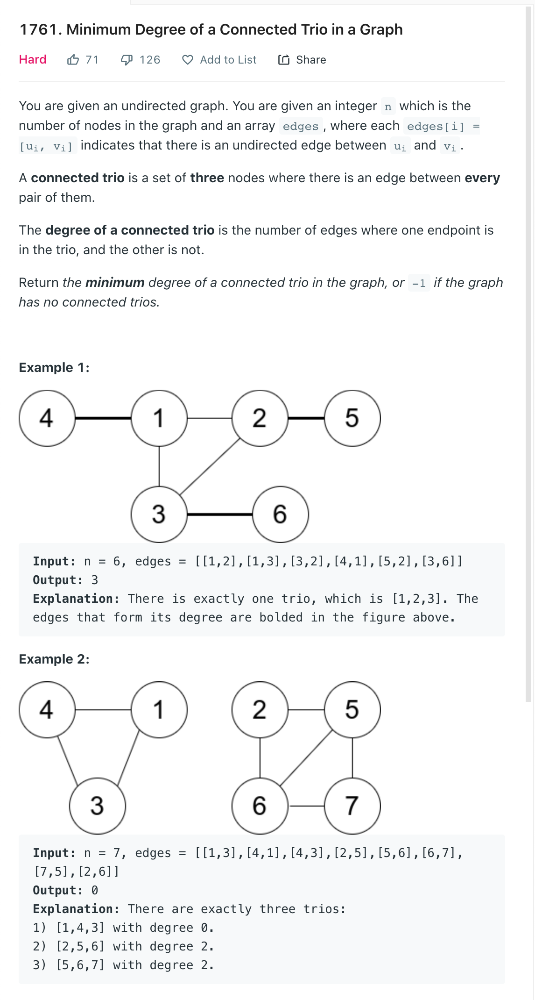
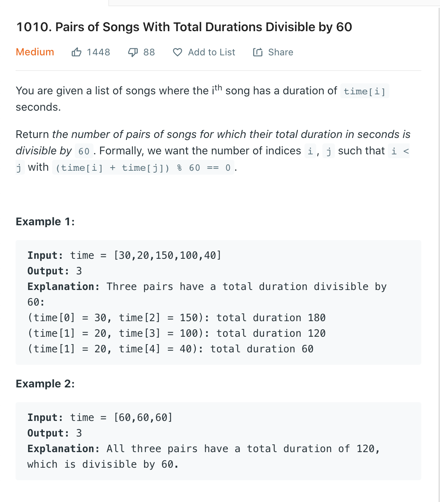
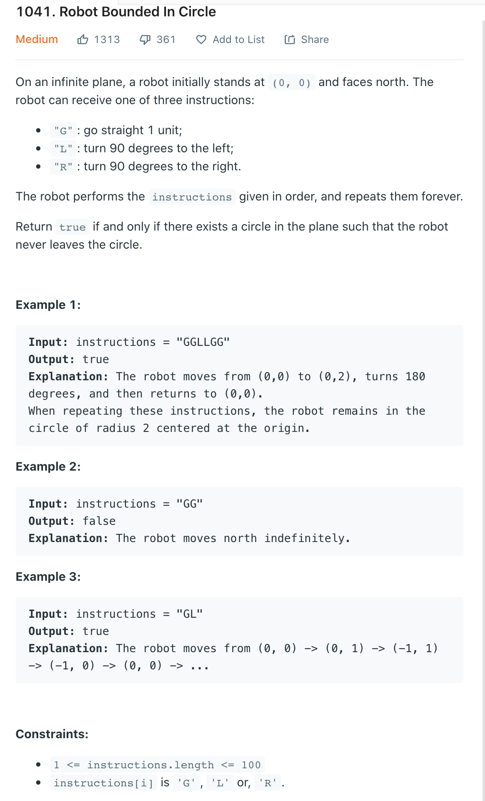
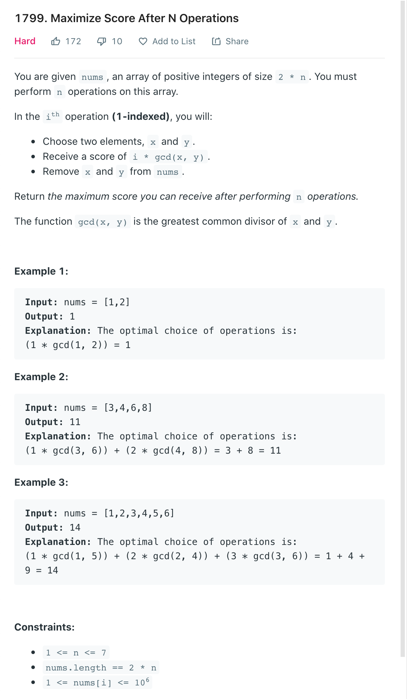
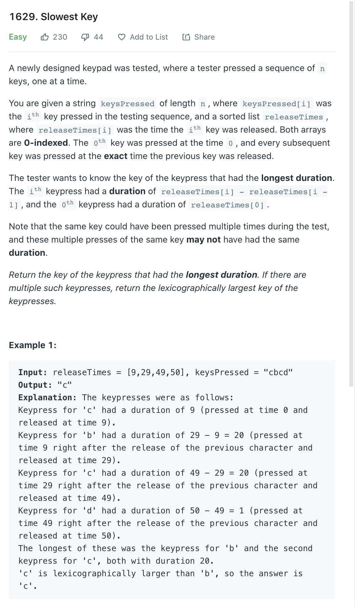
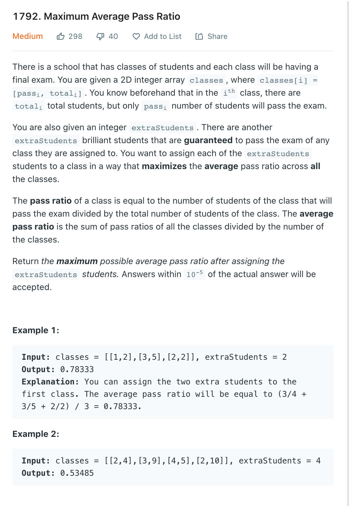

## 面经

### OA

```
1. CloudFront Caching.
2. Storage Optimization

1.optimizating Box Weight
2.Subscriber Groups / audible groups

1. Shopping Options
2. items in containers
```


合集

https://aonecode.com/amazon-online-assessment-questions

https://www.1point3acres.com/bbs/forum.php?mod=viewthread&tid=761387&extra=page%3D2%26filter%3Dsortid%26sortid%3D311%26searchoption%5B3046%5D%5Bvalue%5D%3D5%26searchoption%5B3046%5D%5Btype%5D%3Dradio%26searchoption%5B3109%5D%5Bvalue%5D%3D2%26searchoption%5B3109%5D%5Btype%5D%3Dradio%26sortid%3D311%26orderby%3Ddateline

**https://leetcode.com/discuss/interview-question/1183360/Amazon-Online-Assesment-Questions**

https://algo.monster/problems/amazon_online_assessment_questions

https://www.1point3acres.com/bbs/forum.php?mod=viewthread&tid=767814&extra=page%3D1%26filter%3Dsortid%26sortid%3D311%26searchoption%5B3046%5D%5Bvalue%5D%3D5%26searchoption%5B3046%5D%5Btype%5D%3Dradio%26searchoption%5B3109%5D%5Bvalue%5D%3D2%26searchoption%5B3109%5D%5Btype%5D%3Dradio%26sortid%3D311%26orderby%3Ddateline

^^ 重要

https://aonecode.com/amazon-online-assessment-questions#lsv

https://www.teamblind.com/post/Amazon-OA-question-complilation-xjQosyo3

https://www.1point3acres.com/bbs/forum.php?mod=viewthread&tid=715940&extra=page=16&filter=lastpost&orderby=lastpost&sortid=311&sortid=311&orderby=lastpost


### Reorder Data in Log Files



#### Solution

1. 考察了java Comparator怎么写

```java
class Solution {
    public String[] reorderLogFiles(String[] logs) {
        Comparator<String> comp = new Comparator<> () {
            @Override
            public int compare(String s1, String s2) {
                int s1SpaceIndex = s1.indexOf(' ');
                int s2SpaceIndex = s2.indexOf(' ');
                char s1FirstChar = s1.charAt(s1SpaceIndex + 1);
                char s2FirstChar = s2.charAt(s2SpaceIndex + 1);
    
                if(Character.isDigit(s1FirstChar)) {
                    if(Character.isDigit(s2FirstChar)) {
                        return 0; // remain the same
                    } else {
                        return 1; // letter-logs come before digit-logs
                    }
                } else {
                    if(Character.isDigit(s2FirstChar)) {
                        return -1; // remain the same
                    } else {
                        int preCompute = s1.substring(s1SpaceIndex + 1).compareTo(s2.substring(s2SpaceIndex + 1));
                        if(preCompute == 0) {
                            preCompute = s1.substring(0, s1SpaceIndex).compareTo(s2.substring(0, s2SpaceIndex));
                        }
                        return preCompute;
                    }
                }
            }
        };
        Arrays.sort(logs, comp);
        return logs;
    }
}
```


### Optimizing Box Weights

Given a list of integers, partition it into two subsets S1 and S2 such that the sum of S1 is greater than that of S2. And also the number of elements in S1 should be minimal.
Return S1 in increasing order.
Notice if more than one subset A exists, return the one with the maximal sum.

**Examples**:

```
Input:
nums = [4, 5, 2, 3, 1, 2]
Output:
[4, 5]
Explanation:
We can divide the numbers into two subsets A = [4, 5] and B = [1, 2, 2, 3]. The sum of A is 9 which is greater than the sum of B which is 8. There are other ways to divide but A = [4, 5] is of minimal size of 2.

Input:
nums = [10, 5, 3, 1, 20]
Output:
[20]

Input:
nums = [1, 2, 3, 5, 8]
Output:
[5, 8]
```

### Solution:

1. sort the array and pick the largest number in the array until the sum of s1 is larger than S2
2. copy that to a new array
3. time: O(N * logN + N), space: O(N)

```java
public class OptimizeBoxWeight {
    // "static void main" must be defined in a public class.
        public static void main(String[] args) {
            int[] ans1 = optimize(new int[]{1, 1, 2, 1});
            print("ans1", ans1);
            int[] ans2 = optimize(new int[]{3, 7, 6, 2});
            print("ans2", ans2);
            int[] ans3 = optimize(new int[]{4, 5, 2, 3, 1, 2});
            print("ans3", ans3);
        }
        private static int[] optimize(int[] arr) {
            long totalSum = 0;
            for (int num : arr) {
                totalSum += num;
            }
            Arrays.sort(arr);
            long partialSum = 0;
            int i = arr.length;
            while (i > 0 && partialSum < totalSum - partialSum) {
                i--;
                partialSum += arr[i];
            }
            int[] res = new int[arr.length - i];
            for (int j = 0; j < res.length; j++) {
                res[j] = arr[i + j];
            }
            return res;
        }

        private static void print(String name, int[] arr) {
            System.out.println(name);
            for (int n : arr) {
                System.out.println(n);

            }
        }
}
```


### Movies on Flight

- 可能会有变种 https://leetcode.com/discuss/interview-question/1186575/Amazon-OA-May-2021
- There could be duplicate times
- We must find a pair whose duration that equals to EXACTLY d - 30
- There could be more than 1 pair. If there is more than one pair, you choose the pair that's going to have a larger number in it. (eg. `[30, 30]` vs. `[10, 50]`, we would choose `[10, 50]`.
- Return a pair of indicies.
- twosum 名字叫In-Flight Media, 虽然是个新题，我有个case没过去，最后答案用two pointer做的话记得sort一下

```java
// Movies on Flight
/*
You are on a flight and wanna watch two movies during this flight.

You are given a list of integers which includes all the movie durations and also given the duration of the flight which is d in minutes.

Now, you need to pick two movies and the total duration of the two movies is less than or equal to (d - 30min).

Find the pair of movies with the longest total duration. If multiple found, return the pair with the longest movie.

Input
The input consists of two arguments:

movie_duration: a list of integers representing the duration of movies

d: an integer representing the duration of the flight

Output
return the movies pair.

Examples
Example 1:
Input:
movie_duration = [90, 85, 75, 60, 120, 150, 125]

d = 250

Output: [90, 125]
Explanation:
90min + 125min = 215 is the maximum number within 220 (250min - 30min)

https://leetcode.com/discuss/interview-question/356960
*/
// 知识点： two pointer
// 本质上是 1099. Two Sum Less Than K

public class MovieOnFlight {
    public static void main(String[] args) {
        int[] movie_duration1 = {90, 85, 75, 60, 120, 150, 125};
        int d1 = 250;
        int[] movie_duration2 = {90, 85, 75, 60, 155, 150, 125};
        int d2 = 250;
        int[] movie_duration3 = {90, 85, 75, 60, 120,110,110, 150, 125};
        int d3 = 250;
        System.out.println(Arrays.toString(get2SumClosest(movie_duration1, d1-30)));
        System.out.println(Arrays.toString(get2SumClosest(movie_duration2, d2-30)));
        System.out.println(Arrays.toString(get2SumClosest(movie_duration3, d3-30)));
    }

    private static int[] get2SumClosest(int[] movie_duration, int d) {
        Arrays.sort(movie_duration);
        int l = 0, r = movie_duration.length - 1;
        int max = 0;
        int[] res = new int[]{-1, -1};
        while(l < r) {
            int sum = movie_duration[l] + movie_duration[r];
            if((sum > max || (sum == max && Math.max(movie_duration[l] , movie_duration[r]) > Math.max(res[0],  res[1]))) && sum <= d) {
                max = sum;
                res[0] = movie_duration[l];
                res[1] = movie_duration[r];
            }
            if(sum > d)
                r--;
            else
                l++;
        }
        return res;
    }
}
```

### Fill the trunk



```java
// 1710. Maximum Units on a Truck
// 知识点 Arrays.sort

class Solution {
    public int maximumUnits(int[][] boxTypes, int truckSize) {
        Arrays.sort(boxTypes, (a, b) -> b[1] - a[1]);
        int totalUnits = 0;
        for(int[] type : boxTypes) {
            if(truckSize > type[0]) {
                totalUnits += type[0] * type[1];
                truckSize -= type[0];
            } else {
                totalUnits += truckSize * type[1];
                break;
            }
        }
        return totalUnits;
    }
}
```

###  Subarrays with K Different Integers



#### Solution

很难理解，需要多看几遍

```java
// https://leetcode.com/problems/subarrays-with-k-different-integers/discuss/235235/C%2B%2BJava-with-picture-prefixed-sliding-window

public int subarraysWithKDistinct(int[] A, int K) {
  int res = 0, prefix = 0;
  int[] m = new int[A.length + 1];
  for (int i = 0, j = 0, cnt = 0; i < A.length; ++i) {
    if (m[A[i]]++ == 0) ++cnt;
    if (cnt > K) {
      --m[A[j++]]; --cnt; prefix = 0; 
    }
    while (m[A[j]] > 1) {
      ++prefix; --m[A[j++]]; 
    }
    if (cnt == K) res += prefix + 1;
  }
  return res;
} 
```


```java
// https://leetcode.com/problems/subarrays-with-k-different-integers/discuss/523136/JavaC%2B%2BPython-Sliding-Window
public class SubarraysWithKDifferentIntegers {
    public int subarraysWithKDistinct(int[] nums, int k) {
        return subarraysWithAtMostK(nums, k) - subarraysWithAtMostK(nums, k - 1);
    }

    int subarraysWithAtMostK(int[] nums, int k) {
        int i = 0, res = 0;
        Map<Integer, Integer> count = new HashMap<>();
        for(int j = 0; j < nums.length; ++j) {
            if(count.getOrDefault(nums[j], 0) == 0) {
                k--;
            }
            count.put(nums[j], count.getOrDefault(nums[j], 0) + 1);
            while(k < 0) {
                count.put(nums[i], count.get(nums[i]) - 1);
                if(count.get(nums[i]) == 0) {
                    k++;
                }
                i++;
            }
            res += j - i + 1;
        }
        return res;
    }

}

```


### CloudFront Caching


### location

https://aonecode.com/oa-cloudfront-caching

### Solution

1. Underlying problem is to find different connected components in a graph
2. 类似 number of Islands
3. time: O(M+N), space: O(M + N)

```java
public class Solution {
    public int costEvaluation(int n, int[][] connections) {
        Map<Integer, List<Integer>> graph = new HashMap<>();
        for(int[] connection: connections) {
            int node0 = connection[0];
            int node1 = connection[1];
            if(!graph.containsKey(node0)) {
                graph.put(node0, new ArrayList<>());
            }
            graph.get(node0).add(node1);
            if(!graph.containsKey(node1)) {
                graph.put(node1, new ArrayList<>());
            }
            graph.get(node1).add(node0);
        }
        int[] visited = new int[n];
        int result = 0;
        for(int i = 0; i < n; ++i) {
            int count = 0;
            count = dfs(i, graph, visited, count);
            result += Math.ceil(Math.sqrt(count));
        }
        return result;
    }
    public int dfs(int i, Map<Integer, List<Integer>> graph, int[] visited, int count) {
        if(visited[i] == 1) {
            return count;
        }
        visited[i] = 1;
        count++;
        for(int j : graph.getOrDefault(i, new ArrayList<>())) {
            count = dfs(j, graph, visited, count);
        }
        return count;
    }
}
```

### Shopping Pattern

#### loaction

https://www.1point3acres.com/bbs/forum.php?mod=viewthread&tid=672261



#### Solution

1. The HashMap degrees keeps track of the degree for each vertex.
   boolean[][] isEdge keeps track of whether (i, j) is an edge.

2. Then we just iterate through all edges (i, j), and for each edge, iterate through all nodes k, if (i, k) and (j, k) are also edges, then this is a trio. We just use the degrees we stored in the hashmap to calculate the total degrees.

3. The complexity is O(E * V), where E is the number of edges, and V is the number of vertices (which is N). In worst case scenario, there would be ~N^2 edges, so the time complexity is O(N^3).

```java
class Solution {
    public int minTrioDegree(int n, int[][] edges) {
        int min = Integer.MAX_VALUE;
        Map<Integer, Integer> degrees = new HashMap<>(); // vertex, degree
        boolean[][] isEdge = new boolean[n + 1][n + 1];
        
        for (int[] edge : edges) {
            degrees.put(edge[0], degrees.getOrDefault(edge[0], 0) + 1);
            degrees.put(edge[1], degrees.getOrDefault(edge[1], 0) + 1);
            isEdge[edge[0]][edge[1]] = true;
            isEdge[edge[1]][edge[0]] = true;
        }
        
        for (int[] edge : edges) {
            for (int i = 1; i <= n; i++) {
                if (isEdge[i][edge[0]] && isEdge[i][edge[1]]) {
					// subtract 6 because we do not count inner edges of a trio
                    int degree = degrees.get(i) + degrees.get(edge[0]) + degrees.get(edge[1]) - 6;
                    min = Math.min(min, degree);
                }
            }
        }
        
        if (min == Integer.MAX_VALUE)
            return -1;
        return min;
    }
}
```

### Amazon Music Pairs



```java
class Solution {
    public int numPairsDivisibleBy60(int[] time) {
        int remainders[] = new int[60];
        int count = 0;
        for(int t: time) {
            int r = t % 60;
            remainders[r] += 1; 
        }
        for(int i = 0; i <= 30; ++i) {
            int value = remainders[i];
            if(i == 0 || i == 30) {
                count += value * (value - 1) / 2;
            } else {
                count += value * remainders[60 - i];
            }
        }
        return count;
    }
}
```


#### Robot in Circle



#### Solution

1. Calculate the final vector of how the robot travels after executing all instructions once - it consists of a change in position plus a change in direction.

2. The robot stays in the circle iff (looking at the final vector) it changes direction (ie. doesn't stay pointing north), or it moves 0.

3. There was an edge case with the robot one where if the size of the commands is 3 and they contain all 'L', 'R', 'G' commands.

4. Starting at the origin and face north `(0,1)`,
   after one sequence of `instructions`,

   

   1. if chopper return to the origin, he is obvious in an circle.
   2. if chopper finishes with face not towards north,
      it will get back to the initial status in another one or three sequences.

   

   `(x,y)` is the location of chopper.
   `d[i]` is the direction he is facing.
   `i = (i + 1) % 4` will turn right
   `i = (i + 3) % 4` will turn left
   Check the final status after `instructions`.

   Time `O(N)`
   Space `O(1)`

```java
public boolean isRobotBounded(String ins) {
        int x = 0, y = 0, i = 0, d[][] = {{0, 1}, {1, 0}, {0, -1}, { -1, 0}};
        for (int j = 0; j < ins.length(); ++j)
            if (ins.charAt(j) == 'R')
                i = (i + 1) % 4;
            else if (ins.charAt(j) == 'L')
                i = (i + 3) % 4;
            else {
                x += d[i][0]; y += d[i][1];
            }
        return x == 0 && y == 0 || i > 0;
    }
```


### Number Game



### Solution

1. Find every way to split the array until n groups of 2. Brute force recursion is acceptable.
2. Calculate the gcd of every pair and greedily multiply the largest gcds.
3. We need to do the full search for this one. For each `i`, we try every pair from the remaining numbers. Fortunately, the number of pairs in this problem is limited to 7. Nonetheless, we need to do memoisation to avoid TLE. We can track numbers that we used using a bit mask, and also use that bitmask for the memoisation. For 14 numbers, we will have 2 ^ 14 = 16384 possible combinations.

```java
int gcd(int a, int b) { return b == 0 ? a : gcd(b, a % b); }
int dfs(int[] n, int[][] dp, int i, int mask) {
    if (i > n.length / 2)
        return 0;
    if (dp[i][mask] == 0)
        for (int j = 0; j < n.length; ++j)
            for (int k = j + 1; k < n.length; ++k) {
                int new_mask = (1 << j) + (1 << k);
                if ((mask & new_mask) == 0)
                    dp[i][mask] = Math.max(dp[i][mask], i * gcd(n[j], n[k]) + dfs(n, dp, i + 1, mask + new_mask));
            }
    return dp[i][mask];
}
int maxScore(int[] n) {
    return dfs(n, new int[n.length / 2 + 1][1 << n.length], 1, 0);
}
```


### Shopping Options

A customer wants to buy a pair of jeans, a pair of shoes, a skirt, and a top but has a limited budget in dollars. Given different pricing options for each product, determine how many options our customer has to buy 1 of each product. You cannot spend more money than the budgeted amount.

**Example**

```java
priceOfJeans = [2, 3]
priceOfShoes = [4]
priceOfSkirts = [2, 3]
priceOfTops = [1, 2]
budgeted = 10
```

The customer must buy shoes for 4 dollars since there is only one option. This leaves 6 dollars to spend on the other 3 items. Combinations of prices paid for jeans, skirts, and tops respectively that add up to 6 dollars or less are [2, 2, 2], [2, 2, 1], [3, 2, 1], [2, 3, 1]. There are 4 ways the customer can purchase all 4 items.

**Function Description**

Complete the getNumberOfOptions function in the editor below. The function must return an integer which represents the number of options present to buy the four items.

getNumberOfOptions has 5 parameters:
int[] priceOfJeans: An integer array, which contains the prices of the pairs of jeans available.
int[] priceOfShoes: An integer array, which contains the prices of the pairs of shoes available.
int[] priceOfSkirts: An integer array, which contains the prices of the skirts available.
int[] priceOfTops: An integer array, which contains the prices of the tops available.
int dollars: the total number of dollars available to shop with.

**Constraints**

1 ≤ a, b, c, d ≤ 103
1 ≤ dollars ≤ 109
1 ≤ price of each item ≤ 109
Note: a, b, c and d are the sizes of the four price arrays

#### Solution:

得想清楚是小于等于budget

https://github.com/Rugal/algorithm/blob/master/random/src/main/java/ga/rugal/amazon/shoppingoption/Solution.java

https://leetcode.com/discuss/interview-question/1210472/Amazon-Online-Assessment-question

https://leetcode.com/discuss/interview-question/1180017/Amazon-OA

https://algo.monster/problems/amazon_oa_find_all_combination_of_numbers_sum_to_target

```java
直接O(n^4)最后几个case会超时。
我的解法是先求出l1和l2的所有的价格组和c1，l3和l4的所有组和c2，对c2排序。
这样，对c1里的每个价格p1，都可以用二分在c2里找到一个max p2，使得p1 + p2 <= money。
这样的事件复杂度是O(n^2log(n))，所有case都过了。
```

```java
public class Solution {

  private List<Integer> construct(final List<Integer> A,
                                  final List<Integer> B,
                                  final int target) {
    final List<Integer> list = new ArrayList<>();
    // convert n^4 into n^2
    for (int a : A) {
      for (int d : B) {
        final int s = a + d;
        if (s < target) {
          list.add(s);
        }
      }
    }

    list.sort((a, b) -> a - b);
    return list;
  }

  /**
   * Find the right most index that {@code list[index] <= target}<BR>
   * <ul>
   * <li>{@code all(val <= x for val in a[lo:i])} for the left side </li>
   * <li>{@code all(val > x for val in a[i:hi])} for the right side.</li>
   * </ul>
   *
   * @param list
   * @param target
   *
   * @return The returned insertion point i partitions the array a into two halves so that
   */
  private int binarySearch(final List< Integer> l, final int target) {
    int low = 0;
    int high = l.size() - 1;

    while (low <= high) {
      final int mid = (low + high) >>> 1;
      final int cmp = l.get(mid) - target;

      if (0 == cmp) {
        return mid; // key found
      }

      if (cmp < 0) {
        low = mid + 1;
      } else {
        high = mid - 1;
      }
    }
    return low;  // key not found
  }

  public long getNumberOfOptions(final List<Integer> priceOfJeans,
                                 final List<Integer> priceOfShoes,
                                 final List<Integer> priceOfSkirts,
                                 final List<Integer> priceOfTops,
                                 final int dollars) {
    final var a = this.construct(priceOfJeans, priceOfShoes, dollars);
    final var b = this.construct(priceOfSkirts, priceOfTops, dollars);

    int result = 0;

    for (var value : a) {
      result += this.binarySearch(b, dollars - value);
    }
    return result;
  }
}
```


### Slowest Key



#### Solution

1. Get for each press its key and amount of time taken.
2. Iterate on the presses, maintaining the answer so far.
3. The current press will change the answer if and only if its amount of time taken is longer than that of the previous answer, or they are equal but the key is larger than that of the previous answer.

```java
class Solution {
    public char slowestKey(int[] releaseTimes, String keysPressed) {
        int n = releaseTimes.length;
        int maxDifference = releaseTimes[0];
        char bestChar = keysPressed.charAt(0);
        for (int i = 1; i < n; i++) {
            int difference = releaseTimes[i] - releaseTimes[i-1];

            if (difference > maxDifference || 
                (difference == maxDifference && keysPressed.charAt(i) > bestChar)) {
                maxDifference = difference;
                bestChar = keysPressed.charAt(i);
            }
        }
        return bestChar;
    }
}
```


### Five Star Seller



#### Solution

```java
class Solution {
    public double maxAverageRatio(int[][] classes, int extraStudents) {
        PriorityQueue<double[]> maxHeap = new PriorityQueue<>(Comparator.comparingDouble(o -> -o[0])); // Max heap compared by first value in decreasing order.
        for (int[] c : classes) {
            double a = c[0], b = c[1];
            maxHeap.offer(new double[]{profit(a, b), a, b});
        }
        while (extraStudents-- > 0) {
            double[] top = maxHeap.poll();
            double a = top[1], b = top[2];
            maxHeap.offer(new double[]{profit(a+1, b+1), a+1, b+1});
        }
        double ans = 0.0d;
        while (!maxHeap.isEmpty()) {
            double[] top = maxHeap.poll();
            double a = top[1], b = top[2];
            ans += a/b;
        }
        return ans / classes.length;
    }
    double profit(double a, double b) {
        return (a + 1) / (b + 1) - a / b;
    }
}
```


### Items in Containers

Given a string *s* consisting of items as "*" and closed compartments as an open and close "|", an array of starting indices startIndices, and an array of ending indices endIndices, determine the number of items in closed compartments within the substring between the two indices, inclusive.

- An item is represented as an asterisk *
- A compartment is represented as a pair of pipes | that may or may not have items between them.

Example:

```java
s = '|**|*|*'
startIndices = [1,1]
endIndices = [5,6]
 
The String has a total 2 closed compartments, one with 2 items and one with 1 item. For the first par of indices, (1,5), the substring is '|**|*'. There are 2 items in a compartment.
For the second pair of indices, (1,6), the substring is '|**|*|' and there 2+1=3 items in compartments.
Both of the answers are returned in an array. [2,3].
  
```

#### Solution

https://leetcode.com/discuss/interview-question/1148760/items-in-containers-amazon-oa

本质其实就是prefix sum

Time: O(N), Space: O(N).
The idea of the solution is similar with building Prefix Sum. We build an array `arr` in which `arr[i]` is the number of items in compartment from in `s[0...i]`.
Take `"*|*|**|*"` as example, the array will be `[0, 0, 0, 1, 1, 1, 3, 3]`. For better visualization,
`[*, |, *, |, *, *, |, *]`
`[0, 0, 0, 1, 1, 1, 3, 3]`


Before the first '|' is found, arr[i] is always 0 because there will not be any valid compartment. (in this case, i = 0)
when i = 1 we found the first pipe and we can start counting the item for the current comparment.
when i = 2, `currCompartment = 1` but `accSum` is still 0 because we didn't find the pipe that close the current compartment yet, so `arr[2] = 0`
when i = 3, the closed pipe is found so that we can do `accSum += currCompartment` to add all the items for the current compartment.
...


Once we built the array, the number of items in s[i..j] will be `arr[j] - arr[i]`, which is the number of valid items in [0...j] minus the one in [0...i] (i <= j).

```java
public class ItemsInContainers {
    public static void main(String ...args) {
        List<Integer> ans = ItemsInContainers.numberOfItems("|**|*|*", new int[]{1, 1}, new int[]{5, 6});
//        List<Integer> ans = ItemsInContainers.numberOfItems("*|**|*|*", new int[]{2, 2}, new int[]{6, 7});
//        List<Integer> ans = ItemsInContainers.numberOfItems("*******", new int[]{1, 2}, new int[]{6, 6});
//        List<Integer> ans = ItemsInContainers.numberOfItems("*|*|**|*", new int[]{1, 2}, new int[]{4, 8});
        for(int i=0; i<ans.size(); i++) {
            System.out.print(ans.get(i));
            System.out.print(" ");
        }
    }

    public static List<Integer> numberOfItems(String s, int[] startIndices, int[] endIndices) {
        int []cnt = new int[s.length()];

        int accSum = 0;
        int currCompartment = 0;
        boolean metFirstBar = false;
        for(int i=0; i<s.length(); i++) {
            if(s.charAt(i) == '|') {
                metFirstBar = true;
                accSum += currCompartment;
                currCompartment = 0;
            } else if(metFirstBar) {
                currCompartment++;
            }

            cnt[i] = accSum;
        }

        List<Integer> ans = new ArrayList<>();
        for(int i=0; i<startIndices.length; i++) {
            int start = startIndices[i];
            int end = endIndices[i];

            ans.add(cnt[end - 1] - cnt[start - 1]);
        }

        return ans;
    }
}
```


### Optimizing Alexa Suggestions

Similar to leetcode 973

https://leetcode.com/problems/k-closest-points-to-origin/

**Problem Statement:**

Amazon’s Alexa team is working on optimizing the customer experience for scenarios where customers ask generic questions. One example of a generic question is “What are good vegetarian restaurants nearby?” In this example, Alexa would then search for a list of vegetarian restaurants in the city and select the nearest X vegetarian restaurants relative to the customer’s location. Given an array representing the locations of N vegetarian restaurants in the city, implement an algorithm to find nearest X vegetarian restaurants to the customer’s location.

**Input**:

The input to the function/method consists of two arguments:
*allLocations*, a list of elements where each element consists of a pair of integers representing the x and y coordinates of the vegetarian restaurant in the city;

*numRestaurents*, an integer representing the number of nearby vegetarian restaurants that would be returned to the customer(X)

**Output**:

Return a list of elements where each element of the list represent recommended vegetarian restaurant relative to customer’s location.

**Constraints**:
*numRestaurents*<=size(*allLocations*)

**Notes:**
The Customer begins at the location [0,0].
The returned output can be any order.

**Example**

```java
//Input
allLocations=[[1,2][3,4][1,-1]]
numRestaurents=2
//output
[[1,-1][1,2]]
```

```java
class Solution {
    public int[][] kClosest(int[][] points, int k) {
        int[][] res = new int[k][];
        Arrays.sort(points, (a, b) -> {
            long da = a[0]*a[0] + a[1]*a[1]; 
            long db = b[0]*b[0] + b[1]*b[1]; 
            if(da < db) {
                return -1;
            } else if(da == db) {
                return 0;
            } else {
                return 1;
            }
        });
        for(int i = 0; i < k; ++i) {
            res[i] = points[i];
        }
        return res;
    }
}
```


### **Order Delivery Route**

**Problem Statement**

Amazon Fresh is a grocery delivery service that offers consumers the option of purchasing their groceries online and having them delivered on schedule. The Amazon Fresh tram is planning a route for a delivery truck to deliver customer orders in the city of TechIandia. The planner will create a delivery area for each order to effectively plan the route. The area is abstracted as a grid. Not all location locations are accessible by road. The truck only needs to make a single delivery.

Write an s]algorithm to determine the minimum distance required for the truck to deliver the order.

**Assumptions:**

- Some places in the delivery area cannot be accessed by the driver, as there are no roads in those locations.
- The delivery area can be represented as a two-dimensional grid of integers, where each integer represents one cell.
- The truck must start from the top-left corner of the area which is always accessible and move on cell up, down, left, or right at a time.
- The truck must navigate around the areas without roads and cannot leave the area.
- The accessible area is represented as 1, areas without roads are represented by o and the order destination is represented by 0 and the order destination is represented by 9.

**Input**:

The input to the function /method consists of one argument:
*area*, representing the two-dimensional grid of integers.

**Output**

Return an integer representing the total distance traversed to deliver the order else return-1

**Constraints**

1<= rows, columns<=103

**Example**

**Input:**
area=
[[1,0,0],
[1,0,0],
[1,9,1]]

**Output**:
3

### Solution

1. 简单的bfs


### Storage Optimization

https://leetcode.com/discuss/interview-question/1021429/Amazon-OA-or-storage-optimization

Similar to 1465. Maximum Area of a Piece of Cake After Horizontal and Vertical Cuts

https://leetcode.com/problems/maximum-area-of-a-piece-of-cake-after-horizontal-and-vertical-cuts/

#### Solution

```java
class Solution {
  long mod = 1000000007;
    
  public int maxArea(int h, int w, int[] horizontalCuts, int[] verticalCuts) {
        Arrays.sort(horizontalCuts);
        Arrays.sort(verticalCuts);
        return (int)(findMaxInterval(h,horizontalCuts) % mod * findMaxInterval(w,verticalCuts) % mod);
    }
    
    public int findMaxInterval(int n, int[] cuts) {
        int max = 0;
        int lastCut = 0;
        for(int i = 0; i < cuts.length; ++i) {
            max = Math.max(max, cuts[i] - lastCut);
            lastCut = cuts[i];
        }
        max = Math.max(max, n - cuts[cuts.length - 1]);
        return max;
    }
}
```

```python
def storage(n, m, h, v):
   total_rows = n + 2
   total_column = m + 2
   row_set = set(i for i in range(total_rows))
   col_set = set(i for i in range(total_column))
   for removed_row in h:
   		row_set.remove(removed_row)
   for removed_column in v:
   		col_set.remove(removed_column)
   row_list = sorted(list(row_set))
   col_list = sorted(list(col_set))
   row_gap_max, col_gap_max = 0, 0
   for i in range(1, len(row_list)):
   		row_gap_max = max(row_gap_max, row_list[i] - row_list[i - 1])
   for i in range(1, len(col_list)):
   		col_gap_max = max(col_gap_max, col_list[i] - col_list[i - 1])
   return row_gap_max * col_gap_max
```


### Optimal Utilization / Device Application Pairs

https://leetcode.com/discuss/interview-question/373202

Given 2 lists `a` and `b`. Each element is a pair of integers where the first integer represents the unique id and the second integer represents a value. Your task is to find an element from `a` and an element form `b` such that the sum of their values is less or equal to `target` and as close to `target` as possible. Return a list of ids of selected elements. If no pair is possible, return an empty list.

**Example 1:**

```java
Input:
a = [[1, 2], [2, 4], [3, 6]]
b = [[1, 2]]
target = 7

Output: [[2, 1]]

Explanation:
There are only three combinations [1, 1], [2, 1], and [3, 1], which have a total sum of 4, 6 and 8, respectively.
Since 6 is the largest sum that does not exceed 7, [2, 1] is the optimal pair.
```

**Example 2:**

```java
Input:
a = [[1, 3], [2, 5], [3, 7], [4, 10]]
b = [[1, 2], [2, 3], [3, 4], [4, 5]]
target = 10

Output: [[2, 4], [3, 2]]

Explanation:
There are two pairs possible. Element with id = 2 from the list `a` has a value 5, and element with id = 4 from the list `b` also has a value 5.
Combined, they add up to 10. Similarily, element with id = 3 from `a` has a value 7, and element with id = 2 from `b` has a value 3.
These also add up to 10. Therefore, the optimal pairs are [2, 4] and [3, 2].
```

**Example 3:**

```java
Input:
a = [[1, 8], [2, 7], [3, 14]]
b = [[1, 5], [2, 10], [3, 14]]
target = 20

Output: [[3, 1]]
```

**Example 4:**

```java
Input:
a = [[1, 8], [2, 15], [3, 9]]
b = [[1, 8], [2, 11], [3, 12]]
target = 20

Output: [[1, 3], [3, 2]]
```


```java
private List<int[]> getPairs(List<int[]> a, List<int[]> b, int target) {
        Collections.sort(a, (i,j) -> i[1] - j[1]);
        Collections.sort(b, (i,j) -> i[1] - j[1]);
        List<int[]> result = new ArrayList<>();
        int max = Integer.MIN_VALUE;
        int m = a.size();
        int n = b.size();
        int i =0;
        int j =n-1;
        while(i<m && j >= 0) {
            int sum = a.get(i)[1] + b.get(j)[1];
            if(sum > target) {
                 --j;
            } else {
                if(max <= sum) {
                    if(max < sum) {
                        max = sum;
                        result.clear();
                    }
                    result.add(new int[]{a.get(i)[0], b.get(j)[0]});
                    int index = j-1;
                    while(index >=0 && b.get(index)[1] == b.get(index+1)[1]) {
                         result.add(new int[]{a.get(i)[0], b.get(index--)[0]});
                    }
                }
                ++i;
            }
        }
        return result;
    } 

public class OptimalUtilization{
    public List<int[]> solution(List<int[]> a, List<int[]> b, int target){
        Map<Integer, List<int[]>> map = new HashMap<>();//key is sum , value is list of ids from a and b.

        for (int i = 0; i < a.size(); i ++){
            for (int j = 0; j < b.size(); j ++){
                List<int[]> sums = map.getOrDefault(a.get(i)[1] + b.get(j)[1], new ArrayList<int[]>());
                sums.add(new int[] {a.get(i)[0], b.get(j)[0]});
                map.put(a.get(i)[1] + b.get(j)[1], sums);
            }
        }

        List<Integer> allSums = new ArrayList<>();
        for (Integer i : map.keySet()){
            if (i < target){
                allSums.add(i);
            } else if (i == target){
                return map.get(target);
            }
        }
        if (allSums.size() == 0){
            return new ArrayList<>();//target is less than every possible sums.
        }
        return map.get(Collections.max(allSums));
    }
}
```


### Utilization Checks

非常简单但实现时很多edge case要处理。
“给一个大小为n的数组，每个element表示每秒的资源占用量；还有给了服务器数量，threshold，以及什么时候检测到哪一秒达到threshold了服务器数量要怎么变化。经过n秒后，要求返回目前的服务器数量。”

solution：

```java
/**
 * https://aonecode.com/amazon-online-assessment-utilization-checks
 *
 * @author Rugal Bernstein
 */
public class Solution {

  public int finalInstances(int instances, final int[] averageUtil) {
    for (int i = 0; i < averageUtil.length; ++i) {
      final int value = averageUtil[i];
      if (25 <= value && value <= 60) {
        continue;
      }
      if (25 > value) {
        if (1 == instances) {
          continue;
        }
        instances = Math.max((int) Math.ceil(1.0 * instances / 2), 1);
      } else {
        if (200000000 < instances * 2) {
          continue;
        }
        instances = Math.min(instances * 2, 200000000);
      }
      i += 10;
    }
    return instances;
  }
}
```


### Algorithm Swaps / Number of Swaps to Sort 

Given an array and a sorting algorithm, the sorting algorithm will do a selection swap. Find the number of swaps to sort the array.

### Example 1:

#### Input: `[5, 4, 1, 2]`

#### Output: `5`

#### Explanation:

- Swap index `0` with `1` to form the sorted array `[4, 5, 1, 2]`.
- Swap index `0` with `2` to form the sorted array `[1, 5, 4, 2]`.
- Swap index `1` with `2` to form the sorted array `[1, 4, 5, 2]`.
- Swap index `1` with `3` to form the sorted array `[1, 2, 5, 4]`.
- Swap index `2` with `3` to form the sorted array `[1, 2, 4, 5]`.

### Count of Smaller Numbers after Self

You are given an integer array nums and you have to return a new counts array. The counts array has the property where `counts[i]` is the number of smaller elements to the right of `nums[i]`.

Input:

```
    [5,2,6,1]
```

Output:

```
    [2,1,1,0]
```

Explanation:

For the number 5, there are 2 numbers smaller than it after it. (2 and 1)

For the number 2, there is 1 number smaller than it after it. (1)

For the number 6, there is also 1 number smaller than it after it. (1)

For the number 1, there are no numbers smaller than it after it.

Hence, we have `[2, 1, 1, 0]`.

### Number of swaps to sort

Another way to phrase the question is:

If we sort the array by finding the smallest pair `i, j` where `i < j` and `a[i] > a[j]` how many swaps are needed?

To answer that question we just have to sum up the numbers in the above output array: `2 + 1 + 1 = 5` swaps.


### solution:

蠡口伞妖吴变种 https://leetcode.com/problems/count-of-smaller-numbers-after-self/

https://www.1point3acres.com/bbs/thread-727123-1-1.html

https://leetcode.com/discuss/interview-question/1031247/Amazon-or-OA-or-No.-of-swaps

```java
// https://leetcode.com/problems/count-of-smaller-numbers-after-self/discuss/445769/merge-sort-CLEAR-simple-EXPLANATION-with-EXAMPLES-O(n-lg-n)
class Solution {
    private class ArrayValWithOrigIdx {
        int val;
        int originalIdx;
        
        public ArrayValWithOrigIdx(int val, int originalIdx) {
            this.val = val;
            this.originalIdx = originalIdx;
        }
    }
    public List<Integer> countSmaller(int[] nums) {
        if(nums == null || nums.length == 0) return new LinkedList<Integer> ();
        int n = nums.length;
        int[] result = new int[n];
        
        ArrayValWithOrigIdx[] newNums = new ArrayValWithOrigIdx[n];
        for(int i = 0; i< n; ++i) {
            newNums[i] = new ArrayValWithOrigIdx(nums[i], i);
        }
        mergeSortAndCount(newNums, 0, n - 1, result);
        
        List<Integer> resultList = new LinkedList<Integer>();
        for (int i : result) resultList.add(i);
        return resultList;
    }
    
    private void mergeSortAndCount(ArrayValWithOrigIdx[] nums, int start, int end, int[] result) {
        if(start >= end) return;
        int mid = start + (end - start) / 2;
        mergeSortAndCount(nums, start, mid, result);
        mergeSortAndCount(nums, mid + 1, end, result);
        
        int leftPos = start;
        int rightPos = mid + 1;
        List<ArrayValWithOrigIdx> merged = new LinkedList<ArrayValWithOrigIdx>();
        int numElemsRightArrayLessThanLeftArray = 0;
        while(leftPos < mid + 1 && rightPos <= end) {
            if(nums[leftPos].val > nums[rightPos].val) {
                 // this code block is exactly what the problem is asking us for:
                // a number from the right side of the original input array, is smaller
                // than a number from the left side
                //
                // within this code block,
                // nums[rightPos] is smaller than the start of the left sub-array.
                // Since left sub-array is already sorted,
                // nums[rightPos] must also be smaller than the entire remaining left sub-array
                ++numElemsRightArrayLessThanLeftArray;
                 // continue with normal merge sort, merge
                merged.add(nums[rightPos]);
                ++rightPos;
            } else {
                // a number from left side of array, is smaller than a number from
                // right side of array
                result[nums[leftPos].originalIdx] += numElemsRightArrayLessThanLeftArray;
                
                // Continue with normal merge sort
                merged.add(nums[leftPos]);
                ++leftPos;
            }
        }
        
         
        // part of normal merge sort, if either left or right sub-array is not empty,
        // move all remaining elements into merged result
        while (leftPos < mid + 1) {
            result[nums[leftPos].originalIdx] += numElemsRightArrayLessThanLeftArray;

            merged.add(nums[leftPos]);
            ++leftPos;
        }
        while (rightPos <= end) {
            merged.add(nums[rightPos]);
            ++rightPos;
        }
        
        // part of normal merge sort
        // copy back merged result into array
        int pos = start;
        for (ArrayValWithOrigIdx m : merged) {
            nums[pos] = m;
            ++pos;
        }
        
    }
}
```


### Gifting Groups.

#### Solution

1. Gifts group(friend circles) leetcode 547
2. maybe not exactly the same check https://leetcode.com/discuss/interview-question/912928/amazon-oa-2020-gifting-groups-friend-circle-lc-doesnt-solve-this

```java
class Solution {
public void dfs(int[][] M, int[] visited, int i) {
    if(visited[i] == 1) {
        return;
    }
    visited[i] = 1;
    for(int j = 0; j< M[i].length; ++j) {
        if(M[i][j] == 1) {
            dfs(M, visited, j);
        }
    }
}
public int findCircleNum(int[][] M) {
   int[] visited = new int[M.length];
    int count = 0;
    for(int i = 0; i < M.length; ++i) {
        if(visited[i] == 0) {
            dfs(M, visited, i);
            count += 1;
        }
    }
    return count;
}
}
```
### Transaction logs

https://leetcode.com/discuss/interview-question/989768/Amazon-or-OA-2020-or-Transaction-logs

```java
// Transaction logs
// 知识点： hash map， Collections.sort
static List<String> processLogs(List<String> logs, int threshold) {
        Map<String, Integer> map = new HashMap<>();
        for(String line : logs) {
            String[] elements = line.split(" ");
            map.put(elements[0], map.getOrDefault(elements[0], 0) + 1);
            if(elements[0].compareTo(elements[1]) != 0) {
                map.put(elements[1], map.getOrDefault(elements[1], 0) + 1);
            }
        }

        List<String> userIds = new ArrayList<>();
        for(Map.Entry<String, Integer> entry: map.entrySet()) {
            if(entry.getValue() >= threshold) {
                userIds.add(entry.getKey());
            }
        }

        Collections.sort(userIds, new Comparator<String>() {
            @Override
            public int compare(String o1, String o2) {
                return Integer.parseInt(o1) - Integer.parseInt(o2);
            }
        });
        return userIds;
    }
```


### Subscriber Groups / audible groups

similar to https://leetcode.com/problems/number-of-provinces/

find the number of unique friend groups

```java
class Solution {
    
    public void dfs(int[][] M, int[] visited, int i) {
        if(visited[i] == 1) {
            return;
        }
        visited[i] = 1;
        for(int j = 0; j< M[i].length; ++j) {
            if(M[i][j] == 1) {
                dfs(M, visited, j);
            }
        }
    }
    public int findCircleNum(int[][] M) {
       int[] visited = new int[M.length];
        int count = 0;
        for(int i = 0; i < M.length; ++i) {
            if(visited[i] == 0) {
                dfs(M, visited, i);
                count += 1;
            }
        }
        return count;
    }
}
```


### Top K Frequently Mentioned Keywords

https://leetcode.com/problems/top-k-frequent-words/

#### Solution

```java
class Solution {
    public List<String> topKFrequent(String[] words, int k) {
        
        List<String> result = new LinkedList<>();
        Map<String, Integer> map = new HashMap<>();
        for(int i=0; i<words.length; i++)
        {
            if(map.containsKey(words[i]))
                map.put(words[i], map.get(words[i])+1);
            else
                map.put(words[i], 1);
        }
        
        PriorityQueue<Map.Entry<String, Integer>> pq = new PriorityQueue<>(
                 (a,b) -> a.getValue()==b.getValue() ? b.getKey().compareTo(a.getKey()) : a.getValue()-b.getValue()
        );
        
        for(Map.Entry<String, Integer> entry: map.entrySet())
        {
            pq.offer(entry);
            if(pq.size()>k)
                pq.poll();
        }

        while(!pq.isEmpty())
            result.add(0, pq.poll().getKey());
        
        return result;
    }
}
```


### Prime Air route

Given target, forwardRoute, returnRoute,
find the pairs which each part from each route and has maximal sum which is equal or less than target

```
Input:
5000
[[1, 1000], [2, 2000]]
[[1, 3000], [2, 2000]]

Output:
[[2, 1]]
```

#### Solution

(在leetcode discussion里搜题目描述）这里提供平均复杂度O（n）解法 （双指针）-》注意里面那个inner while loop在处理 相同时间 的case

```java
import java.util.*;
public class PrimeAirRoute {
    public List<int[]> getPairs(List<int[]> a, List<int[]> b, int target) {
        Collections.sort(a, (i,j) -> i[1] - j[1]);
        Collections.sort(b, (i,j) -> i[1] - j[1]);
        List<int[]> result = new ArrayList<>();
        int max = Integer.MIN_VALUE;
        int m = a.size();
        int n = b.size();
        int i =0;
        int j =n-1;
        while(i<m && j >= 0) {
            int sum = a.get(i)[1] + b.get(j)[1];
            if(sum > target) {
                 --j;
            } else {
                if(max <= sum) {
                    if(max < sum) {
                        max = sum;
                        result.clear();
                    }
                    result.add(new int[]{a.get(i)[0], b.get(j)[0]});
                    int index = j-1;
                    while(index >=0 && b.get(index)[1] == b.get(index+1)[1]) {
                         result.add(new int[]{a.get(i)[0], b.get(index--)[0]});
                    }
                }
                ++i;
            }
        }
        return result;
    } 
}

```


```java
/**
 * https://leetcode.com/discuss/interview-question/1025705/Amazon-or-OA-or-Prime-Air-time
 *
 * @author Rugal Bernstein
 */
public class Solution {

  public List<int[]> getPair(final int[][] A, final int[][] B, final int target) {
    int sum = -1;
    final List<int[]> result = new ArrayList<>();
    for (int[] a : A) {
      for (int[] b : B) {
        final int s = a[1] + b[1];
        if (s > target || s < sum) {
          continue;
        }
        if (s > sum) {
          result.clear();
          sum = s;
        }
        result.add(new int[]{a[0], b[0]});
      }
    }
    return result;
  }
}
```

### optimizating Box Weight

#### Solution

```java
/**
 * https://leetcode.com/discuss/interview-question/1021441/Amazon-OA-or-optimizating-Box-Weight
 *
 * @author Rugal Bernstein
 */
public class Solution {

  public int[] optimizeBoxWeight(final int[] arr) {
    final int total = Arrays.stream(arr).sum();
    Arrays.sort(arr);
    int sum = 0;
    int index = 0;
    for (; index < arr.length && 2 * sum <= total; ++index) {
      sum += arr[index];
    }
    --index;
    final int[] result = new int[arr.length - index];
    for (int i = 0; i < arr.length - index; ++i) {
      result[i] = arr[index + i];
    }
    return result;
  }
}
```


### 旋转门turnstile

### Solution

```java
import java.util.*;
 
public class Turnstile {
    public static List<Integer> getTimes(int n, List<Integer> arrTime, List<Integer> direction) {
        Queue<Person> enterq = new LinkedList<>();
        Queue<Person> exitq = new LinkedList<>();
        for (int i = 0; i < n; i++) {
            if (direction.get(i) == 0) {
                enterq.offer(new Person(i, arrTime.get(i)));
            } else {
                exitq.offer(new Person(i, arrTime.get(i)));
            }
        }
        List<Integer> ans = Arrays.asList(new Integer[n]);
        int currTime = 0;
        Dir lastDir = Dir.EXIT;
        while (!enterq.isEmpty() && !exitq.isEmpty()) {
            Queue<Person> currq;
            Person in = enterq.peek();
            Person out = exitq.peek();
            int intime = Math.max(in.time, currTime);
            int outtime = Math.max(out.time, currTime);
            if (intime < outtime) {
                ans.set(in.idx, intime);
                lastDir = Dir.ENTER;
                enterq.poll();
                currTime = intime + 1;
            } else if (intime > outtime) {
                ans.set(out.idx, outtime);
                lastDir = Dir.EXIT;
                exitq.poll();
                currTime = outtime + 1;
            } else {
                if (lastDir == Dir.ENTER) {
                    ans.set(in.idx, intime);
                    enterq.poll();
                    currTime = intime + 1;
                } else {
                    ans.set(out.idx, outtime);
                    exitq.poll();
                    currTime = outtime + 1;
                }
            }
        }
 
        Queue<Person> remain = enterq.isEmpty() ? exitq : enterq;
        while (!remain.isEmpty()) {
            Person curr = remain.poll();
            currTime = Math.max(currTime, curr.time);
            ans.set(curr.idx, currTime);
            currTime++;
        }
        return ans;
    }
}
 
enum Dir {
    EXIT,
    ENTER;
}
 
class Person {
    int idx;
    int time;
    public Person(int i, int time) {
        this.idx = i;
        this.time = time;
    }
}

```


### Meandering Array

```java
import java.util.*;
 
public class MeanderingArray {
    int[] rearrangeArray(int[] arr) {
        Arrays.sort(arr);
        int n = arr.length;
        int[] tmp = new int[n];
        int idx = 0;
        for (int i=0, j=n-1; i<=n/2||j>n/2; i++, j--) {
            if (idx < n) {
                tmp[idx] = arr[i];
                idx++;
            }
            if (idx < n) {
                tmp[idx] = arr[j];
                idx++;
            }
        }
        return tmp;
    }
}
```


### Unknown

```java
Given a 2D grid containing 1's, 0's and 9, find the shortest distance between (0,0) and the position that has value 9. 0's are obstacles and we can move horizontally as well as vertically.
  
The second question is similar to traversing a matrix (like in number of islands and unique paths), we just have to keep traversing until value of matrix[i][j] == 9 and store the number of previous nodes encountered to reach 9. Can be solves using DFS.
  
  leetcode rotten tomato
  
  
https://leetcode.com/discuss/interview-question/1248182/Amazon-SDE1-OA
```

```java
/*
You're given an array, and you can update elements in that array by performing integer division with divisor d. What is the minimum number of divisions needed so that there are T numbers that are the same in the array.

E.g. [1,2,3,4,5], threshold T = 3, d = 2. We want the min number of divisions needed so that 3 numbers are the same in the array. The answer is 2. We can divide 2 // 2 = 1 and 3 // 2 = 1 to get 3 1's with 2 operations, or 4 // 2 = 2 and 5 // 2 = 2 to get 3 2's. Another example is [16, 32, 64], T = 3, d = 2, answer is 3. 32 // 2 = 16, and 64 // 2 = 32, then 32 // 2 = 16, 3 divisions needed.

I tried taking the largest number and dividing that each time but when I realized it fails for cases like [1, 2, 10000000], T = 2, d = 2, I ran out of time.


https://leetcode.com/discuss/interview-question/1200301/Amazon-OA
*/

//we can process each value till we reach to 0 and keep track to each generated value by dividing d and number of operation it took. at the end check which value can be generated with minimum operation. Java code is below.
// but without cover the case, input= [4, 5, 6], t = 3, d = 10. add entry 0 to hashmap.

public class Main {
public static void main(String[] args) {
System.out.println("Hello World!");
System.out.println(helper(new int[]{1,2,1000000} , 3 , 2));
}

public static int helper(int[] input , int t , int d){
    
    Map<Integer , List<Integer>> map = new HashMap<>();
    
    for(int i = 0 ; i < input.length ; i++){
        
        process(input[i] , map , d) ;
        
    }
    
    int min = Integer.MAX_VALUE;
    for(List<Integer> divisions : map.values()){
        
        if(divisions.size() >= t){
            Collections.sort(divisions);
            int total = 0;
            for(int i = 0 ; i < t; i++) total += divisions.get(i);
            min = Math.min(min , total);
            
        }
        
    }
    
  return min;
}

public static void  process(int i , Map<Integer , List<Integer>> map , int d){
        int count = 0;
        while(i > 0){
            List<Integer> tmp = map.getOrDefault( i , new ArrayList<>());
            tmp.add(count);
            map.put(i , tmp);
            i /= d; count++;
            
        }
    }
}
```


```java
Given an input string and a set of strings find if the string can be formed using the strings in the set.
Example: input = rosesarered and the set is [ro, roses, rosesar, ere, e, r, d]
should return "true" because rosesarered = rosesar + ere + d.

public boolean canFormString(String input, String[] strArr) {

}
https://leetcode.com/discuss/interview-question/1155152/Amazon-OA-Question
```


### sde1(有空看看)

https://leetcode.com/problems/shortest-path-to-get-food/

https://leetcode.com/problems/minimum-cost-to-connect-sticks/

```
第二题：delivery route。给了一个matrix 。1可以走，0不可以走，9是终点。从（0，0）出发找最短距离。
[1,0,0]
[1,0,0]
[1,9,1]
return 3
bfs 就行。
刷题网 就伞漆
```

```

1. 刷题 #1710 不过input parameter 改了变成2个lists。需要zip（我用的python）
2. 写个sorted pagination，给了page size 和page number。写个sorted pagination，给了page size 和page number。写个sorted pagination，给了page size 和page number。写个sorted pagination，给了page size 和page number。
```


```
1. 基本上 酒參漆, 內容不一樣但 input and output parameters 都一樣. 同樣方法做 passed all test cases.
2. prime air time https://leetcode.com/discuss/int ... ime-Air-time/824897

```


```
1. two sum题。给一组array， 和一个target。要求返回array里两数之和等于target-30的index。找不到的返回（-1，-1）。按two sum的hash map方法做test case过了11/13。剩下两个是怎么fail的现在也没想通。
2. Maximum Available Disk Space in Segment Minima. 以下链接第8题
   https://www.1point3acres.com/bbs/thread-662181-1-1.html
```


```


1. Music Time.  Two Sum类似题目，要求返回结果时不更改原数组顺序
2. Optimal utilization combination. Sort + Two pointer的解法
两个题都要注意处理duplicate value

110分钟两道题，然后每道题要写出时间复杂度和思路
1  类似力扣 散二散
2. 力扣 邀零丝邀
```


### Find The Highest Profit

// 1648. Sell Diminishing-Valued Colored Balls
// https://algo.monster/problems/find_the_highest_profit

### Fetch Items To Display

// https://algo.monster/problems/fetch_items_to_display


```
第一题：类似于 Demolition Robot （类似于刷题网幺灵久夭）
Given a matrix with values 0 (trenches), 1 (flat), and 9 (obstacle) you have to find the minimum distance to reach 9 (obstacle). If not possible then return -1.
The demolition robot must start at the top left corner of the matrix, which is always flat and can move on the block up, down, right, left.
The demolition robot cannot enter 0 trenches and cannot leave the matrix.
```


```
Amazon Fresh Deliveries
Given allLocations list of co-ordinates (x,y) you have to find the X - closest locations from truck's location which is (0,0). Distance is calculated using formula (x^2 + y^2).
If the there is tie then choose the co-ordinate with least x value.
Sample Input :
allLocations : [ [1, 2] , [1, -1], [3, 4] ]
numOfDeliveries : 2
Sample Output :
[ [1, -1], [1 , 2] ]
Output list can be in any order.
This question was basically K closest points to the origin (0,0) with added tie condition.

Demolition Robot
Given a matrix with values 0 (trenches) , 1 (flat) , and 9 (obstacle) you have to find minimum distance to reach 9 (obstacle). If not possible then return -1.
The demolition robot must start at the top left corner of the matrix, which is always flat, and can move on block up, down, right, left.
The demolition robot cannot enter 0 trenches and cannot leave the matrix.
Sample Input :
[1, 0, 0],
[1, 0, 0],
[1, 9, 1]]
Sample Output :
3
This question can be solved by using BFS or DFS.
```


