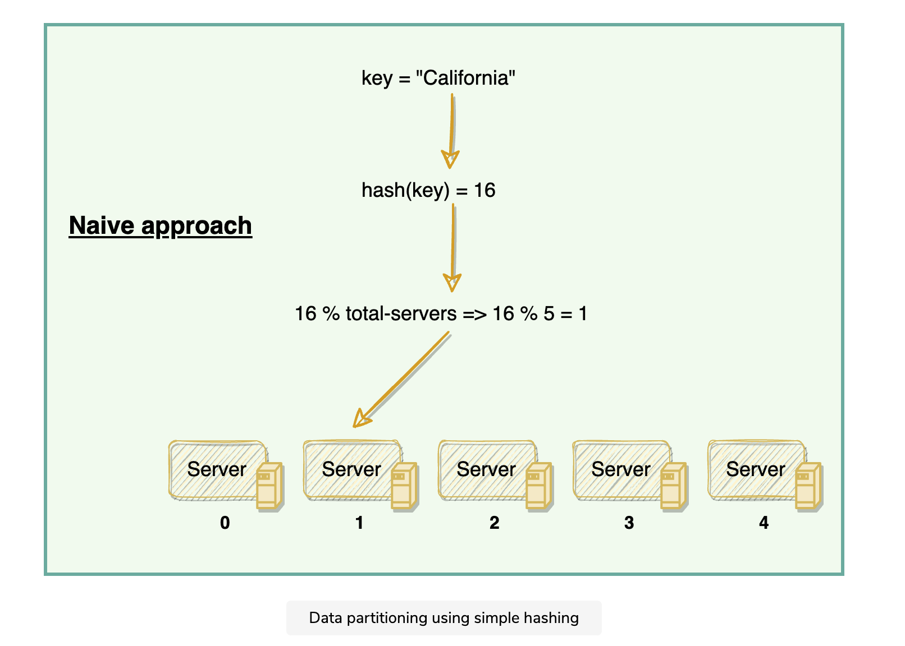
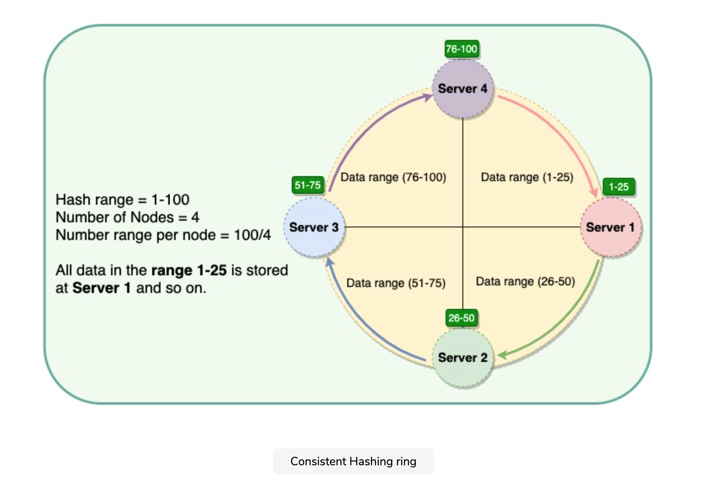
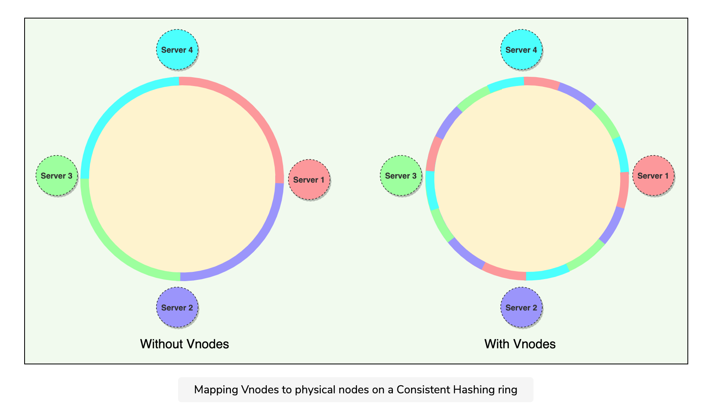
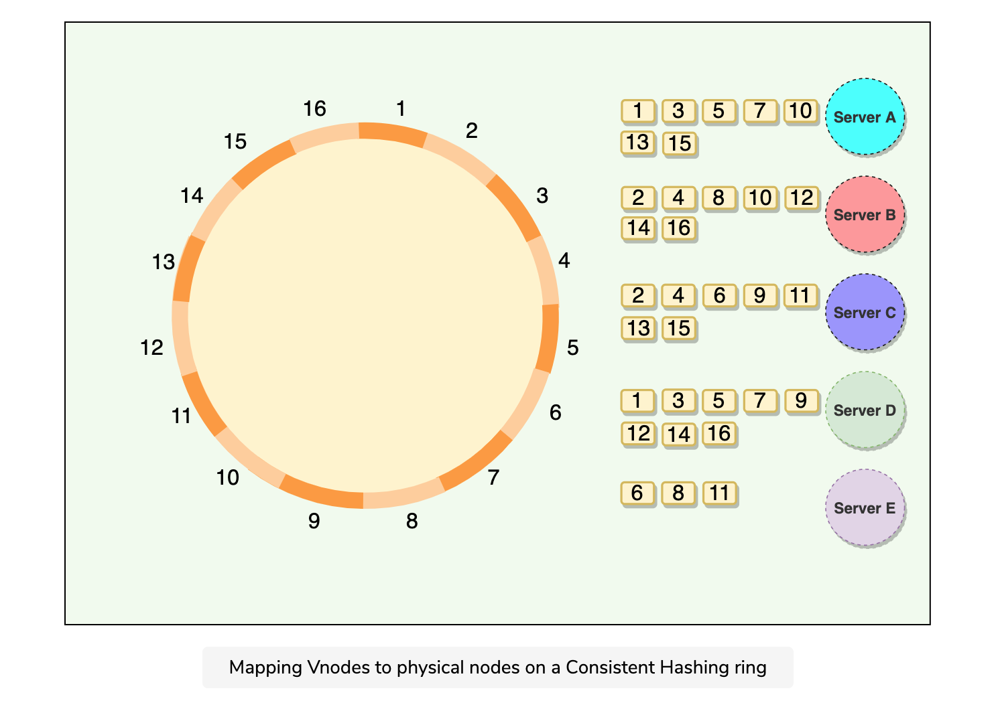

1. How do we know on which node a particular piece of data will be stored?
2. When we add or remove nodes, how do we know what data will be moved from existing nodes to the new nodes? Additionally, how can we minimize data movement when nodes join or leave?

The scheme described in the above diagram solves the problem of finding a server for storing/retrieving the data. But when we add or remove a server, all our existing mappings will be broken. This is because the total number of servers will be changed, which was used to find the actual server storing the data. So to get things working again, we have to **remap all the keys** and move our data based on the new server count, which will be a **complete mess!**

 Consistent Hashing maps data to physical nodes and ensures that **only a small set of keys move when servers are added or removed.**

The Consistent Hashing scheme described above works great when a node is added or removed from the ring, as in these cases, since only the next node is affected. For example, when a node is removed, the next node becomes responsible for all of the keys stored on the outgoing node. However, this scheme can **result in non-uniform data and load distribution**. This problem can be solved with the help of Virtual nodes.

- **Adding or removing nodes**: Adding or removing nodes will result in recomputing the tokens causing a significant administrative overhead for a large cluster.
- **Hotspots**: Since each node is assigned one large range, if the data is not evenly distributed, some nodes can become hotspots.
- **Node rebuilding**: Since each node’s data might be replicated (for fault-tolerance) on a fixed number of other nodes, when we need to rebuild a node, only its replica nodes can provide the data. This puts a lot of pressure on the replica nodes and can lead to service degradation.

nstead of assigning a single token to a node, the hash range is divided into multiple smaller ranges, and each physical node is assigned several of these smaller ranges. Each of these subranges is considered a **Vnode.** With Vnodes, instead of a node being responsible for just one token, it is responsible for many tokens (or subranges).

Practically, Vnodes are **randomly distributed** across the cluster and are generally **non-contiguous** so that no two neighboring Vnodes are assigned to the same physical node or rack. Additionally, nodes do carry replicas of other nodes for fault tolerance. Also, since there can be heterogeneous machines in the clusters, some servers might hold more Vnodes than others. The figure below shows how physical nodes A, B, C, D, & E use Vnodes of the Consistent Hash ring. Each physical node is assigned a set of Vnodes and each Vnode is replicated once.

### Advantages of Vnodes

Vnodes gives the following advantages:

1. As Vnodes **help spread the load more evenly across the physical nodes on the cluster by dividing the hash ranges into smaller subranges**, this speeds up the rebalancing process after adding or removing nodes. When a new node is added, it receives many Vnodes from the existing nodes to maintain a balanced cluster. Similarly, when a node needs to be rebuilt, instead of getting data from a fixed number of replicas, many nodes participate in the rebuild process.
2. Vnodes make it easier to maintain a cluster containing **heterogeneous machines**. This means, with Vnodes, we can assign a high number of sub-ranges to a powerful server and a lower number of sub-ranges to a less powerful server.
3. In contrast to one big range, since Vnodes help assign smaller ranges to each physical node, this **decreases the probability of hotspots.**

