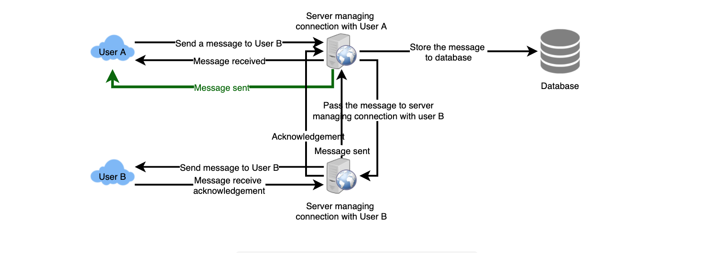

 基本需求

1. 单对单聊天
2. 聊天记录 persistent storage
3. 追踪用户的状态（online/offline）

额外需求：

1. 群聊
2. push notification

Non-funtional 需求：

1. minimum latency
2. highly consistent， 聊天记录保持consistent
3. availablity 可以做出让步

capacity估计

1 TB = 1000 GB = 1M MB = 1B KB

1 PB = 1000TB 估算

1 day = 86400 = 8 * 10 ^4 seconds

500M DAU * 40 messages/day = 20000M messages/day = 20B messages/day

20 billion messages * 100 bytes => 2 TB/day

2 TB * 365 days * 5 years ~= 3.6 PB

2 TB / 86400 sec ~= 25 MB/s

Service user cases:

1. 接受发送消息
2. 从数据库中读取，存放消息
3. 追踪用户的状态，并通知相关用户

Messages Handling

send messages： user connect to server and send the messages

receive messages: 

1. pull model: 用户periodcally 访问server来查看是否有新消息
2. push model: users can keep a connection open with server and can depend upon the server to notify them whenever there are new messgeas

pull model 的缺点就是为了minimize latency， 用户需要经常的检查是否有新消息，大多时候都是一个空的response. 造成很多的资源浪费

push model 就不会有这个缺点，相应的需要所有的active users 保持一个open connection to server

如何做到这一点：Long Polling， WebSockets

**How can the server keep track of all the opened connections to efficiently redirect messages to the users**

hash table. Key is UserID and Value is connection object

