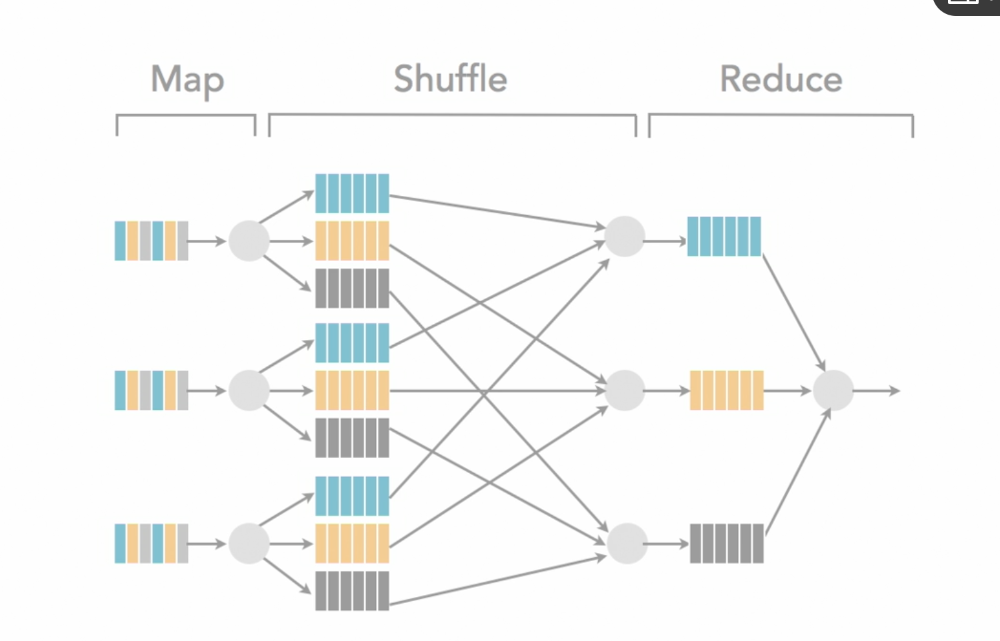

Hadoop 是一个分布式数据基础设施，它将巨大的数据集分派到一个由普通计算机组成的集群中的多个节点进行储存。Hadoop还会索引和追踪这些数据

Spark 是专门用来对分布式存贮的大数据进行处理的工具

Hadoop有hdfs来提供分布式存储的功能，还可以用mapreduce来处理数据，不是一定需要spark。但spark更加效率比起mapreduce

Hadoop is a alternative file system with a processing library 

RDBMS Limits

- Scalability- it is difficult and expensive to scale it to multi TB or single PB data size
- Speed 
- Queryability
- Sophisticated processing

Database Choices

- File System
  - HDFS
- Databases
  - NoSql(key/value, columnstore)
  - RDBMS

Hadoop and HBase

- Hadoop uses an alternative file system(HDFS)
- HBase is a NoSQL database(wide columnstore)
  - key to n values
  - 每条entry的column数是不固定的

CAP Theory

- Consistency
  - Transcaction
- Availability(up time)
- Partitioning
  - Scalability

You can only meet two of the CAP theory

RDBMS have consistency and availability, but having some difficulty  in scalability

**Why?** 去ddia里找一下

Hadoop fit in availability and partitioning

What kinds of Data for Hadoop?

Behavioral Data. The data will be batch processed instead of query individually. 

通常这些数据是需要做一个处理的，像fitbit的数据，丢失一些无所谓，需要整个aggregate以后才有意义

What is Hadoop

- HDFS
- processing API: MapReduce
- Other projects: HBase, Hive, Pig, etc

HDFS- accounts for large chuking of the data and tripple replication by default

Cloud file systems: AWS S3, Azure BLOB

## MapReduce

### Map

execute the Map() function on data, execute on each node(bring the compute to the data), output <key, value> pair on each node

### Reduce

Execute on some node, aggregate sets of <key, value> pairs on some nodes, output a single combined list

