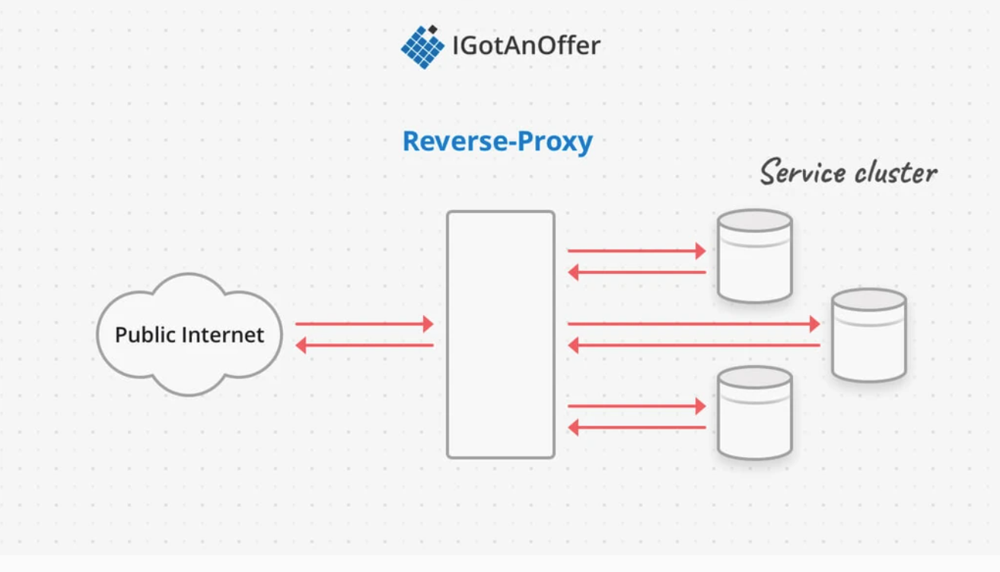

### 分布式系统的Reliability和Availability区别

Reliablity 可靠性， Availiability 可用性

Reliability定义为一个服务连续无故障运行的时间，无故障运行的时间越长，可靠性就越高。

Availiability定义为在足够长的时间里，比如一年的时间里，一个服务可用的时间，服务可用时间越长越好。一般用可服务时间除于总时间算出一个百分比，用百分比作为度量。比如一个服务如果有5个9的可用性，指的就是一年里99.999%时间里服务都是可用的。

1. 假想一个服务，可靠性很高，平均来说可以稳定运行10年，但是一旦服务中断，要用一年的时间来恢复，那么它的可用性只有90%。
2. 假想另一个服务，可靠性很差，运行10秒就会宕机，但是恢复服务只需要1ms, 那么它的可用性是99.99%

提高可用性：

1. 提高可靠性
2. 减少恢复时间

# Metrics

### **Latency**

### **Throughput**

### **Availability**

# Load Balancing

### **Advantages of load balancing**

- **Enable horizontal scaling:** spinning up multiple instances of a service is not possible without a load balancer directing traffic efficiently to the cluster. 
- **Dynamic scaling**: it's possible to seamlessly add and remove servers to respond to load.
- **Abstraction**: the end user only needs to know the address of the load balancer, not the address of every server in the cluster.
- **Throughput**: service availability and response time are unaffected by overall traffic.
- **Redundancy**: distributing load over a cluster means no one server is a single point of failure. Note that the load balancer itself must also not become a single point of failure.
- **Continuous deployment**: it's possible to roll out software updates without taking the whole service down, by using the load balancer to take out one machine at a time.

https://igotanoffer.com/blogs/tech/load-balancing-system-design-interview

[WebSockets and Load Balancers: How to Use Them](https://www.zibtek.com/blog/websockets-and-load-balancers-how-to-use-them/)

# Network protocols and proxies

## Networking Models

### **TCP/IP Model**

**TCP/IP**, also known as the **Internet Protocol Suite** is one of the oldest networking models and greatly influenced the development of the internet as we know it. It’s named after its two primary protocols, TCP and IP. This model has four layers and associated protocols that define the abstraction:

1. **Link Layer:** protocols relevant to a local network, called a “link” or “IP network”. These computers are physically wired on the same network and don’t need a router to communicate, e.g. MAC addresses
2. **Internet Layer:** protocols relevant to connecting different IP networks, e.g. IPv6
3. **Transport Layer:** protocols for direct communication channels over the internet, e.g. TCP
4. **Application Layer:** protocols relevant to applications sending data to and from users over the internet, e.g. HTTP

#### **OSI Model**

The **Open Systems Interconnection model (OSI model)** is a well established model of the internet that is a useful conceptual tool. It has 7 layers, which allows more specificity when talking about networking than with the TCP/IP model. OSI doesn’t specify protocols, and many popular protocols don’t fit in one or more of its layers:

- **Physical Layer:** transmission of raw data on hardware. e.g. Ethernet
- **Data Link Layer:** establishing connection for data transfer between computers in the same physical network, e.g. MAC addresses
- **Network Layer:** establishing connection for data transfer in packets between computers in different networks. e.g. IP 
- **Transport Layer:** transferring data with reliable quality. e.g. TCP
- **Session Layer:** managing data transfer sessions between computers. 
- **Presentation Layer:** translating lower layer data formats for use by the application layer.
- **Application Layer:** application-enabling functionality. e.g. HTTP

## Protocols

#### **IP**

The **Internet Protocol** (**IP)** is the key protocol that allows **computers in different physical networks to communicate with each other**. It’s defined in the Internet Layer of the TCP/IP model, and corresponds to approximately Layer 3 of the OSI model.

IP defines and works with the fundamental data unit of a **packet.** It also provides addressing, in the form of **IP addresses**, so packets can be correctly routed from their source to destination.

**An IP packet consists of a header and some data**. The IP header contains information including the source and destination address. The data is formatted and contains whatever is useful for the next layers.

#### **TCP**

The **Transport Control Protocol** (**TCP)** manages **reliability** of data transferred with IP. TCP is defined in the Transport layer of the TCP/IP model, and corresponds to approximately Layer 4 of the OSI model.

TCP works by first **establishing a connection between the client and server**, and then transferring data. It builds on IP to add **guarantees that data messages are delivered reliably, in order, and checked for errors**.

If the application needs faster data transfer and doesn’t require a confirmed connection it can use the similar **User Datagram Protocol (UDP)** instead. UDP works at the same layer as TCP, but **has no guarantees about data delivery or ordering, which works well for situations like broadcasting.**

TCP is a fast and reliable protocol, and as such many other protocols build off of it, like TLS encryption and WebSockets. 

[TCP VS UDP](https://aonecode.com/getArticle/11)

#### **HTTP**

The **Hypertext Transport Protocol (HTTP)** allows applications to **view and modify data** over the network. HTTP corresponds to the Application layer of the TCP/IP model, and Layer 7 of the OSI model.

To use HTTP, and it’s secure variant HTTPS, a client makes a coded **request** to a server which sends back a coded **response.** HTTP requests and responses are divided into the **header** which contains metadata about the request and the **body** which contains data in some specified format (e.g. JSON).

HTTP uses **uniform resource identifiers (urls)** for users to specify what data they’re trying to access. For example, you’ll type in `[http://igotanoffer.com](http://igotanoffer.com/)` to make a request from your computer to view our website, which is made of HTML, CSS, and JavaScript files, hosted on our servers.

The codes included in HTTP requests and responses convey information about the kind of request or response. **HTTP methods (verbs)** specify what kind of request is being made. We won’t list [all 9 methods](https://en.wikipedia.org/wiki/Hypertext_Transfer_Protocol#Request_methods) here, but the key ones to know are:

- **GET - a request to read data**
- POST - a request to **create** the data in the body
- PUT - a request to **create or update** data at a specified url with the data in the body
- DELETE - a request to delete the data at the specified url
- OPTIONS - a request for a listing of the HTTP methods a server supports

**HTTP status codes** that indicate what kind of response has been sent back. They are 3 digit codes that are grouped by the first number in the code. [Each code](https://en.wikipedia.org/wiki/List_of_HTTP_status_codes) has a corresponding “reason phrase” to make human interpretation easier.

- **1XX** - informational response e.g. `102 Processing`

- **2XX** - successful response e.g. `200 OK`

  - 200 - ok

    201 - created

- **3XX** - redirection response e.g. `302 Found`

- **4XX** - client error response e.g. `404 Not Found`

  - 400 - bad request

    401 - unauthorized

    403 - forbidden

    404 - not found

- **5XX** - server error response e.g. `500 Internal Server Error`

https://developer.mozilla.org/en-US/docs/Web/HTTP/Status

Other features of HTTP include sessions, which can be established and maintained either server side, or client side with **HTTP cookies.** HTTP also supports authentication in a variety of ways. 

## Proxies

A proxy is a server that sits between a client and application server to provide **some intermediary service to the communication**. There are two kinds of proxies that provide different services: forward proxies and reverse proxies.

### **Forward Proxies**

A forward proxy sits between a pool of clients and the public internet. The goal of a forward proxy is to protect the particular client pool by filtering outgoing requests and incoming responses.

The common use cases for forward proxies are:

- Enforcing “terms of use” on a network
- Blocking malicious websites
- Anonymizing network traffic by using the IP address of the proxy instead of the client

For example, a school network might decide to block requests going out to certain social media websites. Alternatively a business network might try to mitigate phishing attacks by not allowing employee requests to known malicious domain names. 

### **Reverse Proxies**

A reverse proxy sits between the public internet and a pool of servers. Because of their location in the system as an intermediary, reverse proxies can provide a number of services, including:

- Anonymizing the cluster servers
- SSL termination
  - **SSL** 终结**是**指在将加密流量传递给Web 服务器之前对其进行解密的过程。
- Load balancing
- Caching
- Filtering requests
- Attack prevention (e.g. DOS detection)

For example, if a company wanted to expose a public API for querying data, but not modifying it, they could filter out any requests that used an HTTP verb other than GET before passing the requests on to the servers that actually process and generate the responses.

As another example, a service could use a reverse proxy to handle TLS termination (the description of HTTPS requests) so that the application servers don’t have to handle encryption/decryption. The proxy would then pass on the requests to the servers within a private network so the communication is still secure. 

# Load Balancing

## GSLB

Global server load balancing

DNS-based load balancing feature provided by Torbit.

How load balancer will help us achieve high throughput and availablity

When domain name is hit request is transferred to one of the VIP's registered in DNS for our domain name. VIP is resolved to a load balancer device, which has a knowledge of FrontEnd hosts.

API Gateway - rate limiting, OAuth checks

# Api gateway

## rate limiting

1. 

# Database

### [Sql Or NoSql，看完这一篇你就懂了](https://www.cnblogs.com/xrq730/p/11039384.html)

a **database** is responsible for the **storage and retrieval** of data for an application

## **Database Basics**

### **CAP Theorem**

The **CAP Theorem** says that any distributed database can only satisfy two of the three features: 

- **Consistency**: every node responds with the most recent version of the data
- **Availability**: any node can send a response 
- **Partition Tolerance**: the system continues working even if communication between any of the nodes is broken

### **Transactions**

A transaction is a series of database operations that are considered to be a "**single unit of work**". The operations in a transaction either all succeed, or they all fail. In this way, the notion of a transaction supports data integrity when part of a system fails. This is formalized in the "ACID" properties:

- **Atomicity** - all operations succeed or fail together, i.e. the transaction is an "atomic" unit
- **Consistency** - a successful transaction places the database in a valid state, that is, no schema violations
- **Isolation** - transactions can be executed concurrently 
- **Durability** - a "committed" transaction is persisted to memory

**Usually relational databases do support ACID transactions, and non-relational databases don’t.**

### **Schemas**

The role of a **schema** is to define the shape of a data structure, and specify what kinds of data can go where. In databases specifically, a schema can specify database-level structures like tables and indexes, and also data-level constraints like field types (string, boolean, reference, etc.)

Schemas can be strictly enforced across the entire database, loosely enforced on part of the database, or they might not exist at all. There can be one schema for the entire database, or different entries can have different schemas. As we'll see below, all of these variations can be valuable in different use cases.

The advantage of a schema when strictly enforced, **is that it is safe to assume that any queries to the system will return data that conforms to the schema assumptions**. As nice as these guarantees can be, they have some major drawbacks:

- **Computationally expensive**: to enforce a schema, the schema properties have to be confirmed on every, write, update, and delete. 
- **Difficult to scale**: especially if the schema specifies how data entries can reference each other, maintaining these constraints becomes more difficult as the reference span clusters and schema rules need to be verified across the network.

The last important feature of databases we’ll talk about before jumping into specific models is scaling - how to respond to increasing database demands in a system.

### **Scaling** 

It is more important than ever to be able to implement databases in distributed clusters as dataset sizes continue to grow. Different databases are better and worse at scaling because of the features they provide. There are two kinds of scaling: 

- **Vertical Scaling**: adding compute (CPU) and memory (RAM, Disk, SSD) resources to a single computer.
- **Horizontal Scaling**: adding more computers to a cluster

Vertical scaling is fairly straightforward, but has much lower overall memory capacity. Horizontal scaling on the other hand has much higher overall compute and storage capacity, and can be sized dynamically without downtime. The big drawback is that relational databases, the most popular database model, struggle to scale horizontally.

There are many techniques to scale a relational database: **master-slave replication**, **master-master replication**, **federation**, **sharding**, **denormalization**, and **SQL tuning**.

#### Master-slave replication

The master serves reads and writes, replicating writes to one or more slaves, which serve only reads. Slaves can also replicate to additional slaves in a tree-like fashion. If the master goes offline, the system can continue to operate in read-only mode until a slave is promoted to a master or a new master is provisioned.

*[Source: Scalability, availability, stability, patterns](http://www.slideshare.net/jboner/scalability-availability-stability-patterns/)*

##### Disadvantage(s): master-slave replication

- Additional logic is needed to promote a slave to a master.
- See [Disadvantage(s): replication](https://github.com/donnemartin/system-design-primer#disadvantages-replication) for points related to **both** master-slave and master-master.

#### Master-master replication

Both masters serve reads and writes and coordinate with each other on writes. If either master goes down, the system can continue to operate with both reads and writes.

*[Source: Scalability, availability, stability, patterns](http://www.slideshare.net/jboner/scalability-availability-stability-patterns/)*

##### Disadvantage(s): master-master replication

- You'll need a load balancer or you'll need to make changes to your application logic to determine where to write.
- Most master-master systems are either loosely consistent (violating ACID) or have increased write latency due to synchronization.
- Conflict resolution comes more into play as more write nodes are added and as latency increases.
- See [Disadvantage(s): replication](https://github.com/donnemartin/system-design-primer#disadvantages-replication) for points related to **both** master-slave and master-master.

##### Disadvantage(s): replication

- There is a **potential for loss of data** if the master fails before any newly written data can be replicated to other nodes.
- Writes are replayed to the read replicas. If there are a lot of writes, the read replicas can get bogged down with replaying writes and can't do as many reads.
- The more read slaves, the more you have to replicate, which leads to greater replication lag.
- On some systems, writing to the master can spawn multiple threads to write in parallel, whereas read replicas only support writing sequentially with a single thread.
- Replication adds more hardware and additional complexity.

#### Federation

*[Source: Scaling up to your first 10 million users](https://www.youtube.com/watch?v=kKjm4ehYiMs)*

Federation (or functional partitioning) splits up databases by function. For example, instead of a single, monolithic database, you could have three databases: **forums**, **users**, and **products**, resulting in less read and write traffic to each database and therefore less replication lag. Smaller databases result in more data that can fit in memory, which in turn results in more cache hits due to improved cache locality. With no single central master serializing writes you can write in parallel, increasing throughput.

##### Disadvantage(s): federation

- Federation is not effective if your schema requires huge functions or tables.
- You'll need to update your application logic to determine which database to read and write.
- Joining data from two databases is more complex with a [server link](http://stackoverflow.com/questions/5145637/querying-data-by-joining-two-tables-in-two-database-on-different-servers).
- Federation adds more hardware and additional complexity.

#### Sharding

*[Source: Scalability, availability, stability, patterns](http://www.slideshare.net/jboner/scalability-availability-stability-patterns/)*

Sharding distributes data across different databases such that each database can only manage a subset of the data. Taking a users database as an example, as the number of users increases, more shards are added to the cluster.

Similar to the advantages of [federation](https://github.com/donnemartin/system-design-primer#federation), sharding results in less read and write traffic, less replication, and more cache hits. Index size is also reduced, which generally improves performance with faster queries. If one shard goes down, the other shards are still operational, although you'll want to add some form of replication to avoid data loss. Like federation, there is no single central master serializing writes, allowing you to write in parallel with increased throughput.

Common ways to shard a table of users is either through the user's last name initial or the user's geographic location.

##### Disadvantage(s): sharding

- You'll need to update your application logic to work with shards, which could result in complex SQL queries.
- Data distribution can become lopsided in a shard. For example, a set of power users on a shard could result in increased load to that shard compared to others.
  - Rebalancing adds additional complexity. A sharding function based on [consistent hashing](http://www.paperplanes.de/2011/12/9/the-magic-of-consistent-hashing.html) can reduce the amount of transferred data.
- Joining data from multiple shards is more complex.
- Sharding adds more hardware and additional complexity.

#### Denormalization

Denormalization attempts to improve read performance at the expense of some write performance. Redundant copies of the data are written in multiple tables to avoid expensive joins. Some RDBMS such as [PostgreSQL](https://en.wikipedia.org/wiki/PostgreSQL) and Oracle support [materialized views](https://en.wikipedia.org/wiki/Materialized_view) which handle the work of storing redundant information and keeping redundant copies consistent.

Once data becomes distributed with techniques such as [federation](https://github.com/donnemartin/system-design-primer#federation) and [sharding](https://github.com/donnemartin/system-design-primer#sharding), managing joins across data centers further increases complexity. Denormalization might circumvent the need for such complex joins.

In most systems, reads can heavily outnumber writes 100:1 or even 1000:1. A read resulting in a complex database join can be very expensive, spending a significant amount of time on disk operations.

##### Disadvantage(s): denormalization

- Data is duplicated.
- Constraints can help redundant copies of information stay in sync, which increases complexity of the database design.
- A denormalized database under heavy write load might perform worse than its normalized counterpart.

## Sql vs NoSql(what to choose)

whether your data is inherently relational and whether you would benefit from being able to do relational queries. In this case I think being able to quickly get all of the photos for a particular user that's a thing you would have to do on a very regular basis and hat is inherently serve relational query pattern.

https://www.youtube.com/watch?v=xQnIN9bW0og&t=142s

#### Key-value store

Key-value stores provide **high performance and are often used for simple data models** or for rapidly-changing data, such as an in-memory cache layer. Since they offer only a limited set of operations, complexity is shifted to the application layer if additional operations are needed.

- [Redis architecture](http://qnimate.com/overview-of-redis-architecture/)
- [Memcached architecture](https://www.adayinthelifeof.nl/2011/02/06/memcache-internals/)

#### Document store

A document store is centered around documents (XML, JSON, binary, etc), where a document stores all information for a given object. Document **stores provide APIs or a query language to query based on the internal structure of the document itself.** 

Document stores provide high flexibility and are often used for working with occasionally changing data.

Some document stores like [MongoDB](https://www.mongodb.com/mongodb-architecture) and [CouchDB](https://blog.couchdb.org/2016/08/01/couchdb-2-0-architecture/) also provide a SQL-like language to perform complex queries. [DynamoDB](http://www.read.seas.harvard.edu/~kohler/class/cs239-w08/decandia07dynamo.pdf) supports both key-values and documents.

#### Wide column store

A wide column store's basic unit of data is a column (name/value pair). A column can be grouped in column families (analogous to a SQL table). Super column families further group column families. You can access each column independently with a row key, and columns with the same row key form a row. Each value contains a timestamp for versioning and for conflict resolution.

Wide column stores offer high availability and high scalability. They are often used for very large data sets.

# Data Storage

https://towardsdatascience.com/choosing-the-right-database-in-a-system-design-interview-b8af9c6dc525

## CDN(Content Delivery Network)

CDNs are a kind of cache that comes into play for sites servin**g large amounts of static media**. In a typical CDN setup, a request will first ask the CDN for a piece of static media; the CDN will serve that content if it has it locally available. If it isn’t available, the CDN will query the back-end servers for the file, cache it locally, and serve it to the requesting user.

If the system we are building is not large enough to have its own CDN, we can ease a future transition by serving the static media off a separate subdomain (e.g., [static.yourservice.com](http://static.yourservice.com/)) using a lightweight HTTP server like Nginx, and cut-over the DNS from your servers to a CDN later.

## Cache

Caching is based on the **principle of locality**, which means that programs repeatedly access data located close to each other. There are two kinds of locality:

- **Temporal locality**, where data that has been referenced recently is likely to be referenced again (i.e. *time-based* locality).
- **Spatial locality**, where data that is stored near recently referenced data is also likely to be referenced (i.e. *space-based* locality).

### **When not to use caching**

- Caching doesn’t work as well when requests have **low repetition (higher randomness)**, because caching performance comes from repeated memory access patterns. 
- Caching isn’t helpful when the **data changes frequently**, as the cached version gets out of sync and the primary data store must be accessed every time. 

### Cache performance

1. Data is located the fastest in a cache if it’s mapped to a single cache entry, which is called a **direct-mapped cache**.But if too many pieces of data are mapped to the same location, the resulting **contention** increases the number of cache misses because relevant data is replaced too soon. 
2. The widely accepted solution is to use a **set-associative cache** design.Each piece of data is mapped to a set of cache entries, which are all checked to determine a cache hit or miss. This is slightly slower than only having to check a single entry, but **gives flexibility around choosing what data to keep in the cache**. 

### Cache Writing Policies

**write-behind cache**: **writes first to the cache**, and then to the primary datastore. We will tagged the updated data with a dirty bit to keep track that the data is out of sync. The data is not persisted until the cache entry is replaced. 

**pros:** fast

**cons:** There may be a **data loss** for this method

**write-around cache**: the application writes **directly to the primary datastore** and the cache checks with the primary datastore to keep the cached data valid. 

**pros**: the write doesn’t have to wait on two systems being updated and the primary datastore is always up to date. 

**cons**:the cache might be behind, if the application is accessing the newest data

**write-through cache**: **updates both the cache data and the backing data at the same time**.

**pros**:If the cache layer fails, then the update isn’t lost because it’s been persisted

**cons**:the write takes longer to succeed because it needs to update the slower memory.

### Cache replacement policies

**LRU - least recently used**

LRU-based algorithms are well suited for applications where the oldest data are the least likely to be used again. For example, a local news outlet where users mostly access today’s news could use a CDN with LRU replacement to make today’s news faster to load. After that day has passed, it becomes less likely that the news article is accessed again, so it can be freed from the cache to make space for the next day’s news. 

**LFU - least frequently used**

For example, an encyclopedia-like service could have certain articles that are popular (e.g. about celebrities) and others that are more obscure.

### **Expiration policies**

In distributed systems there is often an explicit **expiration policy** or **retention policy** for making sure there is always space in the cache for new data. This parameter specifies an amount of time after which a resource is freed if it hasn’t been used, called the **Time To Live (TTL)**.

Finding the right TTL is one way to optimize a caching layer. Sometimes explicit removal policies are **event-driven**, for example freeing an entry when it is written to. 

### **Distributed cache** 

A **private** cache exists in the memory of each application computer in the service cluster. Since each machine stores its own cache, the cached data will get out of sync based on what requests have been directed to that machine, and at what time.

A **shared** cache exists in an isolated layer. In fact, the application might not be aware that there’s a cache. This allows the cache layer and application layer to be scaled independently, and for many different types of application services to use the same cache.

Private and shared caches can be used together, just like CPU architectures have different levels of caching. The private cache can also be a fallback that retains the advantages of caching in case the shared cache layer fails.

https://igotanoffer.com/blogs/tech/caching-system-design-interview

常见技术：

Redis, Memcached

