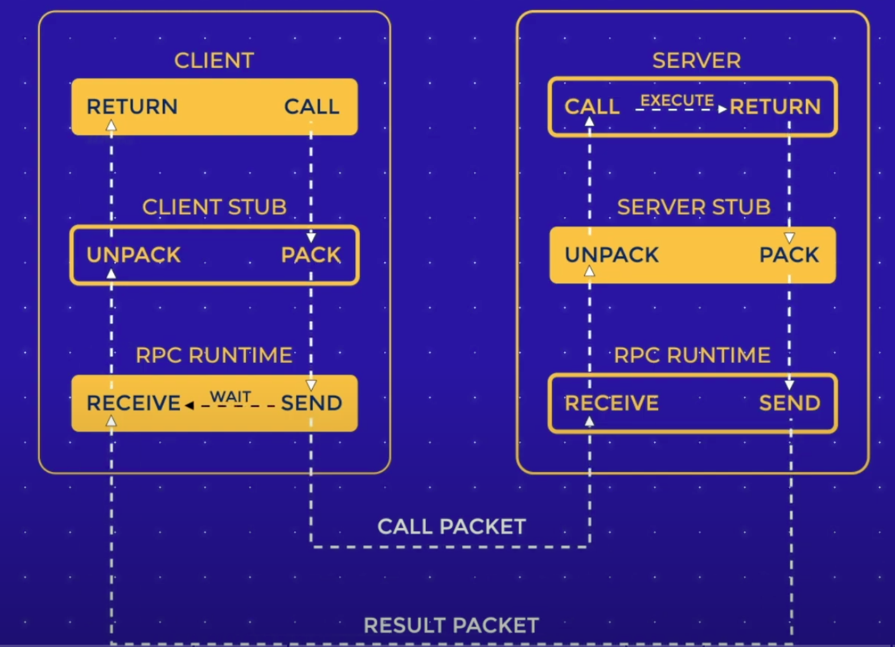

### SOAP

Simple Object Access Protocol. It is an XML-based messaging protocol for exchaning information among computers.

soap ws security extension encrypts a message and puts a lock on it, so only a recipient with a security token is able to pass authentication and access the body

soap operations can achain messages to keep the server aware of the previous requests. It is necessary for complex transcation when multiple parties invloved.

cons: verbose with its xml messge structure and inflexibility

REST

Representational state transfer

Resource based, keeps verbs to minimum, using http methods(get, post, delete, put)

Uniform Interface, Client-server, Stateless, cacheable, Layered System, Code on Demand

GraphQL

Rest: multiple endpoints, server decides how data is returned, shcemaless

Single endpoint, client decides how data is returned, schemaful

RPC

Remote Procesure Call

Short lightweight messages goes easy on the network

Authentication

token

session / web 和app的不同之处

Reference:

https://www.youtube.com/watch?v=NFw0HznpLlM