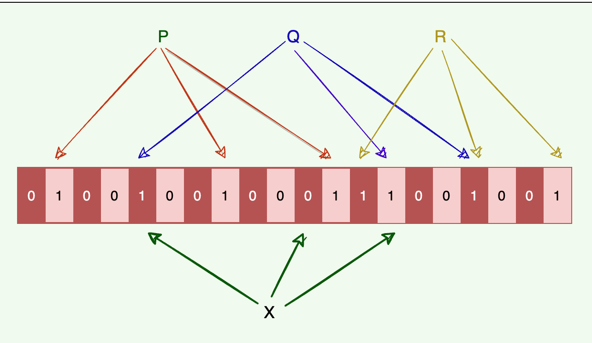

what Bloom filter can do ?

Bloom filter tells whether an element **may be in a set or definitly not in a set**

实现原理

Bloom filter 由一个bit-array 和 k个不同的hash function 组成， 这些hash funciton会将一个element map到这个array中的一个bit上

我们添加一个element的时候，用这k个hash function 来计算hash值，然后把对应的bit给设为1。这时候当我们来check一个element是否在存在的时候，如果k个hash function计算出来的bit 有不为1的，那肯定是不存在的。但所有都是1，还是有可能不存在

