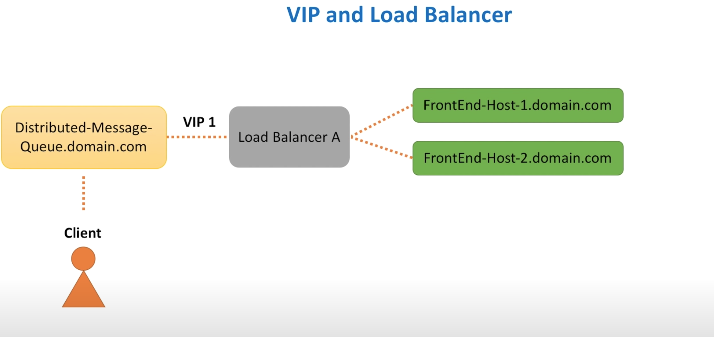
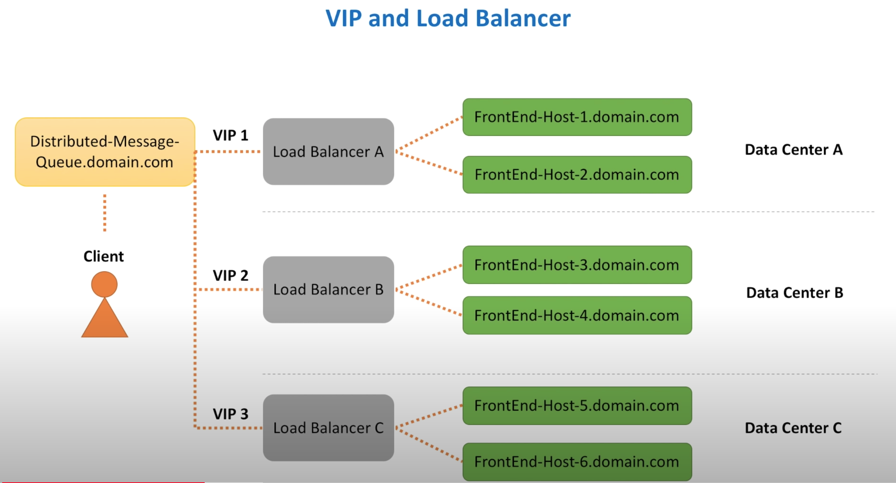
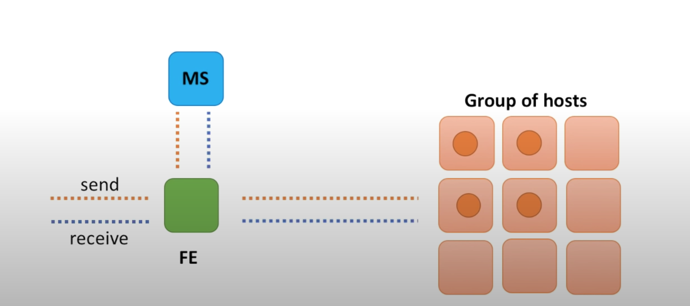

### Why message queue:

**Synchronous communication** 

advantage

easier and faster to implement

disadvantage:

1. hard to deal with consumer failure
2. need to think not to overwhelm consumer with too many request
3. how to deal with a slow consumer service host

**Message Queue** to implement asynchronous communication

### Requirements

Funtional 

- sendMessage(messageBody)
- receiveMessage()

Non-funtional

- Scalable(handles load increases, more queues and messages)
- Highly Available(survives hardware/ network failures)
- Highly Performant(single digit latency for main operations)
- Durable(onced submitted, data never lost)

VIP and Load Balancer

How Load Balancer avoid single point failure?

We can use the concept of Primay and secondary node. The primary node accepts connections and serves request while the secondary node monitors primary. If the primary node cannot accept the request, then the secondary can take over.

How load Balancer scale up?

We can use a concept of multiple VIPS(VIP partitioning). In DNS, we assign multiple A records to the same DNS name for the service. Requests are partitioned across several load balancers. And by spreading load balancers across several data centers, we improve both availablity and performance.

### BackEnd Service

Where and how do we store messges?

We can use Database, but it seems that database may not be the best options. Since the distributed message queue needs to handle a high throughput. If we choice database as the options. It will turn to be design a database that can hanlde high throughput or if such database exists.

Ram and a local disk of a backend host

------

How do we replicate data?

Replicate within a group of hosts.

How does FrontEnd select a backend host to send data to ? How does FrontEnd know where to retrieve data from?

Metadata service

