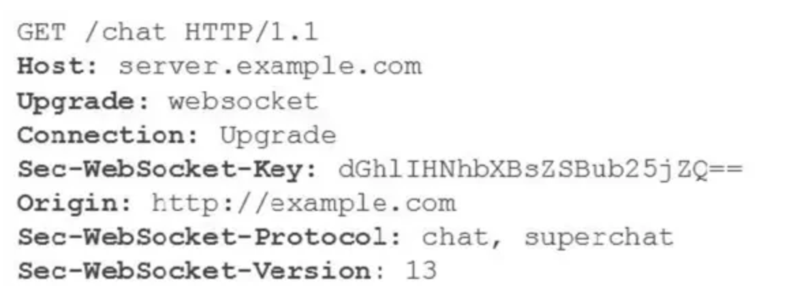

## Http 短连接和长链接

**短连接**：每次Http请求都会建立Tcp连接，管理容易

**长连接**：只需要建立一次Tcp连接，以后Http请求重复使用同一个Tcp连接，管理难

HTTP1.1规定了默认保持长连接（HTTP persistent connection ，也有翻译为持久连接），数据传输完成了保持TCP连接不断开（不发RST包、不四次挥手），等待在同域名下继续用这个通道传输数据；相反的就是短连接

**如何避免资源浪费？** 

timeout， 如果服务器没有告诉客户端超时时间也没关系，服务端可能主动发起四次挥手断开TCP连接，客户端能够知道该TCP连接已经无效；另外TCP还有心跳包来检测当前连接是否还活着，方法很多，避免浪费资源。

**client和server之间的连接太多咋办？**

在长连接的应用场景下，client端一般不会主动关闭它们之间的连接，Client与server之间的连接如果一直不关闭的话，会存在一个问题，随着客户端连接越来越多，server早晚有扛不住的时候，这时候server端需要采取一些策略，如**关闭一些长时间没有读写事件发生的连接，这样可以避免一些恶意连接导致server端服务受损**；如果条件再允许就可以以客户端机器为颗粒度，**限制每个客户端的最大长连接数**，这样可以完全避免某个蛋疼的客户端连累后端服务。

**应用场景**

一般长连接（追求实时性高的场景）用于少数client-end to server-end的频繁的通信，例如：数据库的连接用长连接， 如果用短连接频繁的通信会造成socket错误，而且频繁的socket 创建也是对资源的浪费。
而像WEB网站的http服务一般都用短链接（追求资源易回收场景），因为长连接对于服务端来说会耗费一定的资源，而像WEB网站这么频繁的成千上万甚至上亿客户端的连接用短连接会更省一些资源。

**和短轮询长轮询有啥区别**

和短连接和长连接有本质区别。长、短连接是**客户端与服务端建立和保持TCP连接的机制**；而长、短轮询是**指客户端请求服务端，服务端给予应答的方式**

## WebSockets

轮询和长轮询都是使用普通的HTTP协议传输数据，它只允许client单方面发起请求，然后server进行响应，而不能主动给client发送数据。

WebSocket协议是HTML5定义的一种新协议，它实现了浏览器与服务器全双工通信(full-duplex)。

webosocket使用HTTP请求握手，握手之后，就不再使用HTTP请求，可以在client与server之间进行数据交换时避免反复传输http headers。

WebSocket 和长短连接时对应的概念

**advantage：full duplex， lower overhead， facilitating real-time data transfer from and to the server，** 

### WebSocket和HTTP长连接区别

- HTTP1.1通过使用Connection:keep-alive进行长连接，HTTP 1.1默认进行持久连接。在一次 TCP 连接中可以完成多个 HTTP 请求，但是对每个请求仍然要单独发 header，Keep-Alive不会永久保持连接，它有一个保持时间，可以在不同的服务器软件（如Apache）中设定这个时间。
- websocket的长连接，是一个`真的全双工`，第一次tcp链路建立之后，后续数据可以双方都进行发送，不需要发送请求头，并且这个连接会持续存在直到客户端或者服务器端的某一方主动关闭连接，`与HTTP长连接不同，WebSocket可以更灵活的控制连接关闭的时机，而不是HTTP协议的Keep-Alive一到，服务端立马就关闭（这样很不人性化）`。

为了建立一个WebSocket连接，客户端浏览器首先要向服务器发起一个HTTP请求，这个请求和通常的HTTP请求不同，包含了一些附加头信息，其中附加头信息“Upgrade: WebSocket”表明这是一个申请协议升级的HTTP请求。服务器端解析这些附加的头信息，然后生成应答信息返回给客户端，客户端和服务器端的WebSocket连接就建立起来了，双方可以通过这个连接通道自由地传递信息，并且这个连接会持续存在直到客户端或者服务器端的某一方主动关闭连接。

请求消息中的“Sec-WebSocket-Key”是随机的，服务器端会用这些数据来构造出一个SHA-1的信息摘要，把“Sec-WebSocket-Key”加上一个魔幻字符串“258EAFA5-E914- 47DA-95CA-C5AB0DC85B11”。使用SHA-1加密，然后进行BASE-64编码，将结果做为“Sec-WebSocket-Accept”头的值，返回给客户端。

### Server-Sent Events

**SSE 的本质**

严格地说，[HTTP 协议](https://www.ruanyifeng.com/blog/2016/08/http.html)无法做到服务器主动推送信息。但是，有一种变通方法，就是服务器向客户端声明，接下来要发送的是流信息（streaming）。也就是说，发送的不是一次性的数据包，而是一个**数据流**，会连续不断地发送过来。这时，**客户端不会关闭连接，会一直等着服务器发过来的新的数据流，视频播放就是这样的例子**。本质上，这种通信就是以流信息的方式，完成一次用时很长的下载。SSE 就是利用这种机制，使用流信息向浏览器推送信息。它基于 HTTP 协议，目前除了 IE/Edge，其他浏览器都支持。

**SSE和websocket的区别**

SSE 与 WebSocket 作用相似，都是建立浏览器与服务器之间的通信渠道，然后服务器向浏览器推送信息。

总体来说，WebSocket 更强大和灵活。因为它是全双工通道，可以双向通信；SSE 是单向通道，只能服务器向浏览器发送，因为流信息本质上就是下载。如果浏览器向服务器发送信息，就变成了另一次 HTTP 请求。

SSE 也有自己的优点。

- SSE 使用 HTTP 协议，现有的服务器软件都支持。WebSocket 是一个独立协议。
- SSE 属于轻量级，使用简单；WebSocket 协议相对复杂。
- SSE 默认支持断线重连，WebSocket 需要自己实现。
- SSE 一般只用来传送文本，二进制数据需要编码后传送，WebSocket 默认支持传送二进制数据。
- SSE 支持自定义发送的消息类型。

Under SSEs the client establishes a persistent and long-term connection with the server

server可以发送消息给client，但client需要通过其他的protocol来发送消息给server

1. Client requests data from a server using regular HTTP.
2. The requested webpage opens a connection to the server.
3. The server sends the data to the client whenever there’s new information available.

**SSEs are best when we need real-time traffic from the server to the client or if the server is generating data in a loop and will be sending multiple events to the client.**

## 通信方式

下面这两种polling都是基于http 短连接的

### Ajax Polling

传统轮询，间隔一段时间就发一个request给server，如果没有data 就返回一个空的response

优点： 实现起来简单

缺点很明显：程序每发出一次请求就要新建一个Http请求。因为发起Http请求时会有很多头部信息，真正的请求信息几乎很少，这样就会造成资源浪费， HTTP overhead

### HTTP Long-Polling

而长轮询意味着浏览器只需启动一个HTTP请求，其连接的服务器会“hold”住此次连接，直到有新消息才返回响应信息并关闭连接，客户端处理完响应信息后再向服务器发送新的Http请求,以此类推。（其实还是**http 短连接**）

轮询可能在以下3种情况时终止。

> - 有新数据推送 。当服务器向浏览器推送信息后，应该主动结束程序运行从而让连接断开，这样浏览器才能及时收到数据。
> - 没有新数据推送 。**应该设定一个最长时限，避免WEB服务器超时（Timeout），若一直没有新信息，服务器应主动向浏览器发送本次轮询无新信息的正常响应，并断开连接，这也被称为“心跳”信息**。
> - 网络故障或异常 。由于网络故障等因素造成的请求超时或出错也可能导致轮询的意外中断，此时浏览器将收到错误信息。

- 服务器端会阻塞请求直到有数据传递或超时才返回；
- 客户端响应处理函数会在处理完服务器返回的信息后，再次发出请求，重新建立连接；
- 当客户端处理接收的数据、重新建立连接时，服务器端可能有新的数据到达；这些信息会被服务器端保存直到客户端重新建立连接，客户端会一次把当前服务器端所有的信息取回。

- 优点：在无消息的情况下不会频繁的请求，耗费资源小。
- 缺点：服务器hold住连接会消耗资源，返回数据顺序无保证，难于管理维护

Long polling vs web sockets

https://ably.com/blog/websockets-vs-long-polling

Resource:

https://www.ruanyifeng.com/blog/2017/05/server-sent_events.html

https://segmentfault.com/a/1190000020427990