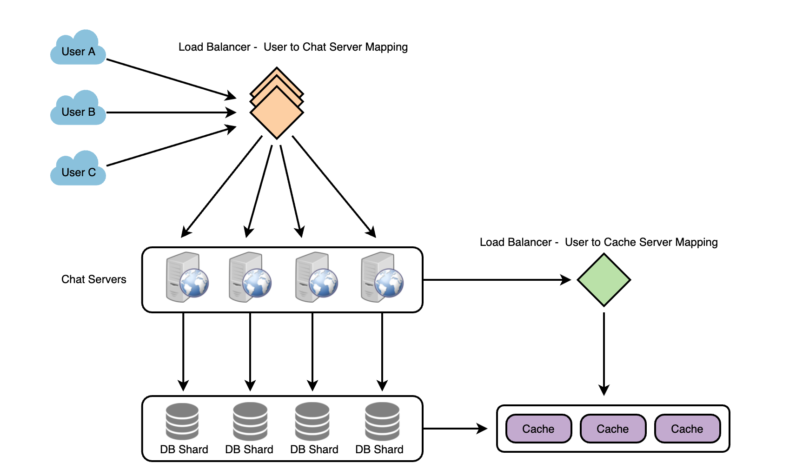

an **instant messaging** service

Functional Requirements:

1. one-on-one conversations between users
2. persistent storage of chat history
3. keep track of the online/offline statuses of its users

Non-functional Requirements:

1. low latency
2. highly consistent
3. high availability

Group Chats: Messenger should support multiple people talking to each other in a group.

Push notifications: Messenger should be able to notify users of new messages when they are offline.

## 消息处理

这题的关键就是 pull or push model 的选择

**How would we efficiently send/receive messages?** To send messages, a user needs to connect to the server and post messages for the other users.

1. **Pull model:** Users can periodically ask the server if there are any new messages for them.
2. **Push model:** Users can keep a connection open with the server and can depend upon the server to notify them whenever there are new messages.

To minimize latency for the user, they have to check the server quite frequently, and most of the time, they will be getting an empty response if there are no pending messages. This will waste a lot of resources and does not look like an efficient solution.

**How will clients maintain an open connection with the server?**

Http Long Polling, WebSocket

In long polling, clients can request information from the server with the **expectation that the server may not respond immediately**. If the server has no new data for the client when the poll is received, **instead of sending an empty response, the server holds the request open and waits for response information to become available**. Once it does have new information, the server immediately sends the response to the client, completing the open request. Upon receipt of the server response, **the client can immediately issue another server request for future updates**. This gives a lot of improvements in latencies, throughputs, and performance. However, the long polling request can timeout or receive a disconnect from the server; in that case, the client has to open a new request.

**How can the server keep track of all the opened connections to efficiently redirect messages to the users?**

The server can maintain a hash table, where “key” would be the UserID and “value” would be the connection object. So whenever the server receives a message for a user, it looks up that user in the hash table to find the connection object and sends the message on the open request.

**What will happen when the server receives a message for a user who has gone offline?**

If the receiver has disconnected, the server can notify the sender about the delivery failure. However, if it is a temporary disconnect, e.g., **the receiver’s long-poll request just timed out,** then we should expect a reconnect from the user. In that case, we can ask the sender to **retry sending the message**. This retry could be embedded in the client’s logic so that users don’t have to retype the message. The server can also store the message for a while and retry sending it once the receiver reconnects.

**How many chat servers do we need?**

Assuming **a modern server can handle 50K concurrent connections at any time**

**How do we know which server holds the connection to which user?** 

We can introduce a software load balancer in front of our chat servers; that can map each UserID to a server to redirect the request.

**How should the server process a ‘deliver message’ request?** The server needs to do the following things upon receiving a new message: 1) Store the message in the database, 2) Send the message to the receiver, and 3) Send an acknowledgment to the sender.

The chat server will first find the server that holds the connection for the receiver and pass the message to that server to send it to the receiver. The chat server can then send the acknowledgment to the sender; **we don’t need to wait to store the message in the databas**e (this can happen in the background). 

**How does the messenger maintain the sequencing of the messages?** We can store a timestamp with each message, which is the time when the server receives the message. However, this will still not ensure the correct ordering of messages for clients. The scenario where the server timestamp cannot determine the exact order of messages would look like this:

1. User-1 sends a message M1 to the server for User-2.
2. The server receives M1 at T1.
3. Meanwhile, User-2 sends a message M2 to the server for User-1.
4. The server receives the message M2 at T2, such that T2 > T1.
5. The server sends the message M1 to User-2 and M2 to User-1.

So User-1 will see M1 first and then M2, whereas User-2 will see M2 first and then M1.

To resolve this, we need to keep a sequence number with every message for each client. This sequence number will determine the exact ordering of messages for EACH user. With this solution, both clients will see a different view of the message sequence, but this view will be consistent for them on all devices.

**这个解决方案没有太看明白，找找资料看一看**

## 储存消息

**Which storage system should we use?** 

support a very high rate of small updates and also fetch a range of records quickly. we have a huge number of small messages that need to be inserted in the database and, while querying, a user is mostly interested in sequentially accessing the messages.

We cannot use RDBMS like MySQL or NoSQL like MongoDB because **we cannot afford to read/write a row from the database every time a user receives/sends a message**. This will not only make **the basic operations of our service run with high latency but also create a huge load on databases.**

Both of our requirements can be easily met with a wide-column database solution like [HBase](https://en.wikipedia.org/wiki/Apache_HBase). HBase is a column-oriented key-value NoSQL database that can store multiple values against one key into multiple columns. HBase is modeled after Google’s [BigTable](https://en.wikipedia.org/wiki/Bigtable) and runs on top of Hadoop Distributed File System ([HDFS](https://en.wikipedia.org/wiki/Apache_Hadoop)). **HBase groups data together to store new data in a memory buffer and, once the buffer is full, it dumps the data to the disk.** This way of storage not only helps to store a lot of small data quickly but also fetching rows by the key or scanning ranges of rows. HBase is also an efficient database to store variable-sized data, which is also required by our service.

**这个wide-column database 需要好好看一看**

**How should clients efficiently fetch data from the server?** 

Clients should paginate while fetching data from the server. Page size could be different for different clients, e.g., cell phones have smaller screens, so we need fewer messages/conversations in the viewport.

## 管理用户status

这段下次在看一下如何设计

## Data Partitioning

**Partitioning based on UserID:** Let’s assume we partition based on the hash of the UserID so that we can keep all messages of a user on the same database. If one DB shard is 4TB, we will have “3.6PB/4TB ~= 900” shards for five years. For simplicity, let’s assume we keep 1K shards. So we will find the shard number by “hash(UserID) % 1000” and then store/retrieve the data from there. This partitioning scheme will also be very quick to fetch chat history for any user.

In the beginning, we can start with fewer database servers with multiple shards residing on one physical server. Since we can have multiple database instances on a server, we can easily store multiple partitions on a single server. Our hash function needs to understand this logical partitioning scheme so that it can map multiple logical partitions on one physical server.

Since we will store an unlimited history of messages, we can start with a large number of logical partitions that will be mapped to fewer physical servers. Then, as our storage demand increases, we can add more physical servers to distribute our logical partitions.

**Partitioning based on MessageID:** If we store different messages of a user on separate database shards, fetching a range of messages of a chat would be very slow, so we should not adopt this scheme.

## Cache

We can cache a few recent messages (say last 15) in a few recent conversations that are visible in a user’s viewport (say last 5). Since we decided to store all of the user’s messages on one shard, the cache for a user should entirely reside on one machine too.

## Load balancing

We will need a load balancer in front of our chat servers that can map each UserID to a server that holds the connection for the user and then direct the request to that server. Similarly, we would need a load balancer for our cache servers.

## Fault tolerance and Replication

**What will happen when a chat server fails?** Our chat servers are holding connections with the users. If a server goes down, should we devise a mechanism to transfer those connections to some other server? It’s extremely hard to failover TCP connections to other servers; **an easier approach can be to have clients automatically reconnect if the connection is lost.**

**Should we store multiple copies of user messages?** We cannot store only one copy of the user’s data because if the server holding the data crashes or is down permanently, we don’t have any mechanism to recover that data. For this, either we have to store multiple copies of the data on different servers or use techniques like Reed-Solomon encoding to distribute and replicate it.

##  

## Extended Requirements

### a. Group chat

We can have separate group-chat objects in our system that can be stored on the chat servers. A group-chat object is identified by GroupChatID and will also maintain a list of people who are part of that chat. Our load balancer can direct each group chat message based on `GroupChatID`, and the server handling that group chat can iterate through all the users of the chat to find the server handling the connection of each user to deliver the message.

In databases, we can store all the group chats in a separate table partitioned based on GroupChatID.

### b. Push notifications

In our current design, users can only send messages to online users; if the receiving user is offline, we send a failure to the sending user. Push notifications will enable our system to send messages to offline users.

For Push notifications, each user can opt-in from their device (or a web browser) to get notifications whenever there is a new message or event. Each manufacturer maintains a set of servers that handles pushing these notifications to the user.

To have push notifications in our system, we would need to set up a Notification server, which will take the messages for offline users and send them to the manufacturer’s push notification server, which will then send them to the user’s device.

没太看懂这个，先看看push notaification 设计会不会有点感觉