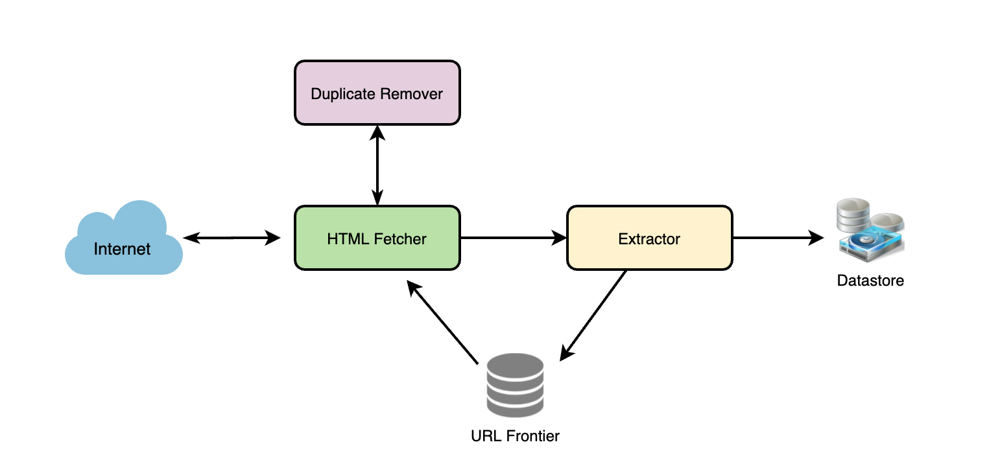

The basic algorithm executed by any Web crawler is to take a list of seed URLs as its input and repeatedly execute the following steps. 类似dfs一样来爬取

1. Pick a URL from the unvisited URL list.
2. Determine the IP Address of its host-name.
3. Establish a connection to the host to download the corresponding document.
4. Parse the document contents to look for new URLs.
5. Add the new URLs to the list of unvisited URLs.
6. Process the downloaded document, e.g., store it or index its contents, etc.
7. Go back to step 1

**Breadth-first or depth-first?** Breadth First Search (BFS) is usually used. However, Depth First Search (DFS) is also utilized in some situations, such as, if your crawler has already established a connection with the website, **it might just DFS all the URLs within this website to save some handshaking overhead.**

**Path-ascending crawling:** Path-ascending crawling can help discover a lot of isolated resources or resources for which no inbound link would have been found in regular crawling of a particular Web site. In this scheme, a crawler would ascend to every path in each URL that it intends to crawl. For example, when given a seed URL of http://foo.com/a/b/page.html, it will attempt to crawl /a/b/, /a/, and /.  这个不太清楚具体怎么work

**1. URL frontier:** To store the list of URLs to download and also prioritize which URLs should be crawled first.
**2. HTML Fetcher:** To retrieve a web page from the server.
**3. Extractor:** To extract links from HTML documents.
**4. Duplicate Eliminator:** To make sure the same content is not extracted twice unintentionally.
**5. Datastore:** To store retrieved pages, URLs, and other metadata.

