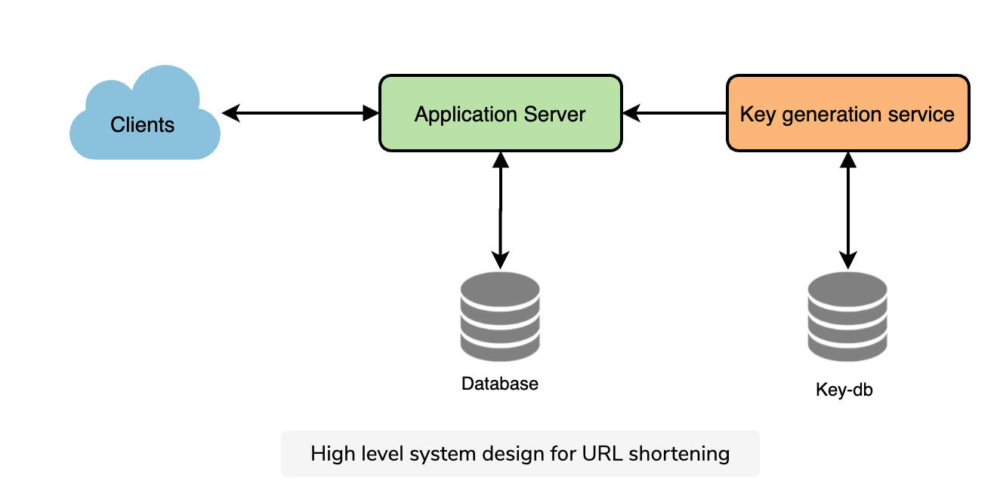
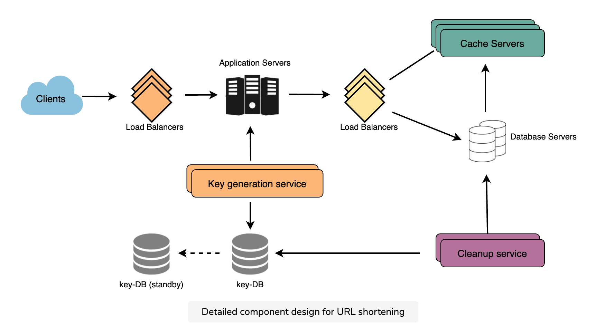

## Requirements

Functional

1. given a url and generate a **shorter and unique** alias of it
2. the short link should be able to **redirect** to original link
3. custom short link
4. links will expire after a standard default timespan

Non-functional

1. highly avaiable
2. low latency. Url redirection shuold happen in real-time
3. link not predictable


## System APIs

```
String createURL(api_dev_key, original_url, custom_alias=None, user_name=None, expire_date=None)

deleteURL(api_dev_key, url_key)
// a successful deletion returns ‘URL Removed’.
```


## Database Design


## Basic System Design and Algorithm

The problem we are solving here is how to generate a short and unique key for a given url.

### encoding actual URL

Compute a unique hash (MD5, SHA256) of the given url. The hash can then be encoded for display. This encoding could be base36 ([a-z ,0-9]) or base62 ([A-Z, a-z, 0-9]) and if we add ‘+’ and ‘/’ we can use [Base64](https://en.wikipedia.org/wiki/Base64#Base64_table) encoding

What should be the length of the short key? depends on how many urls we may have.

If we use the MD5 algorithm as our hash function, it will produce a 128-bit hash value. After base64 encoding, we’ll get a string having more than 21 characters (since each base64 character encodes 6 bits of the hash value). Now we only have space for 6 (or 8) characters per short key; how will we choose our key then? We can take the first 6 (or 8) letters for the key. This could result in key duplication; to resolve that, we can choose some other characters out of the encoding string or swap some characters.


1. If multiple users enter the same URL, they can get the same shortened URL, which is not acceptable.
2. What if parts of the URL are URL-encoded? e.g., http://www.educative.io/distributed.php?id=design, and http://www.educative.io/distributed.php%3Fid%3Ddesign are identical except for the URL encoding.

 We can append an increasing sequence number to each input URL to make it unique and then generate its hash. We don’t need to store this sequence number in the databases, though. Possible problems with this approach could be an ever-increasing sequence number. Can it overflow? Appending an increasing sequence number will also impact the performance of the service.

Another solution could be to append the user id (which should be unique) to the input URL. However, if the user has not signed in, we would have to ask the user to choose a uniqueness key. Even after this, if we have a conflict, we have to keep generating a key until we get a unique one.

### Generating keys offline



We can have a standalone **Key Generation Service (KGS)** that generates random six-letter strings beforehand and stores them in a database (let’s call it key-DB). Whenever we want to shorten a URL, we will take one of the already-generated keys and use it. This approach will make things quite simple and fast.Not only are we not encoding the URL, but we won’t have to worry about duplications or collisions. KGS will make sure all the keys inserted into key-DB are unique


#### Concurrency problem

KGS can use two tables to store keys: one for keys that are not used yet, and one for all the used keys. KGS loads some keys in memory, then it move them to the used keys table. If KGS dies before assigning all the loaded keys to some server, we will be wasting those keys–which could be acceptable, given the huge number of keys we have.

**What would be the key-DB size?** 

 If we need one byte to store one alpha-numeric character, we can store all these keys in:

6 (characters per key) * 68.7B (unique keys) = 412 GB.

**Isn’t KGS a single point of failure?** Yes, it is. To solve this, we can have a standby replica of KGS. Whenever the primary server dies, the standby server can take over to generate and provide keys.

**Can each app server cache some keys from key-DB?** Yes, this can surely speed things up. Although, in this case, if the application server dies before consuming all the keys, we will end up losing those keys. This can be acceptable since we have 68B unique six-letter keys.

**How would we perform a key lookup?** We can look up the key in our database to get the full URL. If it’s present in the DB, issue an “HTTP 302 Redirect” status back to the browser, passing the stored URL in the “Location” field of the request. If that key is not present in our system, issue an “HTTP 404 Not Found” status or redirect the user back to the homepage.

**Should we impose size limits on custom aliases?** Our service supports custom aliases. Users can pick any ‘key’ they like, but providing a custom alias is not mandatory. However, it is reasonable (and often desirable) to impose a size limit on a custom alias to ensure we have a consistent URL database. Let’s assume users can specify a maximum of 16 characters per customer key (as reflected in the above database schema).


## Data Partitioning and Replication

Range Based Partitioning

May lead to unbalanced DB servers

Hash-Based Partitoning: 

In this scheme, we take a hash of the object we are storing. We then calculate which partition to use based upon the hash. In our case, we can take the hash of the ‘key’ or the short link to determine the partition in which we store the data object.

This approach can still lead to overloaded partions, which can be solved using Consistent Hashing


## Cache

这部分要看一看如何

Synchronizing Local In-Memory Caches for Multiple Servers

或者用一个ditributed cache

https://www.youtube.com/watch?v=kliQLwSikO4

https://doc.postsharp.net/caching-pubsub

https://igotanoffer.com/blogs/tech/caching-system-design-interview

在生产环境中如何refresh cache？如何invalidate一个cache中的url？用memcache还是redis？作者并没有说但是真的会有人考（我就被考到了）


##  Load Balancer (LB)

We can add a Load balancing layer at three places in our system:

1. Between Clients and Application servers
2. Between Application Servers and database servers
3. Between Application Servers and Cache servers

Initially, we could use a simple Round Robin approach that distributes incoming requests equally among backend servers. This LB is simple to implement and does not introduce any overhead. Another benefit of this approach is that if a server is dead, LB will take it out of the rotation and stop sending any traffic to it.

A problem with Round Robin LB is that we do not consider the server load. As a result, if a server is overloaded or slow, the LB will not stop sending new requests to that server. To handle this, a more intelligent LB solution can be placed that periodically queries the backend server about its load and adjusts traffic based on that.


## Cleanup 

Instead, we can slowly remove expired links and do a lazy cleanup. Our service will ensure that only expired links will be deleted, although some expired links can live longer but will never be returned to users.

- A separate Cleanup service can run periodically to remove expired links from our storage and cache. This service should be very lightweight and scheduled to run only when the user traffic is expected to be low.
- We can have a default expiration time for each link (e.g., two years).
- After removing an expired link, we can put the key back in the key-DB to be reused.




Can users create private URLs or allow a particular set of users to access a URL?

We can store the permission level (public/private) with each URL in the database. We can also create a separate table to store UserIDs that have permission to see a specific URL. If a user does not have permission and tries to access a URL, we can send an error (HTTP 401) back. Given that we are storing our data in a NoSQL wide-column database like Cassandra, the key for the table storing permissions would be the ‘Hash’ (or the KGS generated ‘key’). The columns will store the UserIDs of those users that have permission to see the URL.