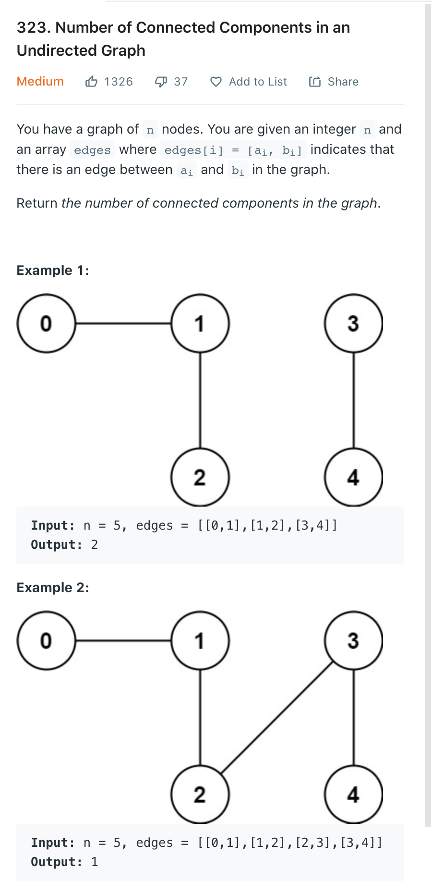

## 基本问题：

（1）DFS中递归的基本要素
（2）终止条件的选择；回溯；剪枝
（3）什么时候需要排序？
（4）如何去除重复元素？一个元素允许使用多次的情况？
（6）在图上进行DFS如何避免回到重复节点
（5）识别一个隐式图，并使用DFS
（6）在某些情况下，利用记忆化搜索进行优化

dfs 的space complexity 是longest path


# Matrix

## 1559 Detect Cycles in 2D Grid

Given a 2D array of characters `grid` of size `m x n`, you need to find if there exists any cycle consisting of the **same value** in `grid`.

A cycle is a path of **length 4 or more** in the grid that starts and ends at the same cell. From a given cell, you can move to one of the cells adjacent to it - in one of the four directions (up, down, left, or right), if it has the **same value** of the current cell.

Also, you cannot move to the cell that you visited in your last move. For example, the cycle `(1, 1) -> (1, 2) -> (1, 1)` is invalid because from `(1, 2)` we visited `(1, 1)` which was the last visited cell.

Return `true` if any cycle of the same value exists in `grid`, otherwise, return `false`.

 

**Example 1:**

****

```
Input: grid = [["a","a","a","a"],["a","b","b","a"],["a","b","b","a"],["a","a","a","a"]]
Output: true
Explanation: There are two valid cycles shown in different colors in the image below:
```

**Example 2:**

****

```
Input: grid = [["c","c","c","a"],["c","d","c","c"],["c","c","e","c"],["f","c","c","c"]]
Output: true
Explanation: There is only one valid cycle highlighted in the image below:
```

**Example 3:**

****

```
Input: grid = [["a","b","b"],["b","z","b"],["b","b","a"]]
Output: false
```

**Solution**

- Start DFS from (i, j).
- Don't visit the last visited point as stated in question.
- Only visit a point if it has same character as starting position
- If you still reach a visited point again, there is a cycle.

```java
class Solution {
    int[] DIR_X = {1, -1, 0, 0};
    int[] DIR_Y = {0, 0, 1, -1};
	
    private boolean dfs(int curX, int curY, int lastX, int lastY, int n, int m, boolean[][] vis, char[][] grid, char startChar) {
        vis[curX][curY] = true;
        boolean hasCycle = false;
        // Visit all directions
        for (int i = 0; i < 4; ++i) {
            int newX = curX + DIR_X[i];
            int newY = curY + DIR_Y[i];
            // Valid point?
            if (newX >= 0 && newX < n && newY >= 0 && newY < m) {
                // Don't visit last visited point
                if (!(newX == lastX && newY == lastY)) {
                    // Only visit nodes that equal start character
                    if (grid[newX][newY] == startChar) {
                        if (vis[newX][newY]) {
						    // Still visited? There is a cycle.
                            return true;
                        } else {
                            hasCycle |= dfs(newX, newY, curX, curY, n, m, vis, grid, startChar);
                        }
                    }
                }
            }
        }
        return hasCycle;
    }
	
    public boolean containsCycle(char[][] grid) {
        int n = grid.length;
        int m = grid[0].length;
        boolean[][] vis = new boolean[n][m];
        boolean hasCycle = false;
        for (int i = 0; i < grid.length; ++i) {
            for (int j = 0; j < grid[i].length; ++j) {
                if (!vis[i][j]) {
                    if(dfs(i, j, -1, -1, n, m, vis, grid, grid[i][j])) {
                        return true;
                    }
                }
            }
        }
        return false;
    }
}
```


## 694 Number of Distinct Islands

You are given an `m x n` binary matrix `grid`. An island is a group of `1`'s (representing land) connected **4-directionally** (horizontal or vertical.) You may assume all four edges of the grid are surrounded by water.

An island is considered to be the same as another if and only if one island can be translated (and not rotated or reflected) to equal the other.

Return *the number of **distinct** islands*.

 

**Example 1:**


```
Input: grid = [[1,1,0,0,0],[1,1,0,0,0],[0,0,0,1,1],[0,0,0,1,1]]
Output: 1
```

**Example 2:**


```
Input: grid = [[1,1,0,1,1],[1,0,0,0,0],[0,0,0,0,1],[1,1,0,1,1]]
Output: 3
```

**Solution**

这题tricky的点就是如何来描述一个island的形状，我们只要记录它的direction就行了，然后用一个hashset 来查看是否重复

```java
class Solution {
public int numDistinctIslands(int[][] grid) {
    Set<String> set = new HashSet<>();
    for(int i = 0; i < grid.length; i++) {
        for(int j = 0; j < grid[i].length; j++) {
            if(grid[i][j] != 0) {
                StringBuilder sb = new StringBuilder();
                dfs(grid, i, j, sb, "o"); // origin
                grid[i][j] = 0;
                set.add(sb.toString());
            }
        }
    }
    return set.size();
}
private void dfs(int[][] grid, int i, int j, StringBuilder sb, String dir) {
    if(i < 0 || i == grid.length || j < 0 || j == grid[i].length 
       || grid[i][j] == 0) return;
    sb.append(dir);
    grid[i][j] = 0;
    dfs(grid, i-1, j, sb, "u");
    dfs(grid, i+1, j, sb, "d");
    dfs(grid, i, j-1, sb, "l");
    dfs(grid, i, j+1, sb, "r");
    sb.append("b"); // back
}
}
```


## 463 Island Perimeter

You are given `row x col` `grid` representing a map where `grid[i][j] = 1` represents land and `grid[i][j] = 0` represents water.

Grid cells are connected **horizontally/vertically** (not diagonally). The `grid` is completely surrounded by water, and there is exactly one island (i.e., one or more connected land cells).

The island doesn't have "lakes", meaning the water inside isn't connected to the water around the island. One cell is a square with side length 1. The grid is rectangular, width and height don't exceed 100. Determine the perimeter of the island.

 

**Example 1:**


```
Input: grid = [[0,1,0,0],[1,1,1,0],[0,1,0,0],[1,1,0,0]]
Output: 16
Explanation: The perimeter is the 16 yellow stripes in the image above.
```

**Example 2:**

```
Input: grid = [[1]]
Output: 4
```

**Example 3:**

```
Input: grid = [[1,0]]
Output: 4
```

**Solution**

loop over the matrix and count the number of islands;
if the current dot is an island, count if it has any right neighbour or down neighbour; 这样能避免重复count neighbour
the result is islands * 4 - neighbours * 2

```java
public class Solution {
    public int islandPerimeter(int[][] grid) {
        int islands = 0, neighbours = 0;

        for (int i = 0; i < grid.length; i++) {
            for (int j = 0; j < grid[i].length; j++) {
                if (grid[i][j] == 1) {
                    islands++; // count islands
                    if (i < grid.length - 1 && grid[i + 1][j] == 1) neighbours++; // count down neighbours
                    if (j < grid[i].length - 1 && grid[i][j + 1] == 1) neighbours++; // count right neighbours
                }
            }
        }

        return islands * 4 - neighbours * 2;
    }
}
```


## 489 Robot Room Cleaner

You are controlling a robot that is located somewhere in a room. The room is modeled as an `m x n` binary grid where `0` represents a wall and `1` represents an empty slot.

The robot starts at an unknown location in the root that is guaranteed to be empty, and you do not have access to the grid, but you can move the robot using the given API `Robot`.

You are tasked to use the robot to clean the entire room (i.e., clean every empty cell in the room). The robot with the four given APIs can move forward, turn left, or turn right. Each turn is `90` degrees.

When the robot tries to move into a wall cell, its bumper sensor detects the obstacle, and it stays on the current cell.

Design an algorithm to clean the entire room using the following APIs:

```
interface Robot {
  // returns true if next cell is open and robot moves into the cell.
  // returns false if next cell is obstacle and robot stays on the current cell.
  boolean move();

  // Robot will stay on the same cell after calling turnLeft/turnRight.
  // Each turn will be 90 degrees.
  void turnLeft();
  void turnRight();

  // Clean the current cell.
  void clean();
}
```

**Note** that the initial direction of the robot will be facing up. You can assume all four edges of the grid are all surrounded by a wall.

**Custom testing:**

The input is only given to initialize the room and the robot's position internally. You must solve this problem "blindfolded". In other words, you must control the robot using only the four mentioned APIs without knowing the room layout and the initial robot's position.

 

**Example 1:**


```
Input: room = [[1,1,1,1,1,0,1,1],[1,1,1,1,1,0,1,1],[1,0,1,1,1,1,1,1],[0,0,0,1,0,0,0,0],[1,1,1,1,1,1,1,1]], row = 1, col = 3
Output: Robot cleaned all rooms.
Explanation: All grids in the room are marked by either 0 or 1.
0 means the cell is blocked, while 1 means the cell is accessible.
The robot initially starts at the position of row=1, col=3.
From the top left corner, its position is one row below and three columns right.
```

**Example 2:**

```
Input: room = [[1]], row = 0, col = 0
Output: Robot cleaned all rooms.
```

**Solution**

这道题就是个dfs， 难点是要在当前的位置dfs完以后要回到上个位置并且保持相同的方向

```java
class Solution {
    
    private static final int[][] directions = {{-1, 0}, {0, 1}, {1, 0}, {0, -1}};
    
    public void cleanRoom(Robot robot) {
        clean(robot, 0, 0, 0, new HashSet<>());
    }
    
    private void clean(Robot robot, int x, int y, int curDirection, Set<String> visited) {
        // Cleans current cell.
        robot.clean();
        visited.add(x + " " + y);
        
        for (int nDirection = curDirection; 
             nDirection < curDirection + 4; 
             nDirection++) {
            int nx = directions[nDirection % 4][0] + x;
            int ny = directions[nDirection % 4][1] + y;
            if (!visited.contains(nx + " " + ny) && robot.move()) {
                clean(robot, nx, ny, nDirection % 4, visited);
            }
            // Changed orientation.
            robot.turnRight();
        }
        
        // Moves backward one step while maintaining the orientation.
        robot.turnRight();
        robot.turnRight();
        robot.move();
        robot.turnRight();
        robot.turnRight();
    }
}
```


## Making A Large Island

You are given an `n x n` binary matrix `grid`. You are allowed to change **at most one** `0` to be `1`.

Return *the size of the largest **island** in* `grid` *after applying this operation*.

An **island** is a 4-directionally connected group of `1`s. 

**Example 1:**

```
Input: grid = [[1,0],[0,1]]
Output: 3
Explanation: Change one 0 to 1 and connect two 1s, then we get an island with area = 3.
```

**Example 2:**

```
Input: grid = [[1,1],[1,0]]
Output: 4
Explanation: Change the 0 to 1 and make the island bigger, only one island with area = 4.
```

**Example 3:**

```
Input: grid = [[1,1],[1,1]]
Output: 4
Explanation: Can't change any 0 to 1, only one island with area = 4.
```

 **Solution**

这题没有写代码，有空回来写一下

Naive dfs will run a dfs on every 0 after we change it to 1. However, we can calculate the size of each island. For each 0, we just need to add the size of the island in its four directions. One tricky part is that we may counter the same island, so we need to mark the island with a unique id.

```java
class Solution {
    public int N = 0;
    public int largestIsland(int[][] grid) {
        N = grid.length;
        //DFS every island and give it an index of island
        int index = 3, res = 0;
        HashMap<Integer, Integer> area = new HashMap<>();
        for (int x = 0; x < N; ++x) for (int y = 0; y < N; ++y)
            if (grid[x][y] == 1) {
                area.put(index, dfs(grid, x, y, index));
                res = Math.max(res, area.get(index++));
            }

        //traverse every 0 cell and count biggest island it can conntect
        for (int x = 0; x < N; ++x) for (int y = 0; y < N; ++y)
            if (grid[x][y] == 0) {
                HashSet<Integer> seen = new HashSet<>();
                int cur = 1;
                for (Pair<Integer, Integer> p : move(x, y)) {
                    index = grid[p.getKey()][p.getValue()];
                    if (index > 1 && !seen.contains(index)) {
                        seen.add(index);
                        cur += area.get(index);
                    }
                }
                res = Math.max(res, cur);
            }
        return res;
    }

    public List <Pair<Integer, Integer>> move(int x, int y) {
        ArrayList <Pair<Integer, Integer>> res = new ArrayList<>();
        if (valid(x, y + 1)) res.add(new Pair<Integer, Integer>(x, y + 1));
        if (valid(x, y - 1)) res.add(new Pair<Integer, Integer>(x, y - 1));
        if (valid(x + 1, y)) res.add(new Pair<Integer, Integer>(x + 1, y));
        if (valid(x - 1, y)) res.add(new Pair<Integer, Integer>(x - 1, y));
        return res;
    }

    public boolean valid(int x, int y) {
        return 0 <= x && x < N && 0 <= y && y < N;
    }

    public int dfs(int[][] grid, int x, int y, int index) {
        int area = 0;
        grid[x][y] = index;
        for (Pair<Integer, Integer> p : move(x, y))
            if (grid[p.getKey()][p.getValue()] == 1)
                area += dfs(grid, p.getKey(), p.getValue(), index);
        return area + 1;
    }
}
```


# **排列组合**：

## 681 Next Closest Time

Given a `time` represented in the format `"HH:MM"`, form the next closest time by reusing the current digits. There is no limit on how many times a digit can be reused.

You may assume the given input string is always valid. For example, `"01:34"`, `"12:09"` are all valid. `"1:34"`, `"12:9"` are all invalid.

 

**Example 1:**

```
Input: time = "19:34"
Output: "19:39"
Explanation: The next closest time choosing from digits 1, 9, 3, 4, is 19:39, which occurs 5 minutes later.
It is not 19:33, because this occurs 23 hours and 59 minutes later.
```

**Example 2:**

```
Input: time = "23:59"
Output: "22:22"
Explanation: The next closest time choosing from digits 2, 3, 5, 9, is 22:22.
It may be assumed that the returned time is next day's time since it is smaller than the input time numerically.
```

**Solution**

一共就4^ 4种可能的组合，全部列出来在算时间差就行了

时间差可以把时间换算成 mins来计算差多少mins

```java
class Solution {
    int diff = Integer.MAX_VALUE;
    String result = "";
    
    public String nextClosestTime(String time) {
        Set<Integer> set = new HashSet<>();
        set.add(Integer.parseInt(time.substring(0, 1)));
        set.add(Integer.parseInt(time.substring(1, 2)));
        set.add(Integer.parseInt(time.substring(3, 4)));
        set.add(Integer.parseInt(time.substring(4, 5)));
        
        if (set.size() == 1) return time;
        
        List<Integer> digits = new ArrayList<>(set);
        int minute = Integer.parseInt(time.substring(0, 2)) * 60 + Integer.parseInt(time.substring(3, 5));

        dfs(digits, "", 0, minute);

        return result;
    }

    private void dfs(List<Integer> digits, String cur, int pos, int target) {
        if (pos == 4) {
            int m = Integer.parseInt(cur.substring(0, 2)) * 60 + Integer.parseInt(cur.substring(2, 4));
            if (m == target) return;
            int d = m - target > 0 ? m - target : 1440 + m - target;
            if (d < diff) {
                diff = d;
                result = cur.substring(0, 2) + ":" + cur.substring(2, 4);
            }
            return;
        }

        for (int i = 0; i < digits.size(); i++) {
            if (pos == 0 && digits.get(i) > 2) continue;
            if (pos == 1 && Integer.parseInt(cur) * 10 + digits.get(i) > 23) continue;
            if (pos == 2 && digits.get(i) > 5) continue;
            if (pos == 3 && Integer.parseInt(cur.substring(2)) * 10 + digits.get(i) > 59) continue;
            dfs(digits, cur + digits.get(i), pos + 1, target);
        }
    }
}
```


## 46 Permutations

Given an array `nums` of distinct integers, return *all the possible permutations*. You can return the answer in **any order**.

**Example 1:**

```
Input: nums = [1,2,3]
Output: [[1,2,3],[1,3,2],[2,1,3],[2,3,1],[3,1,2],[3,2,1]]
```

**Example 2:**

```
Input: nums = [0,1]
Output: [[0,1],[1,0]]
```

**Example 3:**

```
Input: nums = [1]
Output: [[1]]
```

**Solution**

```java
class Solution {
    public List<List<Integer>> permute(int[] nums) {
        List<List<Integer>> output = new LinkedList<>();
        if(nums == null || nums.length == 0) {
            return output;
        }
        List<Integer> nums_lst = new ArrayList<Integer>();
        for(int num : nums) {
            nums_lst.add(num);
        }
        permuteHelper(nums_lst, output, 0);
        return output;
    }
    
    public void permuteHelper(List<Integer> nums, List<List<Integer>> output, int first) {
        int len = nums.size();
        if(first == len) {
            output.add(new ArrayList<Integer>(nums));
        }
        for(int i = first; i < len; ++i) {
            Collections.swap(nums, first, i);
            permuteHelper(nums, output, first + 1);
            Collections.swap(nums, first, i);           
        }
    }
}
```


## 47 Permutations II

Given a collection of numbers, `nums`, that might contain **duplicates**, return *all possible unique permutations **in any order**.*

**Example 1:**

```
Input: nums = [1,1,2]
Output:
[[1,1,2],
 [1,2,1],
 [2,1,1]]
```

**Example 2:**

```
Input: nums = [1,2,3]
Output: [[1,2,3],[1,3,2],[2,1,3],[2,3,1],[3,1,2],[3,2,1]]
```

**Solution**

Permutations 这个系列的题目放到一起看看

```java
class Solution {

    public List<List<Integer>> permuteUnique(int[] nums) {
        List<List<Integer>> results = new ArrayList<>();

        // count the occurrence of each number
        HashMap<Integer, Integer> counter = new HashMap<>();
        for (int num : nums) {
            if (!counter.containsKey(num))
                counter.put(num, 0);
            counter.put(num, counter.get(num) + 1);
        }

        LinkedList<Integer> comb = new LinkedList<>();
        this.backtrack(comb, nums.length, counter, results);
        return results;
    }

    protected void backtrack(
            LinkedList<Integer> comb,
            Integer N,
            HashMap<Integer, Integer> counter,
            List<List<Integer>> results) {

        if (comb.size() == N) {
            // make a deep copy of the resulting permutation,
            // since the permutation would be backtracked later.
            results.add(new ArrayList<Integer>(comb));
            return;
        }

        for (Map.Entry<Integer, Integer> entry : counter.entrySet()) {
            Integer num = entry.getKey();
            Integer count = entry.getValue();
            if (count == 0)
                continue;
            // add this number into the current combination
            comb.addLast(num);
            counter.put(num, count - 1);

            // continue the exploration
            backtrack(comb, N, counter, results);

            // revert the choice for the next exploration
            comb.removeLast();
            counter.put(num, count);
        }
    }
}
```

## 39 Combination Sum

Given an array of **distinct** integers `candidates` and a target integer `target`, return *a list of all **unique combinations** of* `candidates` *where the chosen numbers sum to* `target`*.* You may return the combinations in **any order**.

The **same** number may be chosen from `candidates` an **unlimited number of times**. Two combinations are unique if the frequency of at least one of the chosen numbers is different.

It is **guaranteed** that the number of unique combinations that sum up to `target` is less than `150` combinations for the given input.

**Example 1:**

```java
Input: candidates = [2,3,6,7], target = 7
Output: [[2,2,3],[7]]
Explanation:
2 and 3 are candidates, and 2 + 2 + 3 = 7. Note that 2 can be used multiple times.
7 is a candidate, and 7 = 7.
These are the only two combinations.
```

**Solution**

An important detail on choosing the next number for the combination is that we select the candidates **in order**, where the total candidates are treated as a list. Once a candidate is added into the current combination, we will not **look back** to all the previous candidates in the next explorations.  这样子来避免重复

Recursion 其实可以看作一个n-ry tree

Time complexity: 是它的node 数量，O(N^(T/M))

Space Complexity: 是它的depth， O(T/M) T是target， M是candidates中最小的数

```java
class Solution {

    protected void backtrack(
            int remain,
            LinkedList<Integer> comb,
            int start, int[] candidates,
            List<List<Integer>> results) {

        if (remain == 0) {
            // make a deep copy of the current combination
            results.add(new ArrayList<Integer>(comb));
            return;
        } else if (remain < 0) {
            // exceed the scope, stop exploration.
            return;
        }

        for (int i = start; i < candidates.length; ++i) {
            // add the number into the combination
            comb.add(candidates[i]);
            this.backtrack(remain - candidates[i], comb, i, candidates, results);
            // backtrack, remove the number from the combination
            comb.removeLast();
        }
    }

    public List<List<Integer>> combinationSum(int[] candidates, int target) {
        List<List<Integer>> results = new ArrayList<List<Integer>>();
        LinkedList<Integer> comb = new LinkedList<Integer>();

        this.backtrack(target, comb, 0, candidates, results);
        return results;
    }
}
```


## 40 Combination Sum II

Given a collection of candidate numbers (`candidates`) and a target number (`target`), find all unique combinations in `candidates` where the candidate numbers sum to `target`.

Each number in `candidates` may only be used **once** in the combination.

**Note:** The solution set must not contain duplicate combinations.

**Example 1:**

```
Input: candidates = [10,1,2,7,6,1,5], target = 8
Output: 
[
[1,1,6],
[1,2,5],
[1,7],
[2,6]
]
```

**Example 2:**

```
Input: candidates = [2,5,2,1,2], target = 5
Output: 
[
[1,2,2],
[5]
]
```

**Solution**

Combination sum 1可以无限用，2最多只能用一次嘛，相应的问题就是candidates里面会有duplicate，所以我们需要sort candidates，对每个unique的数在当前的backtracking中只用第一个

```Java
class Solution {
public List<List<Integer>> combinationSum2(int[] candidates, int target) {
   List<List<Integer>> list = new LinkedList<List<Integer>>();
   Arrays.sort(candidates);
   backtrack(list, new ArrayList<Integer>(), candidates, target, 0);
   return list;
}

private void backtrack(List<List<Integer>> list, List<Integer> tempList, int[] cand, int remain, int start) {
   
   if(remain < 0) return; /** no solution */
   else if(remain == 0) list.add(new ArrayList<>(tempList));
   else{
      for (int i = start; i < cand.length; i++) {
         if(i > start && cand[i] == cand[i-1]) continue; /** skip duplicates */
         tempList.add(cand[i]);
         backtrack(list, tempList, cand, remain - cand[i], i+1);
         tempList.remove(tempList.size() - 1);
      }
   }
}
}
```


## 216 Combination Sum III

Find all valid combinations of `k` numbers that sum up to `n` such that the following conditions are true:

- Only numbers `1` through `9` are used.
- Each number is used **at most once**.

Return *a list of all possible valid combinations*. The list must not contain the same combination twice, and the combinations may be returned in any order.

**Solution**


```java
class Solution {
public List<List<Integer>> combinationSum3(int k, int n) {
    List<List<Integer>> list = new ArrayList<>();
    backtrack(list, new ArrayList<Integer>(), k, n, 1);
    return list;
}

private void backtrack(List<List<Integer>> list, List<Integer> tempList, int k, int remain, int start) {
    if(tempList.size() > k) return; /** no solution */
    else if(tempList.size() == k && remain == 0) list.add(new ArrayList<>(tempList));
    else{
        for (int i = start; i <= 9; i++) {
            tempList.add(i);
            backtrack(list, tempList, k, remain-i, i+1);
            tempList.remove(tempList.size() - 1);
        }
    }
}
}
```


77. Combinations
https://leetcode.com/problems/combinations/

78. Subsets
https://leetcode.com/problems/subsets/

90. Subsets II
https://leetcode.com/problems/subsets-ii/

17. Letter Combinations of a Phone Number
https://leetcode.com/problems/le ... -of-a-phone-number/

22. Generate Parentheses
https://leetcode.com/problems/generate-parentheses/

51. N-Queens
https://leetcode.com/problems/n-queens/

254. Factor Combinations
https://leetcode.com/problems/factor-combinations/

301. Remove Invalid Parentheses
https://leetcode.com/problems/remove-invalid-parentheses/

491. Increasing Subsequences
https://leetcode.com/problems/increasing-subsequences/

37. Sudoku Solver
https://leetcode.com/problems/sudoku-solver/

52. N-Queens II
https://leetcode.com/problems/n-queens-ii/

93. Restore IP Addresses
https://leetcode.com/problems/restore-ip-addresses/

131. Palindrome Partitioning
https://leetcode.com/problems/palindrome-partitioning/

Lint-10. String Permutation II
https://www.lintcode.com/problem ... tion-ii/description

Lint-570. Find the Missing Number II
https://www.lintcode.com/problem ... mber-ii/description

Lint-680. Split String
https://www.lintcode.com/problem/split-string/description

# 二叉树

113. Path Sum II
https://leetcode.com/problems/path-sum-ii/

257. Binary Tree Paths
https://leetcode.com/problems/binary-tree-paths/

Lint-246. Binary Tree Path Sum II
https://www.lintcode.com/problem/binary-tree-path-sum-ii/solution

Lint-376. Binary Tree Path Sum
https://www.lintcode.com/problem/binary-tree-path-sum/solution

Lint-472. Binary Tree Path Sum III
https://www.lintcode.com/problem ... sum-iii/description

# 图

140. Word Break II
https://leetcode.com/problems/word-break-ii/
494. Target Sum
https://leetcode.com/problems/target-sum/
1192. Critical Connections in a Network
https://leetcode.com/problems/critical-connections-in-a-network/
126. Word Ladder II
https://leetcode.com/problems/word-ladder-ii/
290. Word Pattern
https://leetcode.com/problems/word-pattern/
291. Word Pattern II
https://leetcode.com/problems/word-pattern-ii/


\721. Accounts Merge

Medium

2892513Add to ListShare

Given a list of `accounts` where each element `accounts[i]` is a list of strings, where the first element `accounts[i][0]` is a name, and the rest of the elements are **emails** representing emails of the account.

Now, we would like to merge these accounts. Two accounts definitely belong to the same person if there is some common email to both accounts. Note that even if two accounts have the same name, they may belong to different people as people could have the same name. A person can have any number of accounts initially, but all of their accounts definitely have the same name.

After merging the accounts, return the accounts in the following format: the first element of each account is the name, and the rest of the elements are emails **in sorted order**. The accounts themselves can be returned in **any order**.

 

**Example 1:**

```
Input: accounts = [["John","johnsmith@mail.com","john_newyork@mail.com"],["John","johnsmith@mail.com","john00@mail.com"],["Mary","mary@mail.com"],["John","johnnybravo@mail.com"]]
Output: [["John","john00@mail.com","john_newyork@mail.com","johnsmith@mail.com"],["Mary","mary@mail.com"],["John","johnnybravo@mail.com"]]
Explanation:
The first and third John's are the same person as they have the common email "johnsmith@mail.com".
The second John and Mary are different people as none of their email addresses are used by other accounts.
We could return these lists in any order, for example the answer [['Mary', 'mary@mail.com'], ['John', 'johnnybravo@mail.com'], 
['John', 'john00@mail.com', 'john_newyork@mail.com', 'johnsmith@mail.com']] would still be accepted.
```

**Example 2:**

```java
Input: accounts = [["Gabe","Gabe0@m.co","Gabe3@m.co","Gabe1@m.co"],["Kevin","Kevin3@m.co","Kevin5@m.co","Kevin0@m.co"],["Ethan","Ethan5@m.co","Ethan4@m.co","Ethan0@m.co"],["Hanzo","Hanzo3@m.co","Hanzo1@m.co","Hanzo0@m.co"],["Fern","Fern5@m.co","Fern1@m.co","Fern0@m.co"]]
Output: [["Ethan","Ethan0@m.co","Ethan4@m.co","Ethan5@m.co"],["Gabe","Gabe0@m.co","Gabe1@m.co","Gabe3@m.co"],["Hanzo","Hanzo0@m.co","Hanzo1@m.co","Hanzo3@m.co"],["Kevin","Kevin0@m.co","Kevin3@m.co","Kevin5@m.co"],["Fern","Fern0@m.co","Fern1@m.co","Fern5@m.co"]]
```

**Solution**

```java
class Solution {
    public List<List<String>> accountsMerge(List<List<String>> accounts) {
        Map<String, Set<String>> graph = new HashMap<>();  //<email node, neighbor nodes>
        Map<String, String> name = new HashMap<>();        //<email, username>
        // Build the graph;
        for (List<String> account : accounts) {
            String userName = account.get(0);
            for (int i = 1; i < account.size(); i++) {
                if (!graph.containsKey(account.get(i))) {
                    graph.put(account.get(i), new HashSet<>());
                }
                name.put(account.get(i), userName);
                
                if (i == 1) continue;
                graph.get(account.get(i)).add(account.get(i - 1));
                graph.get(account.get(i - 1)).add(account.get(i));
            }
        }
        
        Set<String> visited = new HashSet<>();
        List<List<String>> res = new LinkedList<>();
        // DFS search the graph;
        for (String email : name.keySet()) {
            List<String> list = new LinkedList<>();
            if (visited.add(email)) {
                dfs(graph, email, visited, list);
                Collections.sort(list);
                list.add(0, name.get(email));
                res.add(list);
            }
        }
        
        return res;
    }
    
    public void dfs(Map<String, Set<String>> graph, String email, Set<String> visited, List<String> list) {
        list.add(email);
        for (String next : graph.get(email)) {
            if (visited.add(next)) {
                dfs(graph, next, visited, list);
            }
        }
    }
}
```


#### Number of Connected Components in an Undirected Graph



**Follow up**

补上union find solution

**Solution**

1. 非常标准的dfs 和 union find

   

```java
// dfs
/*
Here EE = Number of edges, VV = Number of vertices.
Time complexity: O(E + V)

Building the adjacency list will take O(E) operations, as we iterate over the list of edges once, and insert each edge into two lists.

During the DFS traversal, each vertex will only be visited once. This is because we mark each vertex as visited as soon as we see it, and then we only visit vertices that are not marked as visited. In addition, when we iterate over the edge list of each vertex, we look at each edge once. This has a total cost of O(E + V)

Space complexity:  O(E + V)

Building the adjacency list will take O(E) space. To keep track of visited vertices, an array of size O(V) is required. Also, the run-time stack for DFS will use O(E + V) space.
*/
class Solution {
    public int countComponents(int n, int[][] edges) {
        Map<Integer, List<Integer>> graph = new HashMap<> ();
        for(int i = 0; i < n; ++i) {
            graph.put(i, new ArrayList<>());
        }
        for(int[] edge : edges) {
            graph.get(edge[0]).add(edge[1]);
            graph.get(edge[1]).add(edge[0]);
        }
        boolean[] visited = new boolean[n];
        int count = 0;
        for(int i = 0; i < n; ++i) {
            if(dfs(i, graph, visited)) {
                count++;
            }    
        }
        return count;
    }
    
    private boolean dfs(int i, Map<Integer, List<Integer>> graph, boolean[] visited) {
        if(visited[i]) {
            return false;
        }
        visited[i] = true;
        for(int j : graph.get(i)) {
            dfs(j, graph, visited);
        }
        return true;
    }
}

// union find

```


# Array

## Partition to K Equal Sum Subsets

Given an integer array `nums` and an integer `k`, return `true` if it is possible to divide this array into `k` non-empty subsets whose sums are all equal.

**Example 1:**

```
Input: nums = [4,3,2,3,5,2,1], k = 4
Output: true
Explanation: It's possible to divide it into 4 subsets (5), (1, 4), (2,3), (2,3) with equal sums.
```

**Example 2:**

```
Input: nums = [1,2,3,4], k = 3
Output: false
```

**Solution**

**backtracking** 做的坑坑巴巴的，这个要在看看

TimeComplexity : O(k * 2^n) upper bound

Space complexity: O(n)

```java
class Solution {
    public boolean canPartitionKSubsets(int[] nums, int k) {
        // calculate total sum
        int totalSum = IntStream.of(nums).sum();
        // handle edge cases
        if(k == 0 || totalSum % k != 0) {
            return false;
        }
        return dfs(0, k, new boolean [nums.length], totalSum / k, 0, nums);
        
    }
    
    public boolean dfs(int start, int k, boolean[] visited, int target, int cur, int[] nums) {
        
        if(k == 1) {
            // 把前面的buckets都fill 完了回后，剩下的自然就成立了 
            return true;
        }
        if(cur == target) {
            // 一轮bucket填完以后要重头开始
            return dfs(0, k - 1, visited, target, 0, nums);
        }
        for(int i = start; i < nums.length; ++i) {
            if(!visited[i] && cur + nums[i] <= target) {
                visited[i] = true;
                if(dfs(i + 1, k, visited, target, cur + nums[i], nums)) {
                    return true;
                }
                visited[i] = false;
            }
        }
        return false;
    }
}

```


## Factor Combinations

Numbers can be regarded as the product of their factors.

- For example, `8 = 2 x 2 x 2 = 2 x 4`.

Given an integer `n`, return *all possible combinations of its factors*. You may return the answer in **any order**.

**Note** that the factors should be in the range `[2, n - 1]`.

**Example 1:**

```
Input: n = 1
Output: []
```

**Example 2:**

```
Input: n = 12
Output: [[2,6],[3,4],[2,2,3]]
```

**Example 3:**

```
Input: n = 37
Output: []
```

**Example 4:**

```
Input: n = 32
Output: [[2,16],[4,8],[2,2,8],[2,4,4],[2,2,2,4],[2,2,2,2,2]]
```


**Solution**

```java
class Solution {
public List<List<Integer>> getFactors(int n) {
    List<List<Integer>> res = new LinkedList<>();
    backtrack(2, n, new LinkedList<>(), res);
    return res;
}

void backtrack(int start, int n, List<Integer> list, List<List<Integer>> res) {
  // [3, 4] [4, 3] 是重复的，所以不用去看 i > sqrt(n)的那部分
    for(int i = start; i * i <= n; i++) {
        if(n % i == 0) {
            list.add(i);
            list.add(n / i);
            res.add(new LinkedList<>(list));
            list.remove(list.size() - 1);
            backtrack(i, n / i, list, res);
            list.remove(list.size() - 1);
        }
    }
}
}
```


# 

## Nested List Weight Sum

You are given a nested list of integers `nestedList`. Each element is either an integer or a list whose elements may also be integers or other lists.

The **depth** of an integer is the number of lists that it is inside of. For example, the nested list `[1,[2,2],[[3],2],1]` has each integer's value set to its **depth**.

Return *the sum of each integer in* `nestedList` *multiplied by its **depth***.

**Example 1:**


```
Input: nestedList = [[1,1],2,[1,1]]
Output: 10
Explanation: Four 1's at depth 2, one 2 at depth 1. 1*2 + 1*2 + 2*1 + 1*2 + 1*2 = 10.
```

**Example 2:**


```
Input: nestedList = [1,[4,[6]]]
Output: 27
Explanation: One 1 at depth 1, one 4 at depth 2, and one 6 at depth 3. 1*1 + 4*2 + 6*3 = 27.
```

**Example 3:**

```
Input: nestedList = [0]
Output: 0
```

**Solution**

Time complexity : O(N) N is the total nested elements in the input list 

`For example, the list `[ [[[[1]]]], 2 ]` contains 44 nested lists and 22 nested integers (11 and 22)`

Space complexity : O(N)

```java
class Solution {
    public int depthSum(List<NestedInteger> nestedList) {
       return dfs(nestedList, 1);
    }
    
    private int dfs(List<NestedInteger> list, int depth) {
        int total = 0;
        for(NestedInteger nested : list) {
            if(nested.isInteger()) {
                total += nested.getInteger() * depth;
            } else {
                total += dfs(nested.getList(), depth + 1);
            }
        }
        return total;
    }
}
```

## Nested List Weight Sum II

You are given a nested list of integers `nestedList`. Each element is either an integer or a list whose elements may also be integers or other lists.

The **depth** of an integer is the number of lists that it is inside of. For example, the nested list `[1,[2,2],[[3],2],1]` has each integer's value set to its **depth**. Let `maxDepth` be the **maximum depth** of any integer.

The **weight** of an integer is `maxDepth - (the depth of the integer) + 1`.

Return *the sum of each integer in* `nestedList` *multiplied by its **weight***.

**Example 1:**


```
Input: nestedList = [[1,1],2,[1,1]]
Output: 8
Explanation: Four 1's with a weight of 1, one 2 with a weight of 2.
1*1 + 1*1 + 2*2 + 1*1 + 1*1 = 8
```

**Example 2:**


```
Input: nestedList = [1,[4,[6]]]
Output: 17
Explanation: One 1 at depth 3, one 4 at depth 2, and one 6 at depth 1.
1*3 + 4*2 + 6*1 = 17
```

Solution

Find the maxDepth during dfs and record the depth for each integer in the meantime. Calculate the sum with the map

```java
class Solution {
    int maxDepth;
    public int depthSumInverse(List<NestedInteger> nestedList) {
        Map<Integer, List<Integer> > depth = new HashMap<>();
        maxDepth = 0;
        for(NestedInteger i : nestedList) {
            dfs(i, depth, 1);
        }
        int result = 0;
        for(int d : depth.keySet()) {
            for(int i : depth.get(d)) {
                result += (maxDepth - d + 1) * i;
            }
        }
        return result;
    }
    
    public void dfs(NestedInteger nested, Map<Integer, List<Integer> > depth, int cur) {
        if(nested.isInteger()) {
            maxDepth = Math.max(maxDepth, cur);
            int i = nested.getInteger();
            if(!depth.containsKey(cur)) {
                depth.put(cur, new ArrayList<>());
            }
            depth.get(cur).add(i);
            return ;
        }
        for(NestedInteger n : nested.getList()) {
            dfs(n, depth, cur + 1);
        }
    }
}
```

