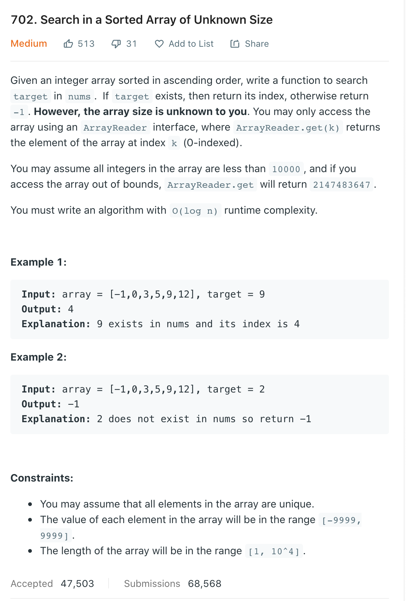
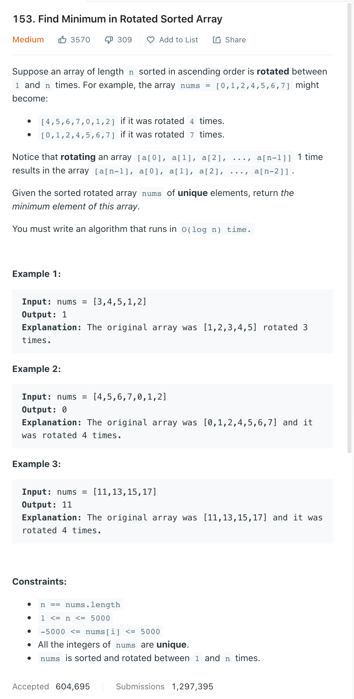
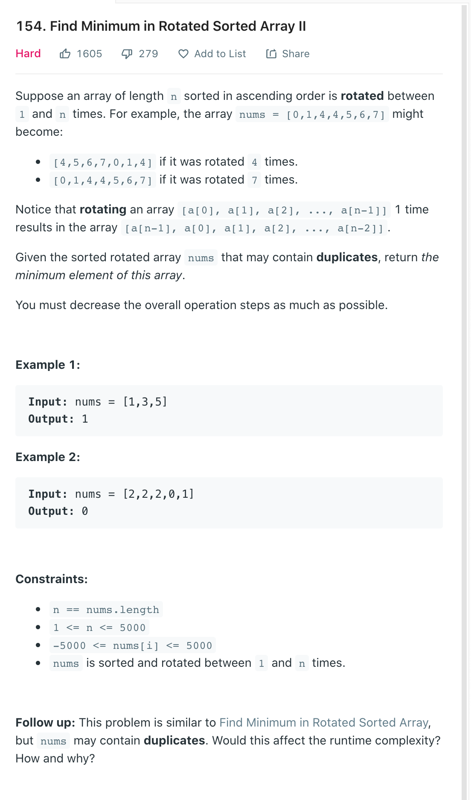
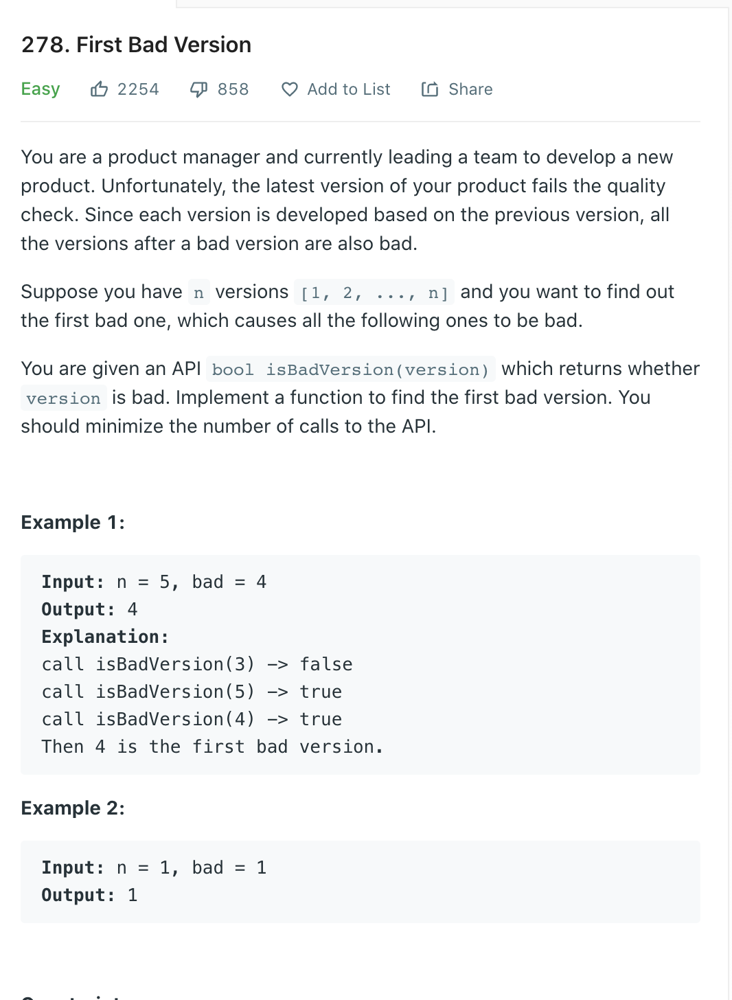
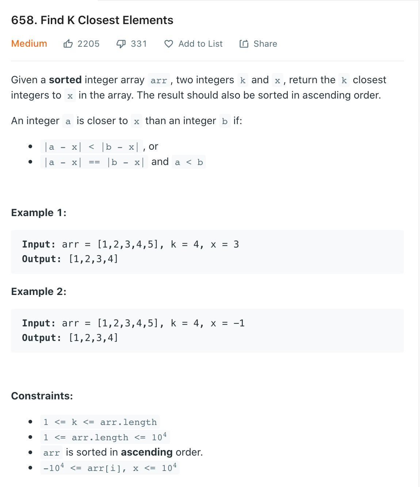

# 基本问题

1. 基本思想？（有序的数据，每次通过判断逻辑排除掉一部分的答案，直到触发终止条件）

2. 二分法实现模板（可以递归，可以迭代；一般以迭代为主）

3. 移动两个指针（start与end）的含义？移动条件是什么（筛选掉一部分数据的依据）？循环的截止条件？

4. 数据中是否有重复数字？对结果有什么影响？

5. 为什么你选择的模板中使用start < end 或者 start <= end 或者 start + 1 < end 作为终止条件？这样写是如何避免死循环的？不这么写在什么情况下会出现死循环？

   1. 二分查找算法的边界, 一般来说分两种情况, 一种是左闭右开区间, 类似于 [left, right), 一种是左闭右闭区间, 类似于 [left, right].

      需要注意的是, 循环体外的初始化条件, 与循环体内的迭代步骤, 都必须遵守**一致的区间规则**, 也就是说, 如果循环体初始化时, 是以左闭右开区间为边界的, 那么循环体内部的迭代也应该如此. 如果两者不一致, 会造成程序的错误. 比如下面就是错误的二分查找算法:

      ```
      def binarySearch(arr, target):
          l , r = 0, len(arr)
          while l < r:            
              mid = (l+r)//2
              if arr[mid] == target:
                  return mid
              if target > arr[mid]:
                  l = mid + 1
              else:
                  r = mid - 1
          return -1
      ```

      这个算法的错误在于, 在循环初始化的时候, 初始化 r=len(arr), 也就是采用的是左闭右开区间, 而当满足 target < arr[mid] 的条件是, target 如果存在的话应该在 [left, mid) 区间中, 但是这里却把 r 赋值为 mid - 1 了, 这样, 如果恰巧 mid-1 就是查找的元素, 那么就会找不到这个元素.
      下面给出两个算法, 分别是正确的左闭右闭和左闭右开区间算法, 可以与上面的进行比较:

      **左闭右闭：包括End区间，end inclusive**

      ```
      def binarySearch(arr, target):
          '''
          定义：在[l...r]的范围里寻找target, 因为这里定义是需要将r归入范围区间, inclusive，所以while循环的边界需要包含r
          '''
          l , r = 0, len(arr) - 1  
          while l <= r:            
      
              mid = (l+r)//2
              if arr[mid] == target:
                  return mid
              if target > arr[mid]:
                  l = mid + 1   # 明确区间的要求，只要使用过的，一律绕过。
              else:
                  r = mid - 1   # 明确区间的要求，只要使用过的，一律绕过。
          return -1
                  
      ```

      **左闭右开，不包括End区间, end exclusive**

      ```
      def binarySearch(arr, target):
          '''
          定义：在[l...r)的范围里寻找target, 因为这里定义是不需要将end归入范围区间
          exclusive，所以while循环的边界小于End即可，因为length本身长度会比index大1
          相对应的，每次target的value小于arr[mid]的时候，我们在重新定义新的end时候，
          也选择exclusive的模式，r = mid即可
          '''
          l , r = 0, len(arr)
          while l < r:            
              mid = l + (r-l)//2
              if arr[mid] == target:
                  return mid
              if target > arr[mid]:
                  l = mid + 1  
              else:
                  r = mid
          return -1
                  
      ```

6. 在处理逻辑中，当前结果>, <, = 目标值时分别如何处理？移动指针的依据是什么？

7. 循环退出后是否需要额外处理？

8. 如果遇到corner case根本没进主循环，你的代码是否能正常工作？

9. 为什么Java需要写 mid = start + (end - start) / 2 而 Python可以直接写 mid = (start + end) // 2 ？

   1. 在对两个Signed 32-bit数字进行相加时，有可能出现**溢出**，例如下面这种情况：

      > left = 1, right = Integer.MAX_VALUE

      当left 与 right 之和超过了所在类型的表示范围的话, 这个和就会成为一个很随机的值, 那么 middle 就不会得到正确的值.
      所以, 更稳妥的做法应该是这样的

      > ```
      > mid = l + (r-l) / 2
      > ```

10. 如何理解从基本的朴素二分，到相对复杂的条件二分，到更加抽象的答案二分？（在一个显性有序数组中一次砍掉一部分 -->  在一组有规律的数据上利用判断条件逐步缩小范围  -->  在一个有序的抽象模型里，利用不断的"猜测+检验"逐步逼近最终结果）

### [总结](https://github.com/yuzhoujr/leetcode/issues/8)


# 朴素二分法

## 704 Binary Search

Given an array of integers `nums` which is sorted in ascending order, and an integer `target`, write a function to search `target` in `nums`. If `target` exists, then return its index. Otherwise, return `-1`.

You must write an algorithm with `O(log n)` runtime complexity.

**Example 1:**

```
Input: nums = [-1,0,3,5,9,12], target = 9
Output: 4
Explanation: 9 exists in nums and its index is 4
```

**Example 2:**

```
Input: nums = [-1,0,3,5,9,12], target = 2
Output: -1
Explanation: 2 does not exist in nums so return -1
```

**Solution**

标准算法

```java
// 标准的bianry search
/*
    定义：在[l...r]的范围里寻找target, 因为这里定义是需要将r归入范围区间, inclusive，所以while循环的边界需要包含r
 */

class Solution {
    public int search(int[] nums, int target) {
        if(nums == null || nums.length == 0) {
            return -1;
        }
        int left = 0;
        int right = nums.length - 1;
        while(left <= right) {
            int mid = left + (right - left) / 2;
            if(nums[mid] == target) {
                return mid;
            } else if(nums[mid] > target) {
                right = mid - 1; // 明确区间的要求，只要使用过的，一律绕过
            } else {
                left = mid + 1; // 明确区间的要求，只要使用过的，一律绕过
            }
        }
        return -1;
    }
}
```


## 34 Find First and Last Position of Element in Sorted Array

Given an array of integers `nums` sorted in ascending order, find the starting and ending position of a given `target` value.

If `target` is not found in the array, return `[-1, -1]`.

You must write an algorithm with `O(log n)` runtime complexity. 

**Example 1:**

```
Input: nums = [5,7,7,8,8,10], target = 8
Output: [3,4]
```

**Example 2:**

```
Input: nums = [5,7,7,8,8,10], target = 6
Output: [-1,-1]
```

**Example 3:**

```
Input: nums = [], target = 0
Output: [-1,-1]
```

 **Solution**

```java
/* 
标准的bianry search
找到target后，需要前后拓展找到所有重复的值
拓展的时候需要注意不要越界
*/
class Solution {
    public int[] searchRange(int[] nums, int target) {
        int[] result = {-1, -1};
        if(nums == null || nums.length == 0) {
            return result;
        }
        int left = 0;
        int right = nums.length - 1;
        while(left <= right) {
            int mid = left + (right - left) / 2;
            if(nums[mid] == target) {
              // 注意不要越界
                while(mid + 1 < nums.length && nums[mid] == nums[mid + 1]) {
                    mid++;
                }
                result[1] = mid;
              // 注意不要越界
                while(mid - 1 >= 0 && nums[mid] == nums[mid - 1]) {
                    mid--;
                }
                result[0] = mid;
                return result;
            } else if(nums[mid] > target) {
                right = mid - 1;
            } else {
                left = mid + 1;
            }
        }
        return result;
    }
 }
```



```java
/*
solution
	1.确认一下array的最大size
	2. binary search
*/
class Solution {
    public int search(ArrayReader reader, int target) {
        int left = 0;
        int right = reader.get(0) > 0? 10000 : 10000 - reader.get(0);
        while(left <= right) {
            int mid = left + (right - left) / 2;
            if(reader.get(mid) == target) {
                return mid;
            } else if(reader.get(mid) < target) {
                left = mid + 1;
            } else {
                right = mid - 1;
            }
        }
        return -1;
    }
    
}
```



**Solution**

1. divided arrays into two parts. 第一部分要整体大于第二部分
2. 需要找的就是两个部分结合的地方
3. 先处理corner case 没有roated， 整个array是一个sorted array
4. 没有明确目标的题型，最后会缩小范围到两个数，然后检查left 和right 得到result

```java
class Solution {
   class Solution {
    public int findMin(int[] nums) {
        if(nums == null || nums.length == 0) {
            return -1;
        }
        int left = 0;
        int right = nums.length - 1;
      // 没有明确目标的题型，最后会缩小范围到两个数，然后检查left 和right 得到result
        while(right - left > 1) {
            int mid = left + (right - left) / 2;
          // 要和right比较， 这样不用特殊处理 没有roate 的corner case
            if(nums[mid] > nums[right]) {
                left = mid;
            } else {
                right = mid;
            }
        }
        return nums[left] < nums[right] ? nums[left] : nums[right];
    }
}
}
```



**Solution**

1. 可以把array分成前后两部分， 前面要整体大于等于后面
2. 使用binary search 来寻找连个部分的结合点 （和right 来比，这样不用处理没有rotate 的corner case）
   1. case 1：nums[mid] < nums[right]  mid现在后面部分，所有right = mid（mid可能是最小值，所以不能把它除外）
   2. case 2:  nums[mid] > nums[right] mid现在在前面部分， left = mid + 1
   3. case 3: nums[mid] == nums[right] 不能判断现在mid是在哪一部分，right--来缩小范围
3. 最后narrow down到一个数就是我们的答案

**Discussion**

> The problem is a follow-up to the problem of [153. Find Minimum in Rotated Sorted Array](https://leetcode.com/problems/find-minimum-in-rotated-sorted-array/). The difference is that in this problem the array can contain duplicates. *So the question is "Would allow duplicates affect the run-time complexity? How and why?"*

First of all, the problem of [153. Find Minimum in Rotated Sorted Array](https://leetcode.com/problems/find-minimum-in-rotated-sorted-array/) can be considered as a specific case of this problem, where it just happens that the array does not contain any duplicate. As a result, the very solutions of this problem would work for the problem of [#153](https://leetcode.com/problems/find-minimum-in-rotated-sorted-array/) as well. It is just that we would never come cross the case #3 (*i.e.* `nums[pivot] == nums[high]`) in the problem of [#153](https://leetcode.com/problems/find-minimum-in-rotated-sorted-array/).

It is due to the fact that there might exist some duplicates in the array, that we come up the case #3 which eventually render the time complexity of the algorithm to be linear \mathcal{O}(N)O(*N*), rather than \mathcal{O}(\log_{2}{N})O(log2*N*).

> One might wonder that whether it works in case #3 if we move the lower boundary (*i.e.* `low += 1`), rather than the upper boundary (*i.e.* `high -= 1`).

The short answer is that it could work for some cases, but not for all. For instance, given the input `[1, 3, 3]`, by moving the lower boundary, we would skip the correct answer.

> While we do `low = pivot + 1` to reduce the search scope, then why not do `high = pivot - 1` instead of `high = pivot`? Or a similar question would be *"why don't we do check of `low <= high` rather than `low < high`"?*

As a matter of fact, the binary search algorithm has several [forms of implementation](https://en.wikipedia.org/wiki/Binary_search_algorithm), regarding how we set the boundaries and the loop conditions. One can refer to the [Explore card of Binary Search](https://leetcode.com/explore/learn/card/binary-search/) in LeetCode for more details. As simple as the idea of binary search might seem to be, it is tricky to make it work for all cases.

As one would discover from the card, the above implementation of binary search complies with the [template II](https://leetcode.com/explore/learn/card/binary-search/126/template-ii/937/) of binary search. And by replacing `high = pivot` with `high = pivot - 1`, the algorithm will not work.

As subtle as it looks like, the update of the pointers should be consistent with the conditions of the loop. As a rule of thumb, it is advised to stick with one form of binary search, and not to mix them up.

> One might notice that we are calculating the pivot with the formula of `pivot = low + (high-low)/2`, rather than the more intuitive term `pivot = (high+low)/2`.

Actually, this is done intentionally to prevent the numeric overflow issue, since the sum of two integers could exceed the limit of the integer number. As a fun fact, the above mistake prevails in many implementations of binary search, as revealed from a post titled [*"Nearly All Binary Searches and Mergesorts are Broken"*](https://ai.googleblog.com/2006/06/extra-extra-read-all-about-it-nearly.html) from googleblog in 2006.

```java
class Solution { 
    public int findMin(int[] nums) {
        if(nums == null || nums.length == 0) {
            return -1;
        }
        int left = 0;
        int right = nums.length - 1;
        while(left < right) {
            int mid = left + (right - left) / 2;
            if(nums[mid] < nums[right]) {
                right = mid;
            } else if(nums[mid] > nums[right]) {
                left = mid + 1;
            } else {
                right--;
            }
        }
        return nums[left];
    }
}
```




```java
public class Solution extends VersionControl {
    public int firstBadVersion(int n) {
        int left = 1;
        int right = n;
        while(left < right) {
            int mid = left + (right - left) / 2;
            System.out.println(mid);
            if(isBadVersion(mid)) {
                right = mid;
            } else {
                left = mid + 1;
            }
        }
        return left;
    }
}
```



这道题还需要仔细想想

bianry 找closest element 是如何处理边界的

```java
class Solution {
    public List<Integer> findClosestElements(int[] arr, int k, int x) {
        List<Integer> result = new ArrayList<Integer>();
        int left = 0;
        int right = arr.length - 1;
        int mid = 0;
        while(left <= right) {
            mid = left + (right - left) / 2;
            if(arr[mid] == x) {
                break;    
            } else if(arr[mid] > x) {
                right = mid - 1;
            } else {
                left = mid + 1;
            }
        }
        
        // initilized our sliding window's bounds
        left = mid - 1;
        right = left + 1;
        
        while(right - left <= k) {
            if(left == -1) {
                right += 1;
            } else if(right == arr.length || Math.abs(arr[left] - x) <= Math.abs(arr[right] - x)) {
                left -= 1;
            } else {
                right += 1;
            }
        }
        // Build and return the window
        for (int i = left + 1; i < right; i++) {
            result.add(arr[i]);
        }
        return result;
    }
}
```


## Find Smallest Letter Greater Than Target

Given a characters array `letters` that is sorted in **non-decreasing** order and a character `target`, return *the smallest character in the array that is larger than* `target`.

**Note** that the letters wrap around.

- For example, if `target == 'z'` and `letters == ['a', 'b']`, the answer is `'a'`.

 

**Example 1:**

```
Input: letters = ["c","f","j"], target = "a"
Output: "c"
```

**Example 2:**

```
Input: letters = ["c","f","j"], target = "c"
Output: "f"
```

**Example 3:**

```
Input: letters = ["c","f","j"], target = "d"
Output: "f"
```

**Example 4:**

```
Input: letters = ["c","f","j"], target = "g"
Output: "j"
```

**Example 5:**

```
Input: letters = ["c","f","j"], target = "j"
Output: "c"
```


**Solution**

重温一遍binary search 背诵模板

wrap around的edge case我们可以在开头给解决了，如果target 比所有的letters都大，那最小的那个letters[0] 就是答案

而第二个模板专门针对的是第一个模板的短板：当要access数组边界的数，如果边界的数在运行中出现更改，可能越界。虽然这种情况也可以用Edge Case来写，但太过麻烦。这点我们后面具体说来。

```java
class Solution {
    public char nextGreatestLetter(char[] letters, char target) {
        int len = letters.length;
        int left = 0;
        int right = len - 1;
        while(left + 1 < right) {
            int mid = left  + (right - left) / 2;
            if(target >= letters[mid]) {
                left = mid;
            } else {
                right = mid;
            }
        }
        if(letters[right] <= target) {
            return letters[0];
        }
        if(letters[left] > target) {
            return letters[left];
        } else {
             return letters[right];
        }
    }
}
```

------


## Sqrt(x)

Given a non-negative integer `x`, compute and return *the square root of* `x`.

Since the return type is an integer, the decimal digits are **truncated**, and only **the integer part** of the result is returned.

**Note:** You are not allowed to use any built-in exponent function or operator, such as `pow(x, 0.5)` or `x ** 0.5`.

**Example 1:**

```
Input: x = 4
Output: 2
```

**Example 2:**

```
Input: x = 8
Output: 2
Explanation: The square root of 8 is 2.82842..., and since the decimal part is truncated, 2 is returned.
```

**Solution**

数学题到时候归纳到一起，背一下

最好的办法是newton's method， 比较常规的就用binary search做好了

这套题的边界条件和模板有点不一样，总结的时候想想

和 上面那个一样的模板

```java
class Solution {
  public int mySqrt(int x) {
 
    long num;
    int pivot, left = 0, right = x;
    while (left <= right) {
      pivot = left + (right - left) / 2;
      num = (long)pivot * pivot;
      if (num > x) right = pivot - 1;
      else if (num < x) left = pivot + 1;
      else return pivot;
    }

    return right;
  }
}
```


## 367 Valid Perfect Square

Given a **positive** integer *num*, write a function which returns True if *num* is a perfect square else False.

**Follow up:** **Do not** use any built-in library function such as `sqrt`.

 

**Example 1:**

```
Input: num = 16
Output: true
```

**Example 2:**

```
Input: num = 14
Output: false
```

**Solution**

```java
class Solution {
    public boolean isPerfectSquare(int num) {
        if(num < 2) {
            return true;
        }
      
      // answer 不会小于2也不会大于 num / 2
        int left = 2;
        int right = num / 2;
        while(left <= right) {
            int mid = left + (right - left) / 2;
            long square = (long)mid * mid;
            if(square == num) {
                return true;
            } else if(square < num) {
                left = mid + 1;
            } else {
                right = mid - 1;
            }
        }
        return false;
    }
}
```


## 74 Search a 2D Matrix

Write an efficient algorithm that searches for a value in an `m x n` matrix. This matrix has the following properties:

- Integers in each row are sorted from left to right.
- The first integer of each row is greater than the last integer of the previous row.

 

**Example 1:**


```
Input: matrix = [[1,3,5,7],[10,11,16,20],[23,30,34,60]], target = 3
Output: true
```

**Example 2:**


```
Input: matrix = [[1,3,5,7],[10,11,16,20],[23,30,34,60]], target = 13
Output: false
```

**Solution**

```java
class Solution {
    public boolean searchMatrix(int[][] matrix, int target) {
        int m = matrix.length;
        if (m == 0)
            return false;
        int n = matrix[0].length;

        // binary search
        int left = 0, right = m * n - 1;
        int pivotIdx, pivotElement;
        while (left <= right) {
            pivotIdx = (left + right) / 2;
            pivotElement = matrix[pivotIdx / n][pivotIdx % n];
            if (target == pivotElement)
                return true;
            else {
                if (target < pivotElement)
                    right = pivotIdx - 1;
                else
                    left = pivotIdx + 1;
            }
        }
        return false;
    }
}
```


# 条件二分法


## Search in Rotated Sorted Array

There is an integer array `nums` sorted in ascending order (with **distinct** values).

Prior to being passed to your function, `nums` is **rotated** at an unknown pivot index `k` (`0 <= k < nums.length`) such that the resulting array is `[nums[k], nums[k+1], ..., nums[n-1], nums[0], nums[1], ..., nums[k-1]]` (**0-indexed**). For example, `[0,1,2,4,5,6,7]` might be rotated at pivot index `3` and become `[4,5,6,7,0,1,2]`.

Given the array `nums` **after** the rotation and an integer `target`, return *the index of* `target` *if it is in* `nums`*, or* `-1` *if it is not in* `nums`.

You must write an algorithm with `O(log n)` runtime complexity.

 

**Example 1:**

```
Input: nums = [4,5,6,7,0,1,2], target = 0
Output: 4
```

**Example 2:**

```
Input: nums = [4,5,6,7,0,1,2], target = 3
Output: -1
```

**Example 3:**

```
Input: nums = [1], target = 0
Output: -1
```

**Solution**

经典的binary search， 但比较绕，建议多看几遍

```java
class Solution {
  public int search(int[] nums, int target) {
    int start = 0, end = nums.length - 1;
    while (start <= end) {
      int mid = start + (end - start) / 2;
      if (nums[mid] == target) 
          return mid;
      // array 可以分成两个ascending order的array， 判断在哪一段上
      else if (nums[mid] >= nums[start]) {
        if (target >= nums[start] && target < nums[mid]) {
            end = mid - 1;
        }
        else 
            start = mid + 1;
      } else {
        if (target <= nums[end] && target > nums[mid]) {
            start = mid + 1;
        } else {
            end = mid - 1;
        }
      }
    }
    return -1;
  }
}
```


------

## Search in Rotated Sorted Array II

There is an integer array `nums` sorted in non-decreasing order (not necessarily with **distinct** values).

Before being passed to your function, `nums` is **rotated** at an unknown pivot index `k` (`0 <= k < nums.length`) such that the resulting array is `[nums[k], nums[k+1], ..., nums[n-1], nums[0], nums[1], ..., nums[k-1]]` (**0-indexed**). For example, `[0,1,2,4,4,4,5,6,6,7]` might be rotated at pivot index `5` and become `[4,5,6,6,7,0,1,2,4,4]`.

Given the array `nums` **after** the rotation and an integer `target`, return `true` *if* `target` *is in* `nums`*, or* `false` *if it is not in* `nums`*.*

You must decrease the overall operation steps as much as possible.

**Example 1:**

```
Input: nums = [2,5,6,0,0,1,2], target = 0
Output: true
```

**Example 2:**

```
Input: nums = [2,5,6,0,0,1,2], target = 3
Output: false
```

**Solution**

区别是这个有duplicated number 到时候放在一起看吧

Time complexity : O(N) worst case, O(logN) best case, where N is the length of the input array.

Space complexity : O(1)

```Java
class Solution {
    public boolean search(int[] nums, int target) {
        int n = nums.length;
        if (n == 0) return false;
        int end = n - 1;
        int start = 0;

        while (start <= end) {
            int mid = start + (end - start) / 2;

            if (nums[mid] == target) {
                return true;
            }
						// if start = mid, we cannot tell which part mid is currently belong to
          // we can only reduce 1
            if (!isBinarySearchHelpful(nums, start, nums[mid])) {
                start++;
                continue;
            }
            // which array does pivot belong to.
            boolean pivotArray = existsInFirst(nums, start, nums[mid]);

            // which array does target belong to.
            boolean targetArray = existsInFirst(nums, start, target);
            if (pivotArray ^ targetArray) { // If pivot and target exist in different sorted arrays, recall that xor is true when both operands are distinct
                if (pivotArray) {
                    start = mid + 1; // pivot in the first, target in the second
                } else {
                    end = mid - 1; // target in the first, pivot in the second
                }
            } else { // If pivot and target exist in same sorted array
                if (nums[mid] < target) {
                    start = mid + 1;
                } else {
                    end = mid - 1;
                }
            }
        }
        return false;
    }

    // returns true if we can reduce the search space in current binary search space
    private boolean isBinarySearchHelpful(int[] arr, int start, int element) {
        return arr[start] != element;
    }

    // returns true if element exists in first array, false if it exists in second
    private boolean existsInFirst(int[] arr, int start, int element) {
        return arr[start] <= element;
    }
}
```


4. Median of Two Sorted Arrays
https://leetcode.com/problems/median-of-two-sorted-arrays/

74. Search a 2D Matrix
https://leetcode.com/problems/search-a-2d-matrix/

162. Find Peak Element
https://leetcode.com/problems/find-peak-element/

302. Smallest Rectangle Enclosing Black Pixels
https://leetcode.com/problems/sm ... osing-black-pixels/

852. Peak Index in a Mountain Array
https://leetcode.com/problems/peak-index-in-a-mountain-array/

# 答案二分法

875. Koko Eating Bananas
https://leetcode.com/problems/koko-eating-bananas/

1283. Find the Smallest Divisor Given a Threshold
https://leetcode.com/problems/fi ... -given-a-threshold/

69. Sqrt(x)
(Lint-586. Sqrt(x) II, follow up)
https://leetcode.com/problems/sqrtx/
https://www.lintcode.com/problem/sqrtx-ii/description

Lint-183. Wood Cut
https://www.lintcode.com/problem/wood-cut/description

Lint-437. Copy Books
https://www.lintcode.com/problem/copy-books/description

Lint-438. Copy Books II
https://www.lintcode.com/problem/copy-books-ii/description


# Missing elements

\1060. Missing Element in Sorted Array

\1539. Kth Missing Positive Number

