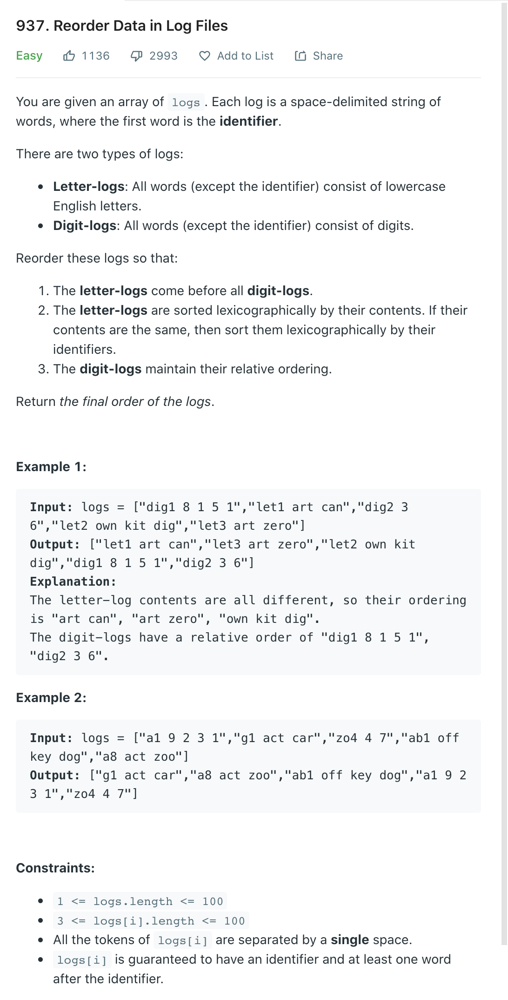

# 基本问题

（1）多指针是一个非常广泛的概念，并不是一个固定的算法。但基本上是通过一些变量的控制与循环把问题的复杂度控制在一两层for循环之内。可以用在数组、链表、区间、滑动窗口、流、回文串、和差问题等多个场景。（前项和其实并不完全是指针问题，但也归并在这里）。
（2）Quick Sort和Merge Sort的基本原理与实现，排序的稳定性问题
（3）Quick Select的实现与复杂度
（4）同向指针与相向指针的使用场景
（5）不同场景下循环终止条件？
（6）两数之和，之差，特定条件下（大小于某值等）的计数问题
（7）三数或三数以上之和的通用写法（两数之和+搜索）
（8）数组有没有排序？是否需要排序？
（9）数组有没有去重？是否需要去重？
（10）离线数据（内存中，有限长）还是在线数据（无法放入内存，长度未知）？
（11）链表操作中dummy node与previous node的使用技巧
（12）链表的中点，判断是否有环，寻找环的交叉点


# 数组

## Sort an Array

## Sort Colors


**Follow up**

 Could you come up with a one-pass algorithm using only constant extra space?

**Solution**

1. 双指针，一个来track 0 的index， 另外一个track 2 的index
2. loop 整个array，将0 swap到数组前端，将2 swap到数组后端
3. time: O(N), space: O(1)

```java
class Solution {
    public void sortColors(int[] nums) {
        if(nums == null && nums.length == 0) {
            return;
        }
        int zeroIndex = 0;
        int twoIndex = nums.length - 1;
        int i = 0;
        while(i <= twoIndex) {
            int cur = nums[i];
            if(cur == 0) {
                swap(nums, i, zeroIndex);
                zeroIndex++;
                
            } else if(cur == 2) {
                swap(nums, i, twoIndex);
                twoIndex--;
            } 
            i++;
        }
        
    }
    
    private void swap(int[] nums, int a, int b) {
        int temp = nums[a];
        nums[a] = nums[b];
        nums[b] = temp;
    }
}
```

## Remove Duplicates from Sorted Array


**Solution**

1. using two pointer, i is used to reference the real index, j is used to loop the array
2. while nuns[j] is not equal to nums[i], we can put that into the real array
3. time: O(N), space: O(1)

```java
class Solution {
    public int removeDuplicates(int[] nums) {
        if (nums.length == 0) return 0;
        int i = 0;
        for (int j = 1; j < nums.length; j++) {
            if (nums[j] != nums[i]) {
                i++;
                nums[i] = nums[j];
            }
        }
        return i + 1;
    }
}
```

## Remove Duplicates from Sorted Array


**Solution**

1. 本质和leetcode26  Remove Duplicates from Sorted Array 相同
2. 需要另外的一个count 来记一下重复的次数
3. time: O(N), space: O(1)

```java
class Solution {
    public int removeDuplicates(int[] nums) {
        if(nums.length == 0) return 0;
        int i = 0;
        int count = 1;
        for(int j = 1; j < nums.length; ++j) {
            if(nums[j] != nums[i]) {
                i++;
                nums[i] = nums[j];
                count = 1;
            } else if(count == 1) {
                i++;
                nums[i] = nums[j];
                count++;
            }
        }
        return i + 1;
    }
}
```

## Merge Sorted Array


**Solution**

1. 从后往前排序
2. time: O(N), space:O(1)

```java
class Solution {
    public void merge(int[] nums1, int m, int[] nums2, int n) {
        int p = nums1.length - 1;
        int p1 = m - 1;
        int p2 = n - 1;
        while(p >= 0) {
            if(p1 < 0) {
                nums1[p] = nums2[p2];
                p2--;
            } else if(p2 < 0) {
                nums1[p] = nums1[p1];
                p1--;
            } else if(nums1[p1] > nums2[p2]) {
                nums1[p] = nums1[p1];
                p1--;
            } else {
                nums1[p] = nums2[p2];
                p2--;
            }
            p--;
        }
    }
}
```

## Move Zeroes


**Solution**

1. 类似leetcode26
2. 最后把后面的零补全

```java
class Solution {
    public void moveZeroes(int[] nums) {
        int count = 0;
        for (int i = 0; i < nums.length; ++i) {
            if(nums[i] != 0) {
                nums[count] = nums[i];
                count++;
            } 
        }
        for(int i = count; i < nums.length; i++) {
            nums[i] = 0;
        }
    }
}
```

## Kth Largest Element in an Array


**Solution**

1. The idea is to init a heap "the smallest element first", and add all elements from the array into this heap one by one keeping the size of the heap always less or equal to `k`. That would results in a heap containing `k` largest elements of the array.
2. Quick select
3. 

```java
// heap
class Solution {
    public int findKthLargest(int[] nums, int k) {
        // init heap 'the smallest element first'
        PriorityQueue<Integer> heap =
            new PriorityQueue<Integer>((n1, n2) -> n1 - n2);

        // keep k largest elements in the heap
        for (int n: nums) {
          heap.add(n);
          if (heap.size() > k)
            heap.poll();
        }

        // output
        return heap.poll();        
  }
}

// quick select
```

## Reorder Data in Log Files



**Tag**: amazon

**Solution**

1. 考察了java Comparator怎么写

```java
class Solution {
    public String[] reorderLogFiles(String[] logs) {
        Comparator<String> comp = new Comparator<> () {
            @Override
            public int compare(String s1, String s2) {
                int s1SpaceIndex = s1.indexOf(' ');
                int s2SpaceIndex = s2.indexOf(' ');
                char s1FirstChar = s1.charAt(s1SpaceIndex + 1);
                char s2FirstChar = s2.charAt(s2SpaceIndex + 1);
    
                if(Character.isDigit(s1FirstChar)) {
                    if(Character.isDigit(s2FirstChar)) {
                        return 0; // remain the same
                    } else {
                        return 1; // letter-logs come before digit-logs
                    }
                } else {
                    if(Character.isDigit(s2FirstChar)) {
                        return -1; // remain the same
                    } else {
                        int preCompute = s1.substring(s1SpaceIndex + 1).compareTo(s2.substring(s2SpaceIndex + 1));
                        if(preCompute == 0) {
                            preCompute = s1.substring(0, s1SpaceIndex).compareTo(s2.substring(0, s2SpaceIndex));
                        }
                        return preCompute;
                    }
                }
            }
        };
        Arrays.sort(logs, comp);
        return logs;
    }
}
```


## Optimizing Box Weights

Given a list of integers, partition it into two subsets S1 and S2 such that the sum of S1 is greater than that of S2. And also the number of elements in S1 should be minimal.
Return S1 in increasing order.
Notice if more than one subset A exists, return the one with the maximal sum.

**Examples**:

```
Input:
nums = [4, 5, 2, 3, 1, 2]
Output:
[4, 5]
Explanation:
We can divide the numbers into two subsets A = [4, 5] and B = [1, 2, 2, 3]. The sum of A is 9 which is greater than the sum of B which is 8. There are other ways to divide but A = [4, 5] is of minimal size of 2.

Input:
nums = [10, 5, 3, 1, 20]
Output:
[20]

Input:
nums = [1, 2, 3, 5, 8]
Output:
[5, 8]
```

**Tag**: amazon

**Solution:**

1. sort the array and pick the largest number in the array until the sum of s1 is larger than S2
2. copy that to a new array
3. time: O(N * logN + N), space: O(N)

```java
public class OptimizeBoxWeight {
    // "static void main" must be defined in a public class.
        public static void main(String[] args) {
            int[] ans1 = optimize(new int[]{1, 1, 2, 1});
            print("ans1", ans1);
            int[] ans2 = optimize(new int[]{3, 7, 6, 2});
            print("ans2", ans2);
            int[] ans3 = optimize(new int[]{4, 5, 2, 3, 1, 2});
            print("ans3", ans3);
        }
        private static int[] optimize(int[] arr) {
            long totalSum = 0;
            for (int num : arr) {
                totalSum += num;
            }
            Arrays.sort(arr);
            long partialSum = 0;
            int i = arr.length;
            while (i > 0 && partialSum < totalSum - partialSum) {
                i--;
                partialSum += arr[i];
            }
            int[] res = new int[arr.length - i];
            for (int j = 0; j < res.length; j++) {
                res[j] = arr[i + j];
            }
            return res;
        }

        private static void print(String name, int[] arr) {
            System.out.println(name);
            for (int n : arr) {
                System.out.println(n);

            }
        }
}
```

## Top K Frequent Elements


**Solution**

heap solution

1. build a hash map element -> its frequency. This step takes O(N) time
2. build a heap of size k using N elements. 

Quick select 

**这个找机会看一看**

```java
class Solution {
    public int[] topKFrequent(int[] nums, int k) {
        if(k == nums.length) {
            return nums;
        }
        Map<Integer, Integer> count = new HashMap();
        for (int n :nums) {
            count.put(n, count.getOrDefault(n, 0) + 1);
        }
        // we need a min heap here. If the element's frequency is larger than the least one in the heap. We will replace it.
        Queue<Integer> heap = new PriorityQueue<>((n1, n2) -> count.get(n1) - count.get(n2));
        
        for (int n : count.keySet()) {
            heap.add(n);
            if(heap.size() > k) heap.poll();
        }
        
        int[] top = new int[k];
        for(int i = k - 1; i >= 0; --i) {
            top[i] = heap.poll();
        }
        return top;
    }
}
```


## Intersection of Two Arrays

Given two integer arrays `nums1` and `nums2`, return *an array of their intersection*. Each element in the result must be **unique** and you may return the result in **any order**.

**Example 1:**

```
Input: nums1 = [1,2,2,1], nums2 = [2,2]
Output: [2]
```

**Example 2:**

```
Input: nums1 = [4,9,5], nums2 = [9,4,9,8,4]
Output: [9,4]
Explanation: [4,9] is also accepted.
```

```java
class Solution {
  public int[] set_intersection(HashSet<Integer> set1, HashSet<Integer> set2) {
    int [] output = new int[set1.size()];
    int idx = 0;
    for (Integer s : set1)
      if (set2.contains(s)) output[idx++] = s;

    return Arrays.copyOf(output, idx);
  }

  public int[] intersection(int[] nums1, int[] nums2) {
    HashSet<Integer> set1 = new HashSet<Integer>();
    for (Integer n : nums1) set1.add(n);
    HashSet<Integer> set2 = new HashSet<Integer>();
    for (Integer n : nums2) set2.add(n);

    if (set1.size() < set2.size()) return set_intersection(set1, set2);
    else return set_intersection(set2, set1);
  }
}
```


## Intersection of Two Arrays II

Given two integer arrays `nums1` and `nums2`, return *an array of their intersection*. Each element in the result must appear as many times as it shows in both arrays and you may return the result in **any order**. 

**Example 1:**

```java
Input: nums1 = [1,2,2,1], nums2 = [2,2]
Output: [2,2]
```

**Example 2:**

```java
Input: nums1 = [4,9,5], nums2 = [9,4,9,8,4]
Output: [4,9]
Explanation: [9,4] is also accepted.
```

**Follow up:**

- What if the given array is already sorted? How would you optimize your algorithm?
  - We can use two pointer to avoid extra memory usage
- What if `nums1`'s size is small compared to `nums2`'s size? Which algorithm is better?
  - use the smaller array to build the map. Reduce memory usage
- What if elements of `nums2` are stored on disk, and the memory is limited such that you cannot load all elements into the memory at once?
  - If `nums1` fits into the memory, we can use [Approach 1](https://leetcode.com/problems/intersection-of-two-arrays-ii/solution/#approach-1-hash-map) to collect counts for `nums1` into a hash map. Then, we can sequentially load and process `nums2`.
  - If neither of the arrays fit into the memory, we can apply some partial processing strategies:
    - Split the numeric range into subranges that fits into the memory. Modify [Approach 1](https://leetcode.com/problems/intersection-of-two-arrays-ii/solution/#approach-1-hash-map) to collect counts only within a given subrange, and call the method multiple times (for each subrange).
    - Use an external sort for both arrays. Modify [Approach 2](https://leetcode.com/problems/intersection-of-two-arrays-ii/solution/#approach-2-sort) to load and process arrays sequentially.

```java
class Solution {
    public int[] intersect(int[] nums1, int[] nums2) {
        // use the smaller array to build the map. Reduce memory usage
        if (nums1.length > nums2.length) {
            return intersect(nums2, nums1);
        }
        HashMap<Integer, Integer> m = new HashMap<>();
        for (int n : nums1) {
            m.put(n, m.getOrDefault(n, 0) + 1);
        }
        int k = 0;
        for (int n : nums2) {
            int cnt = m.getOrDefault(n, 0);
            if (cnt > 0) {
                nums1[k++] = n;
                m.put(n, cnt - 1);
            }
        }
        return Arrays.copyOfRange(nums1, 0, k);
    }
}

// two pointer
public int[] intersect(int[] nums1, int[] nums2) {
    Arrays.sort(nums1);
    Arrays.sort(nums2);
    int i = 0, j = 0, k = 0;
    while (i < nums1.length && j < nums2.length) {
        if (nums1[i] < nums2[j]) {
            ++i;
        } else if (nums1[i] > nums2[j]) {
            ++j;
        } else {
            nums1[k++] = nums1[i++];
            ++j;
        }
    }
    return Arrays.copyOfRange(nums1, 0, k);
}
```


## Longest Mountain in Array

You may recall that an array `arr` is a **mountain array** if and only if:

- `arr.length >= 3`
- `There exists some index i (0-indexed) with 0 < i < arr.length - 1such that:`
  - `arr[0] < arr[1] < ... < arr[i - 1] < arr[i]`
  - `arr[i] > arr[i + 1] > ... > arr[arr.length - 1]`

Given an integer array `arr`, return *the length of the longest subarray, which is a mountain*. Return `0` if there is no mountain subarray.

**Example 1:**

```
Input: arr = [2,1,4,7,3,2,5]
Output: 5
Explanation: The largest mountain is [1,4,7,3,2] which has length 5.
```

**Example 2:**

```
Input: arr = [2,2,2]
Output: 0
Explanation: There is no mountain.
```

**Follow up:**

- Can you solve it using only one pass?
- Can you solve it in `O(1)` space?

**Solution**

```java
class Solution {
    public int longestMountain(int[] arr) {
        int result = 0, start = 0;
        int len = arr.length;
        while(start < len - 2) {
            int end = start;
          // check if it is really the start
            if(end + 1 < len && arr[end] < arr[end + 1]) {
                while(end + 1 < len && arr[end] < arr[end + 1]) {
                    end++;
                }
                 // check if it is really the peak
                if(end + 1 < len && arr[end] > arr[end + 1]) {
                    while(end + 1 < len && arr[end] > arr[end + 1]) {
                        end++;
                    }
                    result = Math.max(result, end - start + 1);
                }
            } 
            start = Math.max(end, start + 1);
            
        }
        return result;
    }
}
```


## Trapping Rain Water

Given `n` non-negative integers representing an elevation map where the width of each bar is `1`, compute how much water it can trap after raining.

 **Example 1:**


```java
Input: height = [0,1,0,2,1,0,1,3,2,1,2,1]
Output: 6
Explanation: The above elevation map (black section) is represented by array [0,1,0,2,1,0,1,3,2,1,2,1]. In this case, 6 units of rain water (blue section) are being trapped.
```

**Example 2:**

```java
Input: height = [4,2,0,3,2,5]
Output: 9
```

**Solution**

这个题基本得背下来了，每次看都忘记

1. brutal force 是每两个组合都试试看比较大小，O(n^2)， 所以在这个基础上看看能不能优化
2. two pointer. 我们先计算每个柱子所能contain的水的量，然后把全部加起来就是总的蓄水量. 如果当前的柱子左右两边都有比它高的柱子，那么它一定能蓄水，并且蓄水量是 min(max(left, right)) - height. 所以我们可以用two pointer，向中间逼近，并且同时track 最max left 和 max right

```java
class Solution {
    public int trap(int[] height) {
        if(height == null || height.length == 0) return 0;
        int left = 0;
        int right = height.length - 1; 
        int max_l = height[left];
        int max_r = height[right]; 
        int result = 0;
        while(left < right) {
            if(max_l < max_r) {
                result += max_l - height[left];
                left++;
                max_l = Math.max(max_l, height[left]);
            } else {
                result += max_r - height[right];
                right--;
                max_r = Math.max(max_r, height[right]);
            }
        }
        return result;
    }
}
```


## Multiply Strings

Given two non-negative integers `num1` and `num2` represented as strings, return the product of `num1` and `num2`, also represented as a string.

**Note:** You must not use any built-in BigInteger library or convert the inputs to integer directly. 

**Example 1:**

```
Input: num1 = "2", num2 = "3"
Output: "6"
```

**Example 2:**

```
Input: num1 = "123", num2 = "456"
Output: "56088"
```

**Solution**

1. simulate multipliaction one digit at a time
2. i 的digit 与 j位置的digit 的乘积是落在 ans[i + j + 1] 的位置上

```java
class Solution {
    public String multiply(String num1, String num2) {
        int len1 = num1.length();
        int len2 = num2.length();
      // 不需要用char array， 最后转换成string 就行了
        int[] ans = new int[len1 + len2];
        for(int i = len1 - 1; i >= 0; --i) {
            for(int j = len2 - 1; j >= 0; --j) {
                int sum = ans[i + j + 1] + (num1.charAt(i) - '0') * (num2.charAt(j) - '0'); 
                
                ans[i + j + 1] = (sum % 10);
                ans[i + j] += sum / 10;
            }
        }
        StringBuilder sb = new StringBuilder();
        for(int i = 0; i < ans.length; ++i) {
            if(ans[i] != 0 || sb.length() != 0){
                sb.append(Integer.toString(ans[i]));
            }
        }
      // 处理结果是0的corner case
        return sb.length() == 0 ? "0":sb.toString();
    }
    
}
```

## Pancake Sorting

Given an array of integers `arr`, sort the array by performing a series of **pancake flips**.

In one pancake flip we do the following steps:

- Choose an integer `k` where `1 <= k <= arr.length`.
- Reverse the sub-array `arr[0...k-1]` (**0-indexed**).

For example, if `arr = [3,2,1,4]` and we performed a pancake flip choosing `k = 3`, we reverse the sub-array `[3,2,1]`, so `arr = [1,2,3,4]` after the pancake flip at `k = 3`.

Return *an array of the* `k`*-values corresponding to a sequence of pancake flips that sort* `arr`. Any valid answer that sorts the array within `10 * arr.length` flips will be judged as correct. 

**Example 1:**

```java
Input: arr = [3,2,4,1]
Output: [4,2,4,3]
Explanation: 
We perform 4 pancake flips, with k values 4, 2, 4, and 3.
Starting state: arr = [3, 2, 4, 1]
After 1st flip (k = 4): arr = [1, 4, 2, 3]
After 2nd flip (k = 2): arr = [4, 1, 2, 3]
After 3rd flip (k = 4): arr = [3, 2, 1, 4]
After 4th flip (k = 3): arr = [1, 2, 3, 4], which is sorted.
```

**Example 2:**

```java
Input: arr = [1,2,3]
Output: []
Explanation: The input is already sorted, so there is no need to flip anything.
Note that other answers, such as [3, 3], would also be accepted.
```

**Constraints:**

- `1 <= arr.length <= 100`
- `1 <= arr[i] <= arr.length`
- All integers in `arr` are unique (i.e. `arr` is a permutation of the integers from `1` to `arr.length`).

**Solution**

```java
```


------

## Shortest Word Distance

Given an array of strings `wordsDict` and two different strings that already exist in the array `word1` and `word2`, return *the shortest distance between these two words in the list*.

**Example 1:**

```
Input: wordsDict = ["practice", "makes", "perfect", "coding", "makes"], word1 = "coding", word2 = "practice"
Output: 3
```

**Example 2:**

```
Input: wordsDict = ["practice", "makes", "perfect", "coding", "makes"], word1 = "makes", word2 = "coding"
Output: 1
```

**Solution**

word可以duplicate， 所以并不能用map的方式来直接找到index解决

**Array** 题没有特定的算法，在loop的过程中我们只要track最近的word1， word2 就行了

We can greatly improve on the brute-force approach by keeping two indices `i1` and `i2` where we store the *most recent* locations of `word1` and `word2`. Each time we find a new occurrence of one of the words, we do not need to search the entire array for the other word, since we already have the index of its most recent occurrence.

```java
class Solution {
    public int shortestDistance(String[] words, String word1, String word2) {
        int i1 = -1, i2 = -1;
        int result = words.length;
        for(int i = 0; i < words.length; ++i) {
            if(word1.equals(words[i])) {
                i1 = i;
            }
            if(word2.equals(words[i])) {
                i2 = i;
            }
            if(i1 != -1 && i2 != -1) {
                result = Math.min(result, Math.abs(i1 - i2));
            }
        }
        return result;
    }
}
```


------


## Shortest Word Distance

Given an array of strings `wordsDict` and two different strings that already exist in the array `word1` and `word2`, return *the shortest distance between these two words in the list*.

**Example 1:**

```
Input: wordsDict = ["practice", "makes", "perfect", "coding", "makes"], word1 = "coding", word2 = "practice"
Output: 3
```

**Example 2:**

```
Input: wordsDict = ["practice", "makes", "perfect", "coding", "makes"], word1 = "makes", word2 = "coding"
Output: 1
```

**Solution**

word可以duplicate， 所以并不能用map的方式来直接找到index解决

**Array** 题没有特定的算法，在loop的过程中我们只要track最近的word1， word2 就行了

```java
class Solution {
    public int shortestDistance(String[] words, String word1, String word2) {
        int i1 = -1, i2 = -1;
        int result = words.length;
        for(int i = 0; i < words.length; ++i) {
            if(word1.equals(words[i])) {
                i1 = i;
            }
            if(word2.equals(words[i])) {
                i2 = i;
            }
            if(i1 != -1 && i2 != -1) {
                result = Math.min(result, Math.abs(i1 - i2));
            }
        }
        return result;
    }
}
```


------


## 244 Shortest Word Distance II

Design a data structure that will be initialized with a string array, and then it should answer queries of the shortest distance between two different strings from the array.

Implement the `WordDistance` class:

- `WordDistance(String[] wordsDict)` initializes the object with the strings array `wordsDict`.
- `int shortest(String word1, String word2)` returns the shortest distance between `word1` and `word2` in the array `wordsDict`.

 

**Example 1:**

```
Input
["WordDistance", "shortest", "shortest"]
[[["practice", "makes", "perfect", "coding", "makes"]], ["coding", "practice"], ["makes", "coding"]]
Output
[null, 3, 1]

Explanation
WordDistance wordDistance = new WordDistance(["practice", "makes", "perfect", "coding", "makes"]);
wordDistance.shortest("coding", "practice"); // return 3
wordDistance.shortest("makes", "coding");    // return 1
```


**Solution**

先把相同的词的index全部归类到一起，比较两个word的最短距离就是比较两个list of integer 之间的最小差，**two pointer** 解决

Time Complexity O(n) 

Space Complexity 0(n)

```java
public class WordDistance {

private Map<String, List<Integer>> indexMap;

public WordDistance(String[] words) {
    indexMap = new HashMap<>();
    for(int i = 0; i < words.length; ++i) {
        if(!indexMap.containsKey(words[i])) {
            indexMap.put(words[i], new ArrayList<>());
        }
        indexMap.get(words[i]).add(i);
    }
}

public int shortest(String word1, String word2) {
   List<Integer> list1 = indexMap.get(word1);
   List<Integer> list2 = indexMap.get(word2);
    if(list1 == null || list2 == null) {
        return -1;
    }
   int i = 0, j = 0;
    int result = Integer.MAX_VALUE;
    while(i < list1.size() && j < list2.size()) {
        result = Math.min(Math.abs(list1.get(i) - list2.get(j)), result);
        if(list1.get(i) < list2.get(j)) {
            i++;
        } else if(list1.get(i) > list2.get(j)) {
            j++;
        } else {
            return result;
        }
    }
    return result;
}
}

```


------

## 605 Can Place Flowers

You have a long flowerbed in which some of the plots are planted, and some are not. However, flowers cannot be planted in **adjacent** plots.

Given an integer array `flowerbed` containing `0`'s and `1`'s, where `0` means empty and `1` means not empty, and an integer `n`, return *if* `n` new flowers can be planted in the `flowerbed` without violating the no-adjacent-flowers rule.

 

**Example 1:**

```
Input: flowerbed = [1,0,0,0,1], n = 1
Output: true
```

**Example 2:**

```
Input: flowerbed = [1,0,0,0,1], n = 2
Output: false
```

**Solution**

```java
class Solution {
    public boolean canPlaceFlowers(int[] flowerbed, int n) {
        
        int count = 0;
        for(int i = 0; i < flowerbed.length; ++i) {
            if((i - 1 >= 0 && flowerbed[i - 1] == 1) 
               || (i + 1 < flowerbed.length && flowerbed[i + 1] == 1 ) || flowerbed[i] == 1) {
                continue;
            }
            flowerbed[i] = 1;
            count++;
            if(count >= n) {
                return true;
            }
        }
        return count >= n;
    }
}
```


------


## Sort Transformed Array

Given a **sorted** integer array `nums` and three integers `a`, `b` and `c`, apply a quadratic function of the form `f(x) = ax2 + bx + c` to each element `nums[i]` in the array, and return *the array in a sorted order*. 

**Example 1:**

```
Input: nums = [-4,-2,2,4], a = 1, b = 3, c = 5
Output: [3,9,15,33]
```

**Example 2:**

```
Input: nums = [-4,-2,2,4], a = -1, b = 3, c = 5
Output: [-23,-5,1,7]
```

**Solution**

**Two pointer** 还考抛物线的知识，完全忘记了都，a > 0 开口向上，a < 0 开头向下  

Always start handling from the two ends of the parabola. The difference is when `a > 0`, they are larger at two ends, when `a < 0`, they are smaller at two ends. So when `a > 0`, we just start to fill out the result array from end to beginning, in other case, we start filling out it from start to the end of result array.

```java
public class Solution {
    public int[] sortTransformedArray(int[] nums, int a, int b, int c) {
        int n = nums.length;
        int[] sorted = new int[n];
        int i = 0, j = n - 1;
      // 向上开口，两边的数就大，所以要从后面开始填起，反之就从前面开始填
        int index = a >= 0 ? n - 1 : 0;
        while (i <= j) {
            if (a >= 0) {
                sorted[index--] = quad(nums[i], a, b, c) >= quad(nums[j], a, b, c) ? quad(nums[i++], a, b, c) : quad(nums[j--], a, b, c);
            } else {
                sorted[index++] = quad(nums[i], a, b, c) >= quad(nums[j], a, b, c) ? quad(nums[j--], a, b, c) : quad(nums[i++], a, b, c);
            }
        }
        return sorted;
    }
    
    private int quad(int x, int a, int b, int c) {
        return a * x * x + b * x + c;
    }
}
```


##  Valid Triangle Number

Given an integer array `nums`, return *the number of triplets chosen from the array that can make triangles if we take them as side lengths of a triangle*.

**Example 1:**

```
Input: nums = [2,2,3,4]
Output: 3
Explanation: Valid combinations are: 
2,3,4 (using the first 2)
2,3,4 (using the second 2)
2,2,3
```

**Example 2:**

```
Input: nums = [4,2,3,4]
Output: 4
```

**Solution**

two pointer 

三角形 小的两条边之和大于第三边，所以我们先sort， 然后选定前两条边 每次挪动第二条边，第三条边可以往前走

```Java
public class Solution {
    public int triangleNumber(int[] nums) {
        int count = 0;
        Arrays.sort(nums);
        for (int i = 0; i < nums.length - 2; i++) {
            int k = i + 2;
            for (int j = i + 1; j < nums.length - 1 && nums[i] != 0; j++) {
                while (k < nums.length && nums[i] + nums[j] > nums[k])
                    k++;
                count += k - j - 1;
            }
        }
        return count;
    }
}
```


------

## 75 Sort Colors

Given an array `nums` with `n` objects colored red, white, or blue, sort them **[in-place](https://en.wikipedia.org/wiki/In-place_algorithm)** so that objects of the same color are adjacent, with the colors in the order red, white, and blue.

We will use the integers `0`, `1`, and `2` to represent the color red, white, and blue, respectively.

You must solve this problem without using the library's sort function.

 

**Example 1:**

```
Input: nums = [2,0,2,1,1,0]
Output: [0,0,1,1,2,2]
```

**Example 2:**

```
Input: nums = [2,0,1]
Output: [0,1,2]
```

**Example 3:**

```
Input: nums = [0]
Output: [0]
```

**Example 4:**

```
Input: nums = [1]
Output: [1]
```

Solution

**Two pointer.** We can use two pointers to help. zeroIndex is pointing at 0 and twoIndex pointing at the last. Looping through the array, if we see 0 than we swap it with the number zeroindex pointing at and zeroIndex plus one. If we 2, swap it with the number twoIndex pointing at and twoIndex minus 1. 

```java
class Solution {
    public void sortColors(int[] nums) {
        if(nums == null && nums.length == 0) {
            return;
        }
        int zeroIndex = 0;
        int twoIndex = nums.length - 1;
        int i = 0;
        while(i <= twoIndex) {
            int cur = nums[i];
            if(cur == 0) {
                swap(nums, i, zeroIndex);
                zeroIndex++;
                
            } else if(cur == 2) {
                swap(nums, i, twoIndex);
                twoIndex--;
            } 
            i++;
        }
        
    }
    
    private void swap(int[] nums, int a, int b) {
        int temp = nums[a];
        nums[a] = nums[b];
        nums[b] = temp;
    }
}
```

##  1762 Buildings With an Ocean View

There are `n` buildings in a line. You are given an integer array `heights` of size `n` that represents the heights of the buildings in the line.

The ocean is to the right of the buildings. A building has an ocean view if the building can see the ocean without obstructions. Formally, a building has an ocean view if all the buildings to its right have a **smaller** height.

Return a list of indices **(0-indexed)** of buildings that have an ocean view, sorted in increasing order. 

**Example 1:**

```
Input: heights = [4,2,3,1]
Output: [0,2,3]
Explanation: Building 1 (0-indexed) does not have an ocean view because building 2 is taller.
```

**Example 2:**

```
Input: heights = [4,3,2,1]
Output: [0,1,2,3]
Explanation: All the buildings have an ocean view.
```

**Example 3:**

```
Input: heights = [1,3,2,4]
Output: [3]
Explanation: Only building 3 has an ocean view.
```

**Example 4:**

```
Input: heights = [2,2,2,2]
Output: [3]
Explanation: Buildings cannot see the ocean if there are buildings of the same height to its right.
```

**Solution**

思想有点monotonic stack的意思，有ocean view 的list 就是一个 decreasing的数组

```java
class Solution {
    public int[] findBuildings(int[] heights) {
        int highest = -1;
        List<Integer> view = new ArrayList<>();
        for(int i = heights.length - 1; i >= 0; i--) {
            if(heights[i] > highest) {
                view.add(i);
            }
            highest = Math.max(highest, heights[i]);
        }
        int[] result = new int[view.size()];
        int index = 0;
        for(int i = view.size() - 1; i >= 0; i--) {
            result[index] = view.get(i);
            index++;
        }
        return result;
    }
}
```


# 链表

## Merge Two Sorted List


**Solution**

```java
class Solution {
    public ListNode mergeTwoLists(ListNode l1, ListNode l2) {
        ListNode dummyNode = new ListNode();
        ListNode cur = dummyNode; // 用一个dummy node来标记head
        while(l1 != null && l2 != null) {
            if(l1.val < l2.val) {
                cur.next = l1;
                l1 = l1.next;
            } else {
                cur.next = l2;
                l2 = l2.next;
            }
            cur = cur.next;
        }
      // 把剩下的list给接上
        if(l1 != null) {
            cur.next = l1;
        } 
        if(l2 != null) {
            cur.next = l2;
        }
        return dummyNode.next;
    }
}
```

## Partition List


**Solution**

```java
class Solution {
    public ListNode partition(ListNode head, int x) {
        ListNode leftHead = new ListNode();
        ListNode rightHead = new ListNode();
        ListNode left = leftHead;
        ListNode right = rightHead;
        while(head != null) {
            if(head.val < x) {
                left.next = head;
                left = left.next;
            } else {
                right.next = head;
                right = right.next;
            }
            head = head.next;
        }
        right.next = null; // 需要给断开，不然会出现环
        left.next = rightHead.next;
        return leftHead.next;
    }
}
```

## Linked List Cycle


**Solution**

1. 经典算法 快慢指针 来判断是否有环

```java
public class Solution {
    public boolean hasCycle(ListNode head) {
        if(head == null) {
            return false;
        }
        ListNode slow = head;
        ListNode fast = head;
        do {
            if(fast == null || fast.next == null) {
                return false;
            }
            slow = slow.next;
            fast = fast.next.next;
        } while(slow != fast);
        return true;
    }
}
```

## Intersection of Two Linked Lists


**Solution**

1. 可以用hash table 来做
2. 先测量两个list的长度，然后在让先走长的那一个，让两个list能在同一起跑线走

```java
public class Solution {
    public ListNode getIntersectionNode(ListNode headA, ListNode headB) {
        int lengthA = getLengthOfLinkedList(headA);
        int lengthB = getLengthOfLinkedList(headB);
        if(lengthA < lengthB) {
            return getIntersectionNode(headB, headA);
        }
        for(int i = 0; i < lengthA - lengthB; ++i) {
            headA = headA.next;
        }
        while(headA != headB) {
            headA = headA.next;
            headB = headB.next;
        }
        return headA;
    }
    
    public int getLengthOfLinkedList(ListNode head) {
        int length = 0;
        while(head != null) {
            head = head.next;
            length += 1;
        }
        return length;
    }
}
```

## Palindrome Linked List


**Solution**

1. recursion 到list 底部，然后一步一步往上比较
2. Recursion 会使用extra space 
3. Space complexity : O(n), where n is the number of nodes in the Linked List. I hinted at the start that this is not using O(1) space. This might seem strange, after all we aren't creating any new data structures. So, where is the O(n) extra memory we're using? Understanding what is happening here requires understanding how the computer runs a recursive function. Each time a function is called within a function, the computer needs to keep track of where it is up to (and the values of any local variables) in the current function before it goes into the called function. It does this by putting an entry on something called the **runtime stack**, called a **stack frame**. Once it has created a stack frame for the current function, it can then go into the called function. Then once it is finished with the called function, it pops the top stack frame to resume the function it had been in before the function call was made. Before doing any palindrome checking, the above recursive function creates n of these stack frames because the first step of processing a node is to process the nodes after it, which is done with a recursive call. Then once it has the n*n* stack frames, it pops them off one-by-one to process them. So, the space usage is on the *runtime stack* because we are creating n*n* stack frames. Always make sure to consider what's going on the *runtime stack* when analyzing a recursive function. It's a common mistake to forget to.
4. 如果不能使用O(n) extra space, 我们需要改动input list， reverse second half in-place

```java
class Solution {
    private ListNode frontPointer;
    public boolean isPalindrome(ListNode head) {
        frontPointer = head;
        return check(head);
    }
    private boolean check(ListNode node) {
        if(node == null) {
            return true;
        }
        if(check(node.next)) {
            if(node.val != frontPointer.val) {
                return false;
            }
            frontPointer = frontPointer.next;
            return true;
        } else {
            return false;
        } 
    }
}
// reverse second half in-place
class Solution {
    public boolean isPalindrome(ListNode head) {
        if(head == null) return true;
        // Find the end of first half and reverse second half
        ListNode firstHalfEnd = findHalf(head);
        ListNode secondHalfStart = reverseList(firstHalfEnd.next);
        // Check whether or not there is a palindrome.
        ListNode p1 = head;
        ListNode p2 = secondHalfStart;
        while (p2 != null) {
            if (p1.val != p2.val) return false;
            p1 = p1.next;
            p2 = p2.next;
        }        

        // Restore the list and return the result.
        //firstHalfEnd.next = reverseList(secondHalfStart);
        return true;
    }
    private ListNode reverseList(ListNode head) {
        ListNode prev = null;
        while(head != null) {
            ListNode nextNode = head.next;
            head.next = prev;
            prev = head;
            head = nextNode;
        }
        return prev;
    }
    private ListNode findHalf(ListNode head) {
        ListNode fast = head;
        ListNode slow = head;
        while(fast.next != null && fast.next.next != null) {
            fast = fast.next.next;
            slow = slow.next;
        }
        return slow;
    }
}
```


## Odd Even Linked List

Given the `head` of a singly linked list, group all the nodes with odd indices together followed by the nodes with even indices, and return *the reordered list*.

The **first** node is considered **odd**, and the **second** node is **even**, and so on.

Note that the relative order inside both the even and odd groups should remain as it was in the input.

You must solve the problem in `O(1)` extra space complexity and `O(n)` time complexity.

**Example 1:**


```
Input: head = [1,2,3,4,5]
Output: [1,3,5,2,4]
```

**Example 2:**


```
Input: head = [2,1,3,5,6,4,7]
Output: [2,3,6,7,1,5,4]
```

 **Constraints:**

- `n == `number of nodes in the linked list
- `0 <= n <= 104`
- `-106 <= Node.val <= 106`

**Solution**

```java
class Solution {
    public ListNode oddEvenList(ListNode head) {
        if(head == null) return head;
      // record the prev node of odd list, it help us to connect odd list with even list
        ListNode prevOdd = null;
        ListNode curOdd = head;
      // dummy node to help track the head
        ListNode curEven = new ListNode();
        ListNode headEven = curEven;
        int count = 1;
        while(curOdd != null) {
            if(count % 2 != 0) {
                prevOdd = curOdd;
                curOdd = curOdd.next;
            } else {
                curEven.next = curOdd;
                curEven = curEven.next;
                prevOdd.next = curEven.next;
                curEven.next = null;
                curOdd = prevOdd.next;
            }
            count += 1;
        }
        prevOdd .next = headEven.next;
        return head;
    }
}
```


## Linked List Cycle II

Given a linked list, return the node where the cycle begins. If there is no cycle, return `null`.

There is a cycle in a linked list if there is some node in the list that can be reached again by continuously following the `next` pointer. Internally, `pos` is used to denote the index of the node that tail's `next` pointer is connected to. **Note that `pos` is not passed as a parameter**.

**Notice** that you **should not modify** the linked list.

**Example 1:**


```java
Input: head = [3,2,0,-4], pos = 1
Output: tail connects to node index 1
Explanation: There is a cycle in the linked list, where tail connects to the second node.
```

**Example 2:**


```java
Input: head = [1,2], pos = 0
Output: tail connects to node index 0
Explanation: There is a cycle in the linked list, where tail connects to the first node.
```

**Example 3:**


```java
Input: head = [1], pos = -1
Output: no cycle
Explanation: There is no cycle in the linked list.
```

**Constraints:**

- The number of the nodes in the list is in the range `[0, 104]`.
- `-105 <= Node.val <= 105`
- `pos` is `-1` or a **valid index** in the linked-list.

**Solution**

1. 和linked list cycle 对比就是多了一个找出成环的位置

2. 可以用set来简单解决

3. 可以用快慢指针来做， Floyd's Tortoise and Hare

   1. phase 1, 用快慢指针来找到是否有环，如果有环快慢指针会相遇在一个intersection

   2. phase 2， 重新用两个指针一个从head 出发，另外一个从intersection出发，相遇的地点就是环的entrance

   3. phase 2的证明 因为快指针的速度是慢指针的两倍， 所以我们知道 2* (F + a) = F + a + b + a -> F = b

      

```java
public class Solution {
    public ListNode detectCycle(ListNode head) {
        Set<ListNode> seen = new HashSet<>();
        while(head != null) {
            if(seen.contains(head)) {
                return head;
            }
            seen.add(head);
            head = head.next;
        }
        return head;
    }

// floyd's Tortoise and Harse
  
  public class Solution {
    private ListNode getIntersect(ListNode head) {
        ListNode tortoise = head;
        ListNode hare = head;

        // A fast pointer will either loop around a cycle and meet the slow
        // pointer or reach the `null` at the end of a non-cyclic list.
        while (hare != null && hare.next != null) {
            tortoise = tortoise.next;
            hare = hare.next.next;
            if (tortoise == hare) {
                return tortoise;
            }
        }

        return null;
}

    public ListNode detectCycle(ListNode head) {
        // If there is a cycle, the fast/slow pointers will intersect at some
        // node. Otherwise, there is no cycle, so we cannot find an entrance to
        // a cycle.
        ListNode intersect = getIntersect(head);
        if (intersect == null) {
            return null;
        }

        // To find the entrance to the cycle, we have two pointers traverse at
        // the same speed -- one from the front of the list, and the other from
        // the point of intersection.
        ListNode ptr1 = head;
        ListNode ptr2 = intersect;
        while (ptr1 != ptr2) {
            ptr1 = ptr1.next;
            ptr2 = ptr2.next;
        }

        return ptr1;
    }
}
```


## Middle of the Linked List

Given a non-empty, singly linked list with head node `head`, return a middle node of linked list.

If there are two middle nodes, return the second middle node. 

**Example 1:**

```java
Input: [1,2,3,4,5]
Output: Node 3 from this list (Serialization: [3,4,5])
The returned node has value 3.  (The judge's serialization of this node is [3,4,5]).
Note that we returned a ListNode object ans, such that:
ans.val = 3, ans.next.val = 4, ans.next.next.val = 5, and ans.next.next.next = NULL.
```

**Example 2:**

```java
Input: [1,2,3,4,5,6]
Output: Node 4 from this list (Serialization: [4,5,6])
Since the list has two middle nodes with values 3 and 4, we return the second one.
```

**Note:**

- The number of nodes in the given list will be between `1` and `100`.

**Solution**

1. 快慢指针

```java
class Solution {
    public ListNode middleNode(ListNode head) {
        ListNode slow = head;
        ListNode fast = head;
        while(fast != null && fast.next != null) {
            fast = fast.next.next;
            slow = slow.next;
        }
        return slow;
    }
}
```


## Rotate List

Given the `head` of a linked list, rotate the list to the right by `k` places.

 

**Example 1:**


```
Input: head = [1,2,3,4,5], k = 2
Output: [4,5,1,2,3]
```

**Example 2:**


```
Input: head = [0,1,2], k = 4
Output: [2,0,1]
```

 **Solution**

```java
class Solution {
    public ListNode rotateRight(ListNode head, int k) {
        if(head == null) return null;
        int listNum = 1;
        ListNode tail = head;
        
        //find tail and count listNum
        while(tail.next != null){
            listNum++;
            tail = tail.next;
        }
        tail.next = head;
        // 这个值是tail 需要走几步才能走到真正的tail 的位置
        int newHeadIndex = listNum - k % listNum;
        
        // 0 - 1 - 2
        // k = 1 tail 要走 2步， k = 2， tail 走1步

        for(int i = 0; i < newHeadIndex; i++){
            tail = tail.next;
        }
        
        head = tail.next;
        tail.next = null;

        return head;
    }
}
```


# 区间


## 616 Add Bold Tag in String

You are given a string `s` and an array of strings `words`. You should add a closed pair of bold tag `<b>` and `</b>` to wrap the substrings in `s` that exist in `words`. If two such substrings overlap, you should wrap them together with only one pair of closed bold-tag. If two substrings wrapped by bold tags are consecutive, you should combine them.

Return `s` *after adding the bold tags*.

 

**Example 1:**

```
Input: s = "abcxyz123", words = ["abc","123"]
Output: "<b>abc</b>xyz<b>123</b>"
```

**Example 2:**

```
Input: s = "aaabbcc", words = ["aaa","aab","bc"]
Output: "<b>aaabbc</b>c"
```

**Solution**

```java
class Solution {
    public String addBoldTag(String s, String[] dict) {
        List<Interval> intervals = new ArrayList<>();
        for (String str : dict) {
        	int index = -1;
        	index = s.indexOf(str, index);
        	while (index != -1) {
        		intervals.add(new Interval(index, index + str.length()));
        		index +=1;
        		index = s.indexOf(str, index);
        	}
        }
        intervals = merge(intervals);
        int prev = 0;
        StringBuilder sb = new StringBuilder();
        for (Interval interval : intervals) {
        	sb.append(s.substring(prev, interval.start));
        	sb.append("<b>");
        	sb.append(s.substring(interval.start, interval.end));
        	sb.append("</b>");
        	prev = interval.end;
        }
        if (prev < s.length()) {
        	sb.append(s.substring(prev));
        }
        return sb.toString();
    }
	
	class Interval {
		int start, end;
		public Interval(int s, int e) {
			start = s;
			end = e;
		}
		
		public String toString() {
			return "[" + start + ", " + end + "]" ;
		}
	}
	
	public List<Interval> merge(List<Interval> intervals) {
        if (intervals == null || intervals.size() <= 1) {
            return intervals;
        }
        Collections.sort(intervals, new Comparator<Interval>(){
            public int compare(Interval a, Interval b) {
                return a.start - b.start;
            }
        });
        
        int start = intervals.get(0).start;
        int end = intervals.get(0).end;
        List<Interval> res = new ArrayList<>();
        for (Interval i : intervals) {
            if (i.start <= end) {
                end = Math.max(end, i.end);
            } else {
                res.add(new Interval(start, end));
                start = i.start;
                end = i.end;
            }
        }
        res.add(new Interval(start, end));
        return res;
    }
}
```


## 759 Employee Free Time

We are given a list `schedule` of employees, which represents the working time for each employee.

Each employee has a list of non-overlapping `Intervals`, and these intervals are in sorted order.

Return the list of finite intervals representing **common, positive-length free time** for *all* employees, also in sorted order.

(Even though we are representing `Intervals` in the form `[x, y]`, the objects inside are `Intervals`, not lists or arrays. For example, `schedule[0][0].start = 1`, `schedule[0][0].end = 2`, and `schedule[0][0][0]` is not defined). Also, we wouldn't include intervals like [5, 5] in our answer, as they have zero length.

 

**Example 1:**

```
Input: schedule = [[[1,2],[5,6]],[[1,3]],[[4,10]]]
Output: [[3,4]]
Explanation: There are a total of three employees, and all common
free time intervals would be [-inf, 1], [3, 4], [10, inf].
We discard any intervals that contain inf as they aren't finite.
```

**Example 2:**

```
Input: schedule = [[[1,3],[6,7]],[[2,4]],[[2,5],[9,12]]]
Output: [[5,6],[7,9]]
```

**Solution**

我们不用去care有几个员工，我们只要找到timeline 之间的interval就行了

```java
class Solution {
     public List<Interval> employeeFreeTime(List<List<Interval>> avails) {
        List<Interval> result = new ArrayList<>();
        List<Interval> timeLine = new ArrayList<>();
        avails.forEach(e -> timeLine.addAll(e));
        Collections.sort(timeLine, ((a, b) -> a.start - b.start));

        Interval temp = timeLine.get(0);
        for(Interval each : timeLine) {
            if(temp.end < each.start) {
                result.add(new Interval(temp.end, each.start));
                temp = each;
            }else{
                temp = temp.end < each.end ? each : temp;
            }
        }
        return result;
    }
}
```


## 数飞机

给出飞机的起飞和降落时间的列表，用序列 `interval` 表示. 请计算出天上同时最多有多少架飞机？

如果多架飞机降落和起飞在同一时刻，我们认为降落有优先权。

样例

**样例 1:**

```java
输入: [(1, 10), (2, 3), (5, 8), (4, 7)]
输出: 3
解释: 
第一架飞机在1时刻起飞, 10时刻降落.
第二架飞机在2时刻起飞, 3时刻降落.
第三架飞机在5时刻起飞, 8时刻降落.
第四架飞机在4时刻起飞, 7时刻降落.
在5时刻到6时刻之间, 天空中有三架飞机.
```

**样例 2:**

```java
输入: [(1, 2), (2, 3), (3, 4)]
输出: 1
解释: 降落优先于起飞.
```

**Solution**

1. 可以用priority queue 的方法

2. 扫描线的方式

   1. 计算空中的飞机个数，可以看成用一个线从左到右扫描的过程，计算每一时刻空中飞机的数量。

      优化：只计算所有线段起始位置时天上的飞机即可，因为只有起始点是可能发生变化的点。遇到起点，天上的飞机数+1，遇到终点则-1。

      因此，我们先将所有线段的起点、终点排序，并标记是起点还是终点，然后从小到大遍历这些点，遇到起点则+1，遇到终点-1，返回过程中最大的数值即为空中飞机数的最大值。

```java
public class Solution {
    /**
     * @param airplanes: An interval array
     * @return: Count of airplanes are in the sky.
     */
    public int countOfAirplanes(List<Interval> airplanes) {
        if(airplanes.size() == 0) {
            return 0;
        }
        Collections.sort(airplanes, (a, b) -> a.start - b.start);
        PriorityQueue<Integer> queue = new PriorityQueue<>();
        queue.add(airplanes.get(0).end);
        for(int i = 1; i < airplanes.size(); ++i) {
            if(queue.peek() <= airplanes.get(i).start) {
                queue.poll();
            }
            queue.add(airplanes.get(i).end);
        }
        return queue.size();
    }
}

// line sweap
public class airplane_count {
    //Definition of Interval:
    public class Interval{
        Integer start, end;
        Interval(Integer start, Integer end) {
            this.start = start;
            this.end = end;
        }
    }
    //Definition of node:
    public class Node implements Comparable<Node> {
        Integer val;
        boolean isstart;
        Node(Integer val, boolean isstart) {
            this.val = val;
            this.isstart = isstart;
        }
        //定义排序接口
        public int compareTo(Node Other) {
            if(this.val == Other.val){//如果连个节点位置相同，把结束点排在前面
                return Boolean.compare(this.isstart,Other.isstart);
            }
            else{
                return Integer.compare(this.val, Other.val);
            }
        }
    }
    public int countOfAirplanes(List<Interval> airplanes) {
        int count = 0;
        int max = 0;
        int size = airplanes.size();
        // write your code here
        //插入元素
        Node[] array = new Node[2 * size];
        for (int i = 0; i < airplanes.size(); i++) {
            array[2 * i] = (new Node(airplanes.get(i).start, true));
            array[2 * i + 1] = (new Node(airplanes.get(i).end, false));
        }
        //排序
        Arrays.sort(array);
        //遍历
        for (int i = 0; i < array.length; i++) {
            if (array[i].isstart) {
                count++;
                if (count > max) {
                    max = count;
                }
            } else {
                count--;
            }
        }
        return max;
    }
}
```


## Merge Intervals

Given an array of `intervals` where `intervals[i] = [starti, endi]`, merge all overlapping intervals, and return *an array of the non-overlapping intervals that cover all the intervals in the input*.

**Example 1:**

```java
Input: intervals = [[1,3],[2,6],[8,10],[15,18]]
Output: [[1,6],[8,10],[15,18]]
Explanation: Since intervals [1,3] and [2,6] overlaps, merge them into [1,6].
```

**Example 2:**

```java
Input: intervals = [[1,4],[4,5]]
Output: [[1,5]]
Explanation: Intervals [1,4] and [4,5] are considered overlapping.
```

**Solution**

1. 按照起点的大小对intervals进行排序
2. 然后把intervals 重合的merge到一起

下面这个follow-up 有空看看

**Facebook Follow-Up**

**Question**: How do you add intervals and merge them for a large stream of intervals? (Facebook Follow-up Question)

Inspired by https://leetcode.com/problems/merge-intervals/discuss/21452/Share-my-interval-tree-solution-no-sorting

We need to have two functions for the tree (`add` interval and `query` tree).

**Implementation Details**

`TreeNode` - On top of the left child, right child, start boundary, and end boundary, we have a **`middle` field** that determines whether a new interval goes to the left child, right right or merged with the current node.

`add` - If the new interval touches or crosses the `middle` of the current node, we update the current node. Otherwise, we put the new interval into the left subtree or right subtree.

- Why do we use `middle` for comparison and not `start` or `end` boundaries?
  The reason is that we can use merge-sort technique to `query` the merged intervals result when the left subtree does not overlap with the right subtree.

`query` - Use merge-sort technique by retrieving the merged intervals of the left subtree (i.e. `left_intervals`) and those of the right subtree (i.e. `right_intervals`). Because of the implementation of `add`, we can guarantee that

- if there's an interval in the `left_intervals` that overlaps with the current node, then we know that all the intervals after that interval overlaps with the current node.
- The first few intervals or zero intervals in the `right_intervals` overlap with the current node.

Here's the visualization:

```
left_res = [ (intervals that do not overlap), (intervals that overlap with current node) ]
right_res = [ (intervals that overlap with current node), (intervals that do not overlap) ]
```

**Code**

```python
class TreeNode:
    def __init__(self, start, end, middle):
        self.start = start
        self.end = end
        self.middle = middle
        self.left = self.right = None

class Solution:
    def __init__(self):
        self.root = None
    
    def merge(self, intervals: List[List[int]]) -> List[List[int]]:
        if not intervals:
            return []
        
        for start, end in intervals:
            if not self.root:
                self.root = TreeNode(start, end, (start + end) // 2)
            else:
                self.add(self.root, start, end)
        
        return self.query(self.root)
    
    
    def add(self, node, start, end):     
        if end < node.middle:
            if node.left:
                self.add(node.left, start, end)
            else:
                node.left = TreeNode(start, end, (start + end) // 2)
        
        elif start > node.middle:
            if node.right:
                self.add(node.right, start, end)
            else:
                node.right = TreeNode(start, end, (start + end) // 2)
        
        else:
            node.start = min(node.start, start)
            node.end = max(node.end, end)
    
    def query(self, node):
        if not node:
            return []
        
        # merge-sort divide and conquer
        left_intervals = self.query(node.left)
        right_intervals = self.query(node.right)
        res = []
        
        inserted = False
        
        for lres in left_intervals:
            if lres[1] < node.start:
                res.append(lres)
            else:
                res.append([min(lres[0], node.start), node.end])
                inserted = True
                break
        
        if not inserted:
            res.append([node.start, node.end])
        
        for rres in right_intervals:
            if rres[0] <= node.end:
                res[-1][1] = max(node.end, rres[1])
            else:
                res.append(rres)
        
        return res
```

```java
class Solution {
    public int[][] merge(int[][] intervals) {
        Arrays.sort(intervals, (a, b) -> a[0] - b[0]);
        LinkedList<int[]> merged = new LinkedList<>();
        for(int[] interval : intervals) {
            if(merged.size() == 0) {
                merged.add(interval);
            } else {
                int[] last = merged.getLast();
                if(interval[0] > last[1]) {
                    merged.add(interval);
                } else {
                    last[1] = Math.max(last[1], interval[1]);
                }
            }
            
        }
        return merged.toArray(new int[merged.size()][]);
    }
    
}
```


## Insert Interval

Given a set of *non-overlapping* intervals, insert a new interval into the intervals (merge if necessary).

You may assume that the intervals were initially sorted according to their start times.

**Example 1:**

```
Input: intervals = [[1,3],[6,9]], newInterval = [2,5]
Output: [[1,5],[6,9]]
```

**Example 2:**

```
Input: intervals = [[1,2],[3,5],[6,7],[8,10],[12,16]], newInterval = [4,8]
Output: [[1,2],[3,10],[12,16]]
Explanation: Because the new interval [4,8] overlaps with [3,5],[6,7],[8,10].
```

**Example 3:**

```
Input: intervals = [], newInterval = [5,7]
Output: [[5,7]]
```

**Example 4:**

```
Input: intervals = [[1,5]], newInterval = [2,3]
Output: [[1,5]]
```

**Example 5:**

```
Input: intervals = [[1,5]], newInterval = [2,7]
Output: [[1,7]]
```

**Solution**


```
```


## Meeting Rooms

Given an array of meeting time `intervals` where `intervals[i] = [starti, endi]`, determine if a person could attend all meetings.

**Example 1:**

```java
Input: intervals = [[0,30],[5,10],[15,20]]
Output: false
```

**Example 2:**

```java
Input: intervals = [[7,10],[2,4]]
Output: true
```

 **Solution**

1. sort the intervals according to its start
2. check if each intervals has overlapping

```java
class Solution {
    public boolean canAttendMeetings(int[][] intervals) {
        if(intervals == null || intervals.length == 0) {
            return true;
        }
        Arrays.sort(intervals, (a, b) -> a[0] - b[0]);
        int[] current = intervals[0];
        for(int i = 1; i < intervals.length; ++i) {
            int[] next = intervals[i];
            if(current[1] > next[0]) {
                return false;
            }
            current = next;
        }
        return true;
    }
}
```


## Meeting Rooms II

Given an array of meeting time intervals `intervals` where `intervals[i] = [starti, endi]`, return *the minimum number of conference rooms required*.

**Example 1:**

```java
Input: intervals = [[0,30],[5,10],[15,20]]
Output: 2
```

**Example 2:**

```java
Input: intervals = [[7,10],[2,4]]
Output: 1 
```

**Constraints:**

- `1 <= intervals.length <= 104`
- `0 <= starti < endi <= 106`

**Solution**

1. sort intervals according the its start time
2. 本质和数飞机是一样的

```java
class Solution {
    //
    public int minMeetingRooms(int[][] intervals) {
        if(intervals.length == 0) {
            return 0;
        }
        Arrays.sort(intervals, (int[] a, int[] b) -> a[0] - b[0]);
        PriorityQueue<Integer> queue = new PriorityQueue<Integer>(intervals.length);
        queue.add(intervals[0][1]);
        for(int i = 1; i < intervals.length; ++i) {
            if(intervals[i][0] >= queue.peek()) {
                queue.poll();
            }
            queue.add(intervals[i][1]);
        }
        return queue.size();
    }
}
```


# 回文串

## Longest Palindromic Substring

https://leetcode.com/problems/longest-palindromic-substring/

## Reverse Vowels of a String

https://leetcode.com/problems/reverse-vowels-of-a-string/

## Valid Palindrome II

https://leetcode.com/problems/valid-palindrome-ii/

## Valid Palindrome

https://leetcode.com/problems/valid-palindrome/

# 流

295. Find Median from Data Stream
https://leetcode.com/problems/find-median-from-data-stream/

346. Moving Average from Data Stream
https://leetcode.com/problems/moving-average-from-data-stream/

352. Data Stream as Disjoint Intervals
https://leetcode.com/problems/data-stream-as-disjoint-intervals/

703. Kth Largest Element in a Stream
https://leetcode.com/problems/kth-largest-element-in-a-stream/

# 前项和


53. Maximum Subarray
https://leetcode.com/problems/maximum-subarray/

238. Product of Array Except Self
https://leetcode.com/problems/product-of-array-except-self/

303. Range Sum Query - Immutable
https://leetcode.com/problems/range-sum-query-immutable/

325. Maximum Size Subarray Sum Equals k
https://leetcode.com/problems/maximum-size-subarray-sum-equals-k/

528. Random Pick with Weight
https://leetcode.com/problems/random-pick-with-weight/

560. Subarray Sum Equals K
https://leetcode.com/problems/subarray-sum-equals-k/

# 和差问题

### Movies on Flight

You are on a flight and wanna watch two movies during this flight. You are given a list of integers which includes all the movie durations and also given the duration of the flight which is d in minutes. Now, you need to pick two movies and the total duration of the two movies is less than or equal to (d - 30min). Find the pair of movies with the longest total duration. If multiple found, return the pair with the longest movie.

Input
The input consists of two arguments:

**movie_duration**: a list of integers representing the duration of movies

**d**: an integer representing the duration of the flight

Output

return the movies pair.

**Example**

```
Input:
movie_duration = [90, 85, 75, 60, 120, 150, 125]
d = 250
Output: [90, 125]
Explanation:
90min + 125min = 215 is the maximum number within 220 (250min - 30min)
```

**Follow up**

1. what if We need to find a pair whose duration that equals to EXACTLY d - 30

**Solution**

1. 先sort数组然后使用双指针来解决
2. 本质上是find 2 sum closet to target

```java
public class MovieOnFlight {
    public static void main(String[] args) {
        int[] movie_duration1 = {90, 85, 75, 60, 120, 150, 125};
        int d1 = 250;
        int[] movie_duration2 = {90, 85, 75, 60, 155, 150, 125};
        int d2 = 250;
        int[] movie_duration3 = {90, 85, 75, 60, 120,110,110, 150, 125};
        int d3 = 250;
        System.out.println(Arrays.toString(get2SumClosest(movie_duration1, d1-30)));
        System.out.println(Arrays.toString(get2SumClosest(movie_duration2, d2-30)));
        System.out.println(Arrays.toString(get2SumClosest(movie_duration3, d3-30)));
    }

    private static int[] get2SumClosest(int[] movie_duration, int d) {
        Arrays.sort(movie_duration);
        int l = 0, r = movie_duration.length - 1;
        int max = 0;
        int[] res = new int[]{-1, -1};
        while(l < r) {
            int sum = movie_duration[l] + movie_duration[r];
            if((sum > max || (sum == max && Math.max(movie_duration[l] , movie_duration[r]) > Math.max(res[0],  res[1]))) && sum <= d) {
                max = sum;
                res[0] = movie_duration[l];
                res[1] = movie_duration[r];
            }
            if(sum > d)
                r--;
            else
                l++;
        }
        return res;
    }
}
```

### 3Sum Closest


**Solution**

1. sort the array and use three pointer to help us
2. pointer i will loop through the array and we consider i as the smallest items in the result
3. then the problem will be find the 2 sum closet to the target

```java
class Solution {
    public int threeSumClosest(int[] nums, int target) {
        int diff = Integer.MAX_VALUE; 
        int len = nums.length;
        Arrays.sort(nums);
        for(int i = 0; i < len - 2; ++i) {
            int lo = i + 1;
            int hi = len - 1;
            while(lo < hi) {
                int sum = nums[lo] + nums[hi] + nums[i];
                if (Math.abs(target - sum) < Math.abs(diff))
                    diff = target - sum;
                if(sum < target) {
                    lo++;
                } else {
                    hi--;
                }
            }
        }
        return target - diff;
    }
}
```


1. Two Sum
https://leetcode.com/problems/two-sum/

15. 3Sum
https://leetcode.com/problems/3sum/

18. 4Sum
https://leetcode.com/problems/4sum/

Lint-382. Triangle Count
https://www.lintcode.com/problem/triangle-count/description

167. Two Sum II - Input array is sorted
https://leetcode.com/problems/two-sum-ii-input-array-is-sorted/

170. Two Sum III - Data structure design
https://leetcode.com/problems/two-sum-iii-data-structure-design/

653. Two Sum IV - Input is a BST
https://leetcode.com/problems/two-sum-iv-input-is-a-bst/

1099. Two Sum Less Than K
https://leetcode.com/problems/two-sum-less-than-k/

259. 3Sum Smaller
https://leetcode.com/problems/3sum-smaller/

Lint-57. 3Sum Closest
https://www.lintcode.com/problem/3sum-closest/description

Lint-443. Two Sum - Greater than target
https://www.lintcode.com/problem ... -target/description

Lint-533. Two Sum - Closet to target
https://www.lintcode.com/problem ... -target/description

Lint-587. Two Sum - Unique pairs
https://www.lintcode.com/problem/two-sum-unique-pairs/description

Lint-609. Two Sum - Less than or equals to target
https://www.lintcode.com/problem ... -target/description

Lint-610. Two Sum - Difference equals to target
https://www.lintcode.com/problem ... rget/my-submissions

# Bit Manipulation

## Find the Duplicate Number

Given an array of integers `nums` containing `n + 1` integers where each integer is in the range `[1, n]` inclusive.

There is only **one repeated number** in `nums`, return *this repeated number*.

You must solve the problem **without** modifying the array `nums` and uses only constant extra space.

 **Example 1:**

```
Input: nums = [1,3,4,2,2]
Output: 2
```

**Example 2:**

```
Input: nums = [3,1,3,4,2]
Output: 3
```

**Example 3:**

```
Input: nums = [1,1]
Output: 1
```

**Example 4:**

```
Input: nums = [1,1,2]
Output: 1
```

 **Constraints:**

- `1 <= n <= 105`
- `nums.length == n + 1`
- `1 <= nums[i] <= n`
- All the integers in `nums` appear only **once** except for **precisely one integer** which appears **two or more** times.

 **Follow up:**

- How can we prove that at least one duplicate number must exist in `nums`?
- Can you solve the problem in linear runtime complexity?

**Solution**

1. simply use a hash map to solve. It requires extrac space.
2. 

```java
class Solution {
    public int findDuplicate(int[] nums) {
        Set<Integer> seen = new HashSet<Integer>();
        for(int num: nums) {
            if(seen.contains(num)) {
                return num;
            }
            seen.add(num);
        }
        throw new IllegalArgumentException("No repeat number");
    }
}

```

