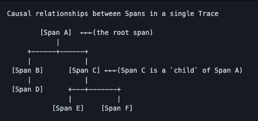

### Traces

Traces in OpenTelemetry are defined implicitly by their Spans. In particular, a Trace can be thought of as a directed acyclic graph (DAG) of Spans, where the edges between Spans are defined as parent/child relationship.

### Spans

A span represents an operation within a transaction. Each Span encapsulates the following state:

- An operation name
- A start and finish timestamp
- [Attributes](https://github.com/open-telemetry/opentelemetry-specification/blob/main/specification/common/common.md#attributes): A list of key-value pairs.
- A set of zero or more Events, each of which is itself a tuple (timestamp, name, [Attributes](https://github.com/open-telemetry/opentelemetry-specification/blob/main/specification/common/common.md#attributes)). The name must be strings.
- Parent's Span identifier.
- [Links](https://github.com/open-telemetry/opentelemetry-specification/blob/main/specification/overview.md#links-between-spans) to zero or more causally-related Spans (via the SpanContext of those related Spans).
- SpanContext information required to reference a Span. See below.

### SpanContext

Represents all the information that identifies Span in the Trace and MUST be propagated to child Spans and across process boundaries. A SpanContext contains the tracing identifiers and the options that are propagated from parent to child Spans.

- TraceId is the identifier for a trace. It is worldwide unique with practically sufficient probability by being made as 16 randomly generated bytes. TraceId is used to group all spans for a specific trace together across all processes.
- SpanId is the identifier for a span. It is globally unique with practically sufficient probability by being made as 8 randomly generated bytes. When passed to a child Span this identifier becomes the parent span id for the child Span.
- TraceFlags represents the options for a trace. It is represented as 1 byte (bitmap).
- Sampling bit - Bit to represent whether trace is sampled or not (mask `0x1`).
- Tracestate carries tracing-system specific context in a list of key value pairs. Tracestate allows different vendors propagate additional information and inter-operate with their legacy Id formats.

### Distributed Trace

A distributed trace is a set of events, triggered as a result of a single logical operation, consolidated across various components of an application. A distributed trace contains events that cross process, network and security boundaries. A distributed trace may be initiated when someone presses a button to start an action on a website - in this example, the trace will represent calls made between the downstream services that handled the chain of requests initiated by this button being pressed.

### Trace Context propagation

The trace context specification defines a universally agreed-upon format for the exchange of trace context propagation data - referred to as *trace context*. Trace context solves the problems described above by

- providing a unique identifier for individual traces and requests, allowing trace data of multiple providers to be linked together.
- providing an agreed-upon mechanism to forward vendor-specific trace data and avoid broken traces when multiple tracing tools participate in a single transaction.
- providing an industry standard that intermediaries, platforms, and hardware providers can support.

A unified approach for propagating trace data improves visibility into the behavior of distributed applications, facilitating problem and performance analysis. The interoperability provided by trace context is a prerequisite to manage modern micro-service based applications.

### Trace Context Headers

Trace context is split into two individual propagation fields supporting interoperability and vendor-specific extensibility:

- `traceparent` describes the position of the incoming request in its trace graph in a portable, fixed-length format. Its design focuses on fast parsing. Every tracing tool *MUST* properly set `traceparent` even when it only relies on vendor-specific information in `tracestate`
- `tracestate` extends `traceparent` with vendor-specific data represented by a set of name/value pairs. Storing information in `tracestate` is optional.